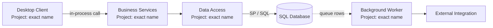
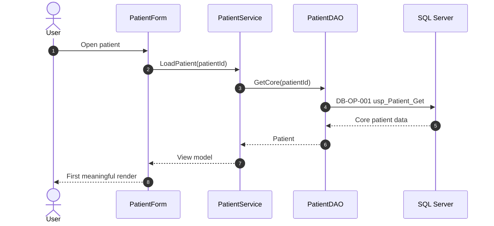
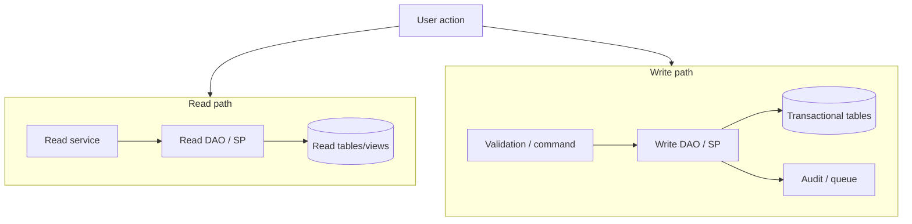
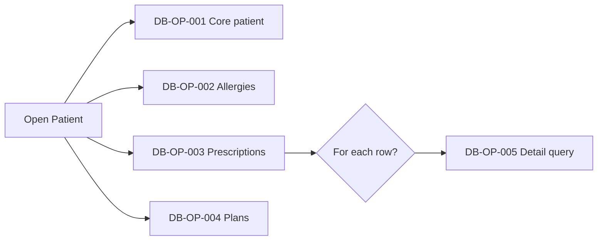
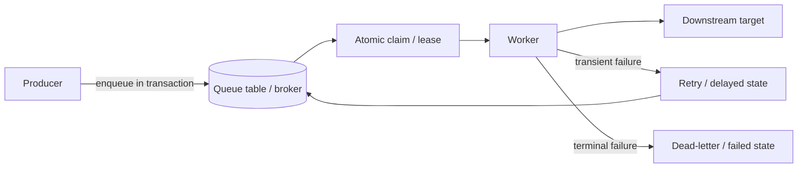
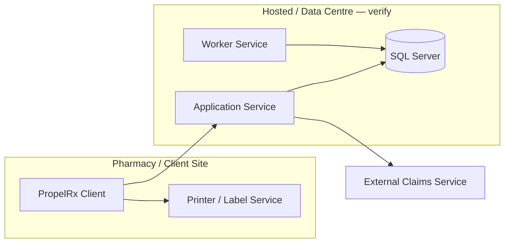
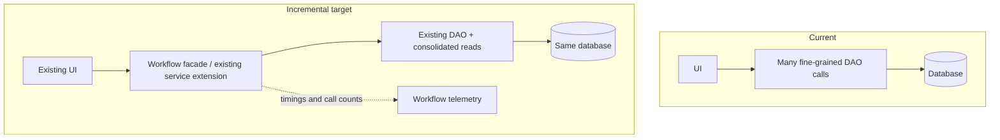

# CareRx / PropelRx Architecture and Scalability Analysis Playbook

> A reusable instruction set for GitHub Copilot, Microsoft Copilot, Codex, or another repository-aware coding assistant working inside the PropelRx Visual Studio solution.

## Purpose

Use this playbook to build an evidence-based picture of how the current solution behaves, where its scalability and performance risks are, and how to improve it incrementally **without re-architecting the entire system**.

The analysis must answer four questions:

1. What happens today?
2. What is measurably or plausibly wrong?
3. What evidence supports each conclusion?
4. What is the smallest safe change that materially improves scalability, performance, reliability, or operability?

The analysis is investigative, not speculative. Do not recommend a named architecture pattern merely because it is fashionable. Trace the implementation first and recommend changes that fit the existing solution, operational constraints, and team capacity.

---

## How to Use This File

1. Place this file at the solution root, for example as `ARCHITECTURE_SCALABILITY_PLAYBOOK.md`.
2. Open the complete Visual Studio solution and ensure the coding assistant can search all projects.
3. Ask the assistant to read this entire file and follow it as the governing analysis prompt.
4. Run the work in phases. Start with inventory and two or three important workflows before attempting a solution-wide conclusion.
5. Save the generated report as `docs/architecture/PropelRx-Architecture-Scalability-Assessment.md`.

Suggested opening prompt:

```text
Read ARCHITECTURE_SCALABILITY_PLAYBOOK.md completely and follow it as the analysis specification.

Begin with Phase 1: solution inventory and evidence map. Do not modify production code. Create or update the requested assessment report, cite exact source locations, flag anything that requires runtime verification, and stop after Phase 1 with a concise summary and a proposed workflow-analysis order.
```

For a focused workflow:

```text
Follow ARCHITECTURE_SCALABILITY_PLAYBOOK.md and analyze the "Open Patient" workflow end to end. Trace every discoverable call from UI entry point through business logic, data access, stored procedures, tables, integrations, queues, and UI rendering. Update the assessment report and Mermaid diagrams. Do not change production code.
```

---

# Instructions to the Coding Assistant

## Role and Objective

Act as an enterprise application architect, senior .NET performance engineer, SQL performance investigator, and production reliability reviewer.

Your objective is to:

- document the current architecture;
- trace important business workflows end to end;
- identify performance, scalability, reliability, concurrency, and operability risks;
- distinguish code-proven facts from hypotheses;
- identify measurements needed to confirm runtime behavior;
- recommend low-disruption improvements in prioritized stages; and
- explicitly identify stable areas that should not be changed.

Do **not** redesign the application from scratch. Do **not** begin by imposing microservices, CQRS, event sourcing, a new ORM, a new UI framework, or a cloud migration. These may only be discussed when repository and runtime evidence demonstrates a specific need, and even then an incremental alternative must be evaluated first.

## Operating Rules

1. **Read-only analysis by default.** Do not edit production code, database objects, configuration, or deployment files unless separately instructed.
2. **Evidence before conclusions.** Every material finding must cite an exact project, file, symbol, and relevant line or range. Database findings must cite the stored procedure, function, view, query, or table when available.
3. **Trace actual call paths.** Do not infer architecture only from folder names or class names.
4. **Separate static evidence from runtime facts.** Static analysis can show possible calls; it cannot prove frequency, duration, contention, cardinality, or production impact.
5. **State uncertainty.** Mark incomplete paths, reflection, dependency injection, dynamic SQL, generated code, external assemblies, or missing database definitions.
6. **Preserve business behavior.** Prefer improvements that keep contracts, workflows, validation rules, and data semantics intact.
7. **Prioritize hotspots.** Analyze high-frequency, high-latency, high-concurrency, and business-critical paths before low-use administrative functions.
8. **Avoid generic advice.** Tie every recommendation to a finding and to the code that would change.
9. **Show blast radius.** Identify callers, downstream dependencies, compatibility risks, rollback options, and validation requirements.
10. **Use the required output format.** Produce the tables and Mermaid diagrams defined below.

## Evidence Labels

Tag every important statement with one of these labels:

| Label | Meaning |
|---|---|
| `[CODE-PROVEN]` | Directly supported by repository source or database definitions. |
| `[CONFIG-PROVEN]` | Directly supported by configuration, deployment, or infrastructure files. |
| `[TEST-PROVEN]` | Demonstrated by an existing or newly run automated test. |
| `[RUNTIME-PROVEN]` | Demonstrated by logs, traces, metrics, profiling, SQL telemetry, or an observed reproduction. |
| `[INFERRED]` | Strongly suggested by static evidence but not confirmed at runtime. |
| `[RUNTIME-VERIFY]` | Requires a stated measurement or production-like test before being treated as fact. |
| `[UNKNOWN]` | Cannot be determined from accessible material. Explain what is missing. |

Do not convert `[INFERRED]` into `[RUNTIME-PROVEN]` through confident wording.

## Required Citation Format

Use repository-relative paths and exact symbols. Include line numbers when the environment provides stable line numbers.

```text
[CODE-PROVEN] Patient search starts in
`PropelRx.Client/Patients/PatientSearchForm.cs:142-181`,
`PatientSearchForm.SearchButton_Click(...)`, and calls
`PropelRx.Business/Patients/PatientService.cs:88`,
`PatientService.SearchPatients(...)`.
```

For SQL:

```text
[CODE-PROVEN] `PatientRepository.GetProfile(...)` executes
`dbo.usp_PatientProfile_Get` using `@PatientId`.
Evidence: `PropelRx.Data/Patients/PatientRepository.cs:214-249` and
`Database/Stored Procedures/dbo.usp_PatientProfile_Get.sql:1-96`.
Reads: `dbo.Patient`, `dbo.PatientAddress`, `dbo.PatientPlan`.
```

For a missing definition:

```text
[RUNTIME-VERIFY] The client invokes `dbo.usp_Claim_Submit`, but its definition is
not present in the repository. Obtain the deployed definition and capture execution
count, duration, reads, writes, waits, and query plan before recommending SQL changes.
```

For every major workflow, provide a compact evidence chain:

```text
UI project/file/symbol
→ business project/file/symbol
→ data-access project/file/symbol
→ SQL/SP name and parameters
→ tables/views/functions
→ queue/worker/integration, if any
→ UI update/rendering symbol
```

---

# Analysis Phases

## Phase 0 — Establish Scope and Guardrails

Before drawing conclusions, record:

- solution name and repository revision/branch if visible;
- projects included and projects unavailable;
- target .NET versions, UI technology, data-access technologies, and database platform;
- build configurations inspected;
- environment-specific configuration files inspected;
- database project/schema availability;
- generated code or vendor assemblies excluded from analysis;
- whether runtime logs, traces, SQL telemetry, and deployment information are available;
- workflows in scope and why they were prioritized; and
- assumptions or known operational constraints.

Never expose passwords, connection strings, keys, tokens, patient information, prescription information, or other regulated/sensitive data in the report. Cite configuration keys, not secret values.

## Phase 1 — Build the Solution and Component Inventory

Inspect every solution project and classify it by responsibility. Look for:

- desktop UI, web UI, services, APIs, libraries, and shared frameworks;
- business/domain services;
- data-access/DAO/repository projects;
- database projects, stored procedure scripts, migration scripts, and schema definitions;
- Windows services, scheduled jobs, batch executables, and background workers;
- queue tables, message brokers, pollers, dispatchers, and retry processors;
- printing, claims, pharmacy synchronization, document handling, reporting, and integrations;
- caching, configuration, logging, telemetry, and feature flags;
- test projects and performance/load-test assets;
- deployment packaging, installers, service definitions, pipelines, and environment manifests.

Search for concrete implementation indicators, including:

```text
SqlConnection, SqlCommand, DbConnection, DbCommand
ExecuteReader, ExecuteScalar, ExecuteNonQuery
CommandType.StoredProcedure, TransactionScope, SqlTransaction
DbContext, ObjectContext, Dapper, Query, Execute
HttpClient, WebRequest, WCF, ChannelFactory, ServiceClient
Task.Run, Thread, ThreadPool, BackgroundWorker, async, await
Timer, Hangfire, Quartz, Windows Service, IHostedService
ConcurrentDictionary, lock, Monitor, Mutex, Semaphore
BeginInvoke, Invoke, Dispatcher, SynchronizationContext
DataSet, DataTable, BindingSource, ObservableCollection
PrintDocument, spooler, label, claim, adjudication
queue, dequeue, poll, retry, status, heartbeat, lease, lock owner
```

Also search for architectural naming conventions:

```text
DAO, DAL, Repository, Gateway, Adapter, Provider
Manager, Service, Coordinator, Controller, Handler
Worker, Processor, Scheduler, Job, Agent, Listener
Client, Proxy, Connector, Integration
```

For every project, record:

| Field | Required detail |
|---|---|
| Project | Exact project name and path |
| Runtime type | UI, library, API, Windows service, job, database, tests, etc. |
| Responsibility | What it actually does, based on symbols/callers |
| Entry points | Forms, controllers, service startup, `Main`, worker loop, scheduled job |
| Key symbols | Important classes/interfaces/methods |
| Dependencies | Project references, packages, external assemblies, services, databases |
| Data behavior | Reads, writes, both, or none |
| Execution model | UI thread, request thread, worker thread, scheduled, event-driven, polling |
| Evidence | Exact citations |
| Confidence | High, medium, low, and why |

Deliver:

- a solution inventory table;
- a dependency summary;
- a list of architectural boundaries actually enforced versus only implied; and
- the required solution/component Mermaid diagram.

## Phase 2 — Select and Trace Major Workflows

Prioritize workflows using business criticality, execution frequency, user-visible latency, concurrency, database load, and production incident history if known.

Analyze, where present:

- open patient;
- search patient;
- open patient profile;
- open prescription;
- create or update prescription;
- claim submission/adjudication/reversal;
- label generation and printing;
- medication or pharmacy synchronization;
- batch processing;
- queue processing and retry;
- reporting or large exports;
- authentication/session initialization; and
- other high-frequency workflows discovered in code.

For each workflow:

1. Identify the exact trigger: event handler, command, controller action, service operation, timer, queue poll, or job.
2. Follow every discoverable call across projects.
3. Record synchronous versus asynchronous boundaries.
4. Record every database call in execution order.
5. Record transactions and their scope.
6. Record external service calls and timeout/retry behavior.
7. Record data transformation, duplication, and serialization.
8. Record thread switches and UI-thread work.
9. Record how results are bound/rendered and whether rendering causes additional calls.
10. Identify error, retry, cancellation, and cleanup paths.
11. Identify caching and cache invalidation behavior.
12. Mark branches whose runtime frequency is unknown.

Create one workflow evidence table per workflow:

| Step | Layer/process | Exact symbol or SP | Sync/async | Read/write | Transaction | Expected frequency | Evidence label and citation | Runtime verification |
|---:|---|---|---|---|---|---|---|---|

Create a Mermaid sequence diagram for every major workflow analyzed.

## Phase 3 — Analyze Database Chattiness and Data Access

The goal is to determine whether one business action causes excessive round trips, redundant reads, serial calls that could be grouped, broad result sets, or repeated initialization.

### 3.1 Inventory calls

For each workflow, enumerate all possible database interactions in order, including:

- connection opens/closes;
- commands and stored procedure executions;
- ORM queries and lazy-loading triggers;
- scalar existence/count/look-up calls;
- repeated reference-data queries;
- N+1 loops;
- calls made during property access, data binding, grid formatting, or event callbacks;
- writes, audit writes, history writes, status changes, and queue inserts;
- commits/rollbacks; and
- retries that can repeat a command.

Give every call a stable ID such as `DB-OP-001`. Link it back to the workflow step and source citation.

### 3.2 Classify chattiness

Look for:

- many sequential calls required to render one screen;
- one stored procedure per panel, tab, row, property, validation, or lookup;
- the same SP/query executed repeatedly with identical parameters;
- per-row queries inside a loop;
- eager loading of inactive tabs or optional details;
- calls triggered multiple times by UI events or binding;
- repeated opening of connections or transactions;
- tiny queries whose aggregate network latency dominates;
- overly broad queries that transfer unused columns/rows;
- multiple services independently loading the same patient/context data;
- no request-level cache for immutable or stable reference data;
- synchronous database access blocking a UI or request thread; and
- polling queries whose empty-result executions dominate total volume.

Static call count is a range, not an observed fact. Report:

```text
Minimum statically visible calls
Maximum/conditional statically visible calls
Calls inside loops and their cardinality variable
Potential repeats due to UI events, retries, or lazy loading
Observed runtime calls, only when measured
```

### 3.3 Inspect command behavior

For each important data-access method, capture:

- command/SP/query name;
- parameters and parameter sources;
- timeout configuration;
- connection lifetime and pooling assumptions;
- transaction attachment;
- result-set count and mapped objects;
- synchronous/asynchronous API usage;
- exception and retry handling;
- cancellation support;
- logging/telemetry; and
- caller count.

Check for correctness and performance risks such as:

- `AddWithValue` type/length mismatches;
- missing command timeout policy;
- missing disposal or connection leaks;
- swallowed SQL exceptions;
- retries inside a transaction;
- non-idempotent retries;
- unbounded result sets;
- client-side filtering/sorting of large data;
- `SELECT *` and unused columns;
- string-concatenated or dynamic SQL;
- implicit conversions;
- ORM tracking where read-only/no-tracking is sufficient; and
- lazy loading in UI or serialization paths.

### 3.4 Runtime measurements required

When available, correlate static findings with:

- SQL execution count per workflow/session;
- duration and percentile latency (`p50`, `p95`, `p99`);
- logical/physical reads and writes;
- rows returned/affected;
- query plans and regressions;
- waits, blocking, deadlocks, and lock duration;
- connection pool utilization/exhaustion;
- timeout and retry counts;
- client-to-database network latency;
- database CPU, I/O, tempdb, and memory pressure; and
- execution frequency by application version/site/pharmacy.

If telemetry is absent, write a concrete measurement plan. Do not invent numbers.

### 3.5 Required database-call map

Produce:

- a per-workflow call table;
- a Mermaid database-call/chattiness map;
- a duplicate/redundant call list;
- candidates for batching, aggregation, caching, deferred loading, or removing calls; and
- a runtime validation plan.

## Phase 4 — Separate Read Paths from Write Paths

Map reads and writes independently even when they begin from the same UI action.

For reads, identify:

- authoritative source;
- query/SP chain;
- data volume and shape;
- cache usage and staleness tolerance;
- consistency requirement;
- refresh triggers;
- optional/lazy/deferred portions; and
- whether read work blocks UI rendering.

For writes, identify:

- command origin and validation;
- affected entities/tables;
- stored procedures and side effects;
- transaction boundary and isolation level;
- audit/history behavior;
- queue/outbox/event inserts;
- external calls inside or adjacent to the transaction;
- idempotency and duplicate-submission controls;
- optimistic/pessimistic concurrency behavior;
- retry safety; and
- post-write refresh/read-back calls.

Detect places where a read-only screen unexpectedly writes state, or where a write triggers a full reload that multiplies database traffic.

Produce the required read-versus-write Mermaid diagram and a table of consistency and transaction requirements.

## Phase 5 — Inspect Stored Procedures and SQL Objects

For every high-frequency or high-impact stored procedure/query:

- cite its definition when present;
- list callers;
- list tables, views, functions, and other procedures referenced;
- classify reads and writes;
- identify transaction behavior and error handling;
- identify dynamic SQL and parameterization;
- identify temp tables, table variables, cursors, loops, and scalar functions;
- note result sets and whether callers consume all of them;
- inspect predicates, joins, ordering, pagination, aggregation, and update scope;
- identify possible non-sargable predicates and implicit conversions;
- identify parameter-sensitivity risks only as hypotheses unless supported by plans/telemetry;
- identify missing or overlapping index candidates only when supported by execution plans or workload evidence;
- note schema ownership and deployment/versioning mechanism; and
- identify duplicated business rules between SQL and application code.

Do not recommend indexes based only on column names. Require query plans, row counts, selectivity, write overhead, and representative workload evidence.

Create a stored-procedure assessment table:

| SP/query | Callers | Read/write | Objects touched | Static concern | Runtime evidence | Recommendation | Citation |
|---|---|---|---|---|---|---|---|

## Phase 6 — Analyze UI Loading and Rendering

For desktop UI, inspect form/window/control lifecycle and event subscriptions. For web UI, inspect request, view-model, component, and client-fetch lifecycle.

Look for:

- database/service calls on the UI thread;
- sequential loading that could safely overlap;
- duplicate loads from `Load`, `Shown`, selection change, binding, validation, tab change, resize, format, or paint events;
- re-entrant event handlers;
- cascading binding events;
- grids loading all rows without pagination/virtualization;
- eager loading of hidden tabs;
- CPU-heavy mapping, formatting, sorting, or filtering on the UI thread;
- repeated calculation of derived values;
- synchronous waits on tasks (`.Result`, `.Wait()`, `GetAwaiter().GetResult()`);
- improper `Task.Run` around I/O;
- missing cancellation when screens close or searches change;
- cross-thread access and excessive marshaling;
- excessive control creation or layout passes;
- large images/documents or print assets loaded eagerly;
- memory retention through static events, timers, caches, or undisposed forms; and
- refresh-after-save patterns that reload more data than necessary.

For each major screen, report:

- critical data needed for first meaningful render;
- secondary/optional data;
- load order;
- UI-thread work;
- database/network calls;
- cancellation and stale-result handling;
- rendering/binding hotspots; and
- opportunities for deferred, cached, incremental, or parallel-safe loading.

Do not recommend parallel calls until connection-pool, database-load, thread-safety, ordering, and consistency impacts are evaluated. Turning 20 serial calls into 20 parallel calls may reduce one user's latency while harming total system throughput.

## Phase 7 — Analyze Queues, Workers, Batch Jobs, and Polling

Identify all asynchronous processing mechanisms, including database-backed queues.

For each queue/worker/job, document:

- producer and enqueue transaction;
- queue technology/table/schema;
- message/job payload and identifiers;
- consumer startup and worker loop;
- polling frequency and empty-poll behavior;
- batch size;
- claim/lease/lock mechanism;
- concurrency setting and partitioning;
- ordering requirements;
- transaction boundary;
- timeout, retry, delay, and backoff;
- poison/dead-letter handling;
- idempotency/deduplication;
- crash recovery and abandoned work;
- status transitions;
- retention and cleanup;
- monitoring, lag, age, and failure metrics;
- downstream database and integration calls; and
- safe scale-out constraints.

Look for race conditions such as `SELECT` followed by separate `UPDATE` to claim work, long transactions while external systems respond, fixed-interval hot polling, retry storms, unbounded queues, missing indexes on queue status/time, and multiple workers processing the same item.

Produce the required worker/queue Mermaid diagram. Clearly label transaction boundaries, retries, and ownership/lease transitions.

## Phase 8 — Analyze Threading, Concurrency, and Resource Use

Map the execution model across UI, services, APIs, and workers.

Inspect:

- `async`/`await` propagation;
- blocking waits and sync-over-async;
- fire-and-forget tasks;
- exception observation;
- cancellation and timeouts;
- shared mutable/static state;
- locks and lock scope;
- concurrent collections;
- thread-affine objects and UI controls;
- per-user versus global caches;
- database connection use across threads;
- service proxy/thread safety;
- worker concurrency and throttling;
- CPU-bound versus I/O-bound work;
- resource disposal; and
- memory growth risks.

Do not claim a race, deadlock, leak, or starvation issue solely from a pattern match. Explain the concrete execution sequence that makes it possible and flag runtime verification.

## Phase 9 — Analyze Transactions and Consistency

Inventory explicit and ambient transactions. For each critical write workflow, document:

- transaction start/end;
- connection(s) enlisted;
- stored procedures and statements included;
- isolation level;
- expected lock duration;
- UI or network waits inside the transaction;
- external calls inside the transaction;
- nested/ambient transaction behavior;
- distributed transaction escalation risk;
- error/rollback path;
- retry boundary;
- partial-success behavior;
- idempotency; and
- audit/history consistency.

Look for transactions that are too broad, missing where atomicity is required, or split across operations that can leave inconsistent state. Recommend boundary changes only after documenting business invariants.

## Phase 10 — Analyze Integration Points

Inventory every external dependency:

- claims/adjudication networks;
- pharmacy and patient systems;
- printing/label services;
- authentication/identity;
- file shares/SFTP;
- email/SMS/fax;
- vendor APIs and SDKs;
- Windows services or local machine dependencies;
- message brokers;
- reporting/analytics;
- licensing/configuration services; and
- other databases.

For each integration, record:

- protocol and client library;
- caller symbols;
- synchronous/asynchronous behavior;
- endpoint/configuration key, without secret values;
- authentication mechanism at a high level;
- timeout policy;
- retry/backoff and retry safety;
- circuit breaking/throttling if any;
- connection reuse;
- payload size/serialization;
- availability assumptions;
- failure handling and user impact;
- telemetry/correlation IDs;
- data sensitivity; and
- fallback/reconciliation path.

Flag integrations called inside UI-thread work or database transactions.

## Phase 11 — Infer Deployment and Runtime Topology

Use configuration, project output types, installers, pipeline files, service definitions, and connection settings to infer:

- client processes and install locations;
- local versus shared services;
- application/API/worker hosts;
- database instances or roles;
- external services;
- network boundaries;
- shared file systems or print infrastructure;
- scale-out units;
- singletons/single points of failure; and
- environment differences.

Label inferred nodes and connections as `[INFERRED]` unless deployment evidence confirms them. Never expose sensitive hostnames, credentials, or patient/site identifiers in a broadly shared report; sanitize where appropriate.

Produce the deployment/runtime topology Mermaid diagram if enough evidence exists. If not, produce a partial diagram with `Unknown` nodes and a list of questions needed to complete it.

## Phase 12 — Synthesize Incremental Improvements

Tie every proposed change to one or more evidence-backed findings. Prefer the following progression where applicable:

1. **Measure and make behavior visible** — correlation IDs, workflow timing, database-call counts, slow-operation logs, queue lag, error/retry counts.
2. **Remove waste** — duplicate loads, redundant calls, unused result sets, unnecessary refreshes, repeated lookup loads.
3. **Reduce round trips** — aggregate/coarse-grained read methods, multi-result stored procedures, set-based operations, safe batching.
4. **Load less and later** — defer inactive tabs, page/virtualize grids, request only needed columns/rows.
5. **Cache stable data carefully** — reference/configuration data with clear scope, expiry, invalidation, memory limits, and consistency tolerance.
6. **Move blocking I/O off critical UI paths** — true asynchronous APIs, cancellation, progress, and stale-result protection.
7. **Tighten transaction boundaries** — keep network/UI waits outside transactions while preserving invariants.
8. **Harden workers** — atomic claims, bounded concurrency, backoff, idempotency, dead-letter handling, lag metrics.
9. **Optimize verified SQL hotspots** — plans, indexes, predicates, set-based rewrites, parameter behavior.
10. **Introduce seams around hotspots** — facade/application service, gateway, or workflow coordinator only where it enables incremental consolidation and testing.
11. **Scale selected components independently** — only after measured demand and clear boundaries justify it.

For every recommendation include:

- finding(s) addressed;
- exact code/SQL areas affected;
- proposed change;
- why it helps;
- expected impact stated qualitatively unless measured;
- implementation effort;
- delivery and operational risk;
- dependencies/prerequisites;
- backward-compatibility considerations;
- validation and load-test plan;
- observability required;
- rollback/feature-flag strategy; and
- what must remain unchanged.

Do not promise percentage improvements without benchmark or production evidence.

---

# Required Mermaid Diagrams

All Mermaid must be syntactically valid and render without proprietary extensions. Keep diagrams readable. Split oversized diagrams by domain or workflow rather than creating an unreadable graph.

## 1. Solution / Component Architecture

Show projects/processes, responsibilities, and dependency direction. Distinguish in-process calls, database calls, messaging/queues, and external integrations.



Replace placeholders with evidence-backed names. Add citation references in the prose immediately below the diagram.

## 2. Major Workflow Sequence Diagram

Create one per major workflow. Number database interactions using the stable `DB-OP-*` IDs.



Show conditional branches, loops, UI-thread blocking, queue handoffs, external calls, and transaction boundaries when relevant.

## 3. Read-versus-Write Path



Label consistency expectations and transaction boundaries.

## 4. Database-call / Chattiness Map



Annotate proven duplicate calls, conditional calls, and loop cardinality. Do not portray a possible branch as always executed.

## 5. Worker / Queue Architecture



Replace the conceptual states with the actual implementation and show gaps such as missing atomic claim or dead-letter handling.

## 6. Deployment / Runtime Topology



Every uncertain node or link must say `verify` and be listed in the runtime-verification table.

## 7. Current versus Incremental Target Architecture

Use two diagrams or clearly separated subgraphs. The target must represent staged improvements, not a replacement platform.



Show which components remain unchanged, which are modified, and which are newly introduced. Associate each target change with a recommendation ID.

---

# Finding and Recommendation Scales

## Severity

| Severity | Definition |
|---|---|
| Critical | Credible risk of widespread outage, data loss/corruption, security/privacy breach, or inability to perform a critical business function. Escalate immediately. |
| High | Material impact on critical workflow latency, throughput, reliability, concurrency, or operational recovery; likely to worsen with growth. |
| Medium | Noticeable or localized performance/reliability issue, or a scaling constraint not yet proven to be urgent. |
| Low | Maintainability/observability inefficiency with limited current operational impact. |
| Informational | Context, design note, or measurement opportunity without a current defect claim. |

## Effort

| Effort | Working definition |
|---|---|
| XS | Hours; one small, isolated change. |
| S | A few developer days; limited files and dependencies. |
| M | Approximately one to three iterations; several components or database objects. |
| L | Multi-team or multi-release change with migration/compatibility work. |
| XL | Program-level change. Must be broken into incremental stages before approval. |

## Delivery / Operational Risk

| Risk | Definition |
|---|---|
| Low | Localized, backwards-compatible, easily tested and rolled back. |
| Medium | Cross-component behavior or database change; requires staged rollout and focused regression/load testing. |
| High | Critical workflow/data semantics, broad deployment coordination, difficult rollback, or meaningful production migration. |

## Finding Table

Use stable IDs such as `F-001`.

| ID | Finding | Evidence status | Severity | Affected workflows | Scalability/performance mechanism | Exact citations | Runtime verification | Confidence |
|---|---|---|---|---|---|---|---|---|

Each finding must explain the mechanism. For example, do not merely say “chatty database.” State that the screen can issue N sequential commands, which adds network round-trip latency and database scheduler/connection overhead, and cite the call sites.

## Recommendation Table

Use stable IDs such as `R-001`.

| ID | Recommendation | Findings addressed | Expected effect | Effort | Risk | Prerequisites | Validation | Rollback | Exact change area |
|---|---|---|---|---|---|---|---|---|---|

## Runtime-verification Table

Use stable IDs such as `V-001`.

| ID | Question/hypothesis | Why static analysis is insufficient | Measurement | Environment/workflow | Success/decision threshold | Owner/input needed |
|---|---|---|---|---|---|---|

Thresholds must be proposed as decisions to agree with product/operations when no existing service-level objective exists. Do not invent an SLO and present it as established.

---

# Required Assessment Report Structure

Generate `docs/architecture/PropelRx-Architecture-Scalability-Assessment.md` with the following sections.

## 1. Executive Summary

- scope and repository revision;
- overall architecture in plain language;
- most important proven risks;
- most important unverified hypotheses;
- safest improvement sequence; and
- explicit statement that the proposal is incremental.

## 2. Top Findings

List the top 5–10 findings in priority order. Include severity, confidence, affected workflow, mechanism, and evidence IDs/citations.

## 3. Scope, Inputs, and Limitations

Document accessible projects, missing dependencies, database definitions, runtime evidence, excluded areas, and assumptions.

## 4. Current Solution Inventory

Include project/component table, dependency summary, entry points, and solution/component diagram.

## 5. Major Workflow Traces

For each workflow include:

- business purpose and trigger;
- evidence chain;
- step table;
- sequence diagram;
- database-call count range;
- UI/threading behavior;
- read/write and transaction behavior;
- queue/integration behavior;
- findings; and
- runtime-verification needs.

## 6. Database Chattiness and SQL Assessment

Include database-call maps, duplicated calls, N+1/loop risks, SP table, transaction observations, and telemetry/query-plan needs.

## 7. Read-versus-Write Architecture

Include the diagram, data consistency requirements, write-side effects, audit/queue behavior, and post-write refresh costs.

## 8. UI Loading and Rendering

Describe critical-render data, secondary data, blocking calls, event-triggered duplicate loads, binding/rendering work, and safe deferral/cancellation opportunities.

## 9. Queues, Workers, and Batch Processing

Include worker/queue diagram, scale-out constraints, polling behavior, atomicity, idempotency, retries, poison handling, and lag/health telemetry.

## 10. Threading, Concurrency, Transactions, and Resource Use

Cover execution model, async/blocking behavior, shared state, lock/transaction scope, connection use, cancellation, disposal, and runtime verification.

## 11. Integration Points

Include integration inventory, dependency direction, resilience behavior, critical-path impact, and unknowns.

## 12. Deployment and Runtime Topology

Include topology diagram, evidence, uncertain elements, scale units, and single points of failure.

## 13. Quick Wins

Include changes usually achievable with low effort/risk, but only when evidence supports them. Examples may include:

- remove a proven duplicate query or refresh;
- defer a hidden tab's data load;
- cache stable reference data with defined invalidation;
- add correlation/timing/database-call instrumentation;
- add cancellation to superseded searches;
- bound an unbounded result set;
- correct an obvious hot polling interval with backoff;
- add missing queue lag/failure metrics; or
- replace per-row access with an existing set-based operation.

For each quick win, include the linked finding, exact change location, test, rollout, and rollback.

## 14. Medium-term Changes

Include staged changes such as:

- consolidated workflow-specific reads;
- safe multi-result or set-based retrieval;
- workflow facade/coordinator using existing layers;
- pagination/virtualization;
- true asynchronous I/O across a critical path;
- transaction-boundary correction;
- atomic queue claiming and bounded concurrency;
- idempotency and retry hardening;
- verified SQL/index optimization; and
- targeted caching with measurable hit rate and invalidation.

Break large changes into independently deployable stages.

## 15. Areas Not to Change

Identify components or behaviors that should remain stable because they:

- are not on a measured hotspot;
- encode sensitive business/regulatory rules;
- have high regression risk and little scaling benefit;
- are vendor-owned or unsupported;
- already provide adequate performance/reliability;
- form stable contracts used by many callers; or
- lack enough evidence to justify modification.

This section is mandatory. Avoiding unnecessary change is part of the scalability strategy.

## 16. Incremental Target Architecture

Include current-versus-target diagram and explain:

- what remains unchanged;
- what is consolidated or deferred;
- where observability is added;
- where compatibility seams are introduced;
- how database and worker load are reduced; and
- how rollout can occur workflow by workflow.

## 17. Prioritized Roadmap

Organize recommendations into:

- **Stage 0 — Verify and instrument**;
- **Stage 1 — Remove waste / quick wins**;
- **Stage 2 — Consolidate critical paths**;
- **Stage 3 — Harden concurrency, queues, and integrations**; and
- **Stage 4 — Reassess with production measurements**.

Show dependencies, effort, risk, validation gates, and decision points.

## 18. Full Findings and Recommendations Tables

Include all stable IDs and trace every recommendation back to findings and evidence.

## 19. Runtime Verification Plan

Include every `[RUNTIME-VERIFY]` flag and specify:

- instrumentation/tool or data source;
- exact workflow and test data characteristics;
- concurrency/load shape;
- metrics;
- comparison baseline;
- privacy-safe logging requirements;
- acceptance/decision criteria; and
- who must provide access or business context.

## 20. Open Questions

List only questions that materially affect findings or decisions. State what answer would change.

## 21. Appendix: Evidence Index

Map projects, files, classes, methods, stored procedures, tables, configuration keys, tests, and diagrams to finding/workflow IDs.

---

# Required Quality Checks Before Finishing

Before presenting the report, verify all of the following:

- [ ] Every material finding has exact code, configuration, SQL, test, or runtime evidence.
- [ ] Every inferred claim is labeled `[INFERRED]` or `[RUNTIME-VERIFY]`.
- [ ] No runtime call count, latency, throughput, contention, or improvement percentage was invented.
- [ ] Every major workflow has an end-to-end trace and sequence diagram.
- [ ] Database calls are listed in order with conditional and loop behavior represented honestly.
- [ ] Read and write paths are separated.
- [ ] Transaction boundaries and external calls are visible.
- [ ] UI-thread and rendering behavior are covered.
- [ ] Workers/queues include claims, concurrency, retries, idempotency, failure handling, and lag.
- [ ] Integrations include timeouts, retry safety, and critical-path impact.
- [ ] Deployment topology distinguishes proven and inferred elements.
- [ ] Mermaid diagrams render successfully.
- [ ] Findings have severity and confidence.
- [ ] Recommendations have effort, risk, validation, and rollback.
- [ ] Each recommendation links to a finding and an exact change area.
- [ ] Quick wins, medium-term changes, and areas not to change are all present.
- [ ] The incremental target preserves existing business behavior and stable contracts.
- [ ] Secrets, credentials, patient data, and regulated information are not reproduced.
- [ ] The report clearly states limitations and missing evidence.

---

# Final Instruction

Produce a factual, navigable assessment that a developer, architect, database specialist, operations engineer, and business owner can review together.

Lead with the most important evidence and the safest improvement sequence. Be specific enough that another engineer can reproduce every call trace and validate every claim. Prefer small changes with measurable outcomes. Recommend a broader architectural change only when incremental options are insufficient and the evidence clearly demonstrates why.
