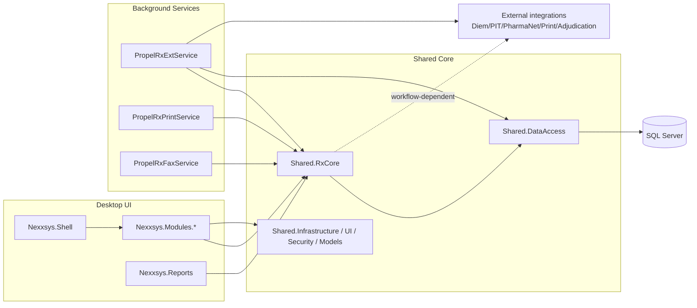

# Phase 1 — Solution Inventory and Evidence Map

## Scope and guardrails
- [CODE-PROVEN] Read-only inventory from solution and project metadata; no production code/config/DB changes were made.
- [CODE-PROVEN] Solution context is `Labyrinth.sln` on .NET Framework 4.8-heavy projects.

## 1) Phase 1 objective output
This report provides:
1. Solution inventory table (major projects and responsibilities).
2. Dependency/runtime summary.
3. Architectural boundaries enforced vs implied.
4. Prioritized workflow-analysis order.
5. Solution/component Mermaid diagram.

---

## 2) Solution-level inventory evidence

- [CODE-PROVEN] The solution contains Prism/WPF client modules, shared service/domain/data layers, Windows services, report apps, web/reporting components, and test projects.
  - Evidence: `Labyrinth.sln:6-77`; `get_projects_in_solution` workspace output.

- [CODE-PROVEN] Core project set includes:
  - Desktop shell: `Nexxsys.Shell`
  - Business/services: `Shared.RxCore`
  - Data layer: `Shared.DataAccess`
  - UI modules: `Nexxsys.Modules.*`
  - Worker/services: `PropelRxExtService`, `PropelRxPrintService`, `PropelRxFaxService`
  - Reports: `Nexxsys.Reports`, `Nexxsys.Modules.Reports`, `Nexxsys.Reports.Library`, `PatientCenter.Reports`
  - Web: `PatientCenter.Web`
  - Tests: `Nexxsys.UnitTests`, `Shared.UnitTests`, `Nexxsys.UnitTests.PrescribeIT`.
  - Evidence: `Labyrinth.sln:21-77`; `get_projects_in_solution` output.

---

## 3) Technology/runtime baseline

- [CODE-PROVEN] Main analyzed projects target .NET Framework 4.8.
  - Evidence: `Nexxsys.Shell/Nexxsys.Shell.csproj:13`; `Shared.DataAccess/Shared.DataAccess.csproj:12`; `Shared.RxCore/Shared.RxCore.csproj:12`; `PropelRxExtService/PropelRxExtService.csproj:12`.

- [CODE-PROVEN] Desktop shell uses WPF + Prism + Unity bootstrapper/module registration.
  - Evidence: `Nexxsys.Shell/App.xaml.cs:147-165`, `:450-451`; `Nexxsys.Shell/BootStrapper.cs:46`, `:55-71`; `Nexxsys.Modules.RxDetail/RxDetailModule.cs:12-14`, `:40-44`, `:56-84`; `Nexxsys.Modules.Workbench/WorkbenchModule.cs:14-16`, `:42-45`, `:50-67`.

- [CODE-PROVEN] Data access uses Dapper-based static context + SQL connections and stored procedure command paths.
  - Evidence: `Shared.DataAccess/DapperDbContext.cs:1-2`, `:22`, `:123-128`, `:235-242`, `:441`, `:557-565`, `:736-738`; `Shared.DataAccess/Shared.DataAccess.csproj:59-67`.

- [CODE-PROVEN] Service-host executables support Windows Service mode and interactive test mode.
  - Evidence: `PropelRxExtService/Program.cs:27-42`; `PropelRxPrintService/Program.cs:21-36`; `PropelRxFaxService/Program.cs:13-26`.

---

## 4) Inventory table (major components)

| Project / group | Runtime type | Responsibility (evidence-based) | Entry points | Data behavior | Execution model | Confidence | Evidence |
|---|---|---|---|---|---|---|---|
| `Nexxsys.Shell` | WPF desktop app (`WinExe`) | Main Prism shell startup, bootstrap, module loading, app init/warmup | `App.Main`, `App.OnStartup`, `Bootstrapper` | Reads/writes via services | UI thread + background tasks | High | `Nexxsys.Shell.csproj:9,13`; `App.xaml.cs:55-141`, `:147-168`, `:450-451`; `BootStrapper.cs:46-71` |
| `Nexxsys.Modules.*` (RxDetail/Workbench/Patient/Drug/Doctor/Pharmacy/etc.) | Class libraries | Prism modules registering views/viewmodels for workflow UI regions | `Initialize()`, `RegisterViewsAndServices()` | Primarily service-mediated R/W | UI event/command-driven | High | `Labyrinth.sln:25-74`; `RxDetailModule.cs:40-44`, `:56-84`; `WorkbenchModule.cs:42-45`, `:50-132` |
| `Shared.RxCore` | Class library | Core business/service workflows (prescriptions, queue processing support, integrations) | Service methods via `ServiceManager` | Both | Sync + async service logic | High | `Shared.RxCore.csproj:8-12`; phase workflow evidence from Phase2/3/4 reports |
| `Shared.DataAccess` | Class library | DAO + Dapper SQL access and SP execution helpers | DAO methods, `DapperDbContext` APIs | Both | Per-call connection scope | High | `Shared.DataAccess.csproj:8-12`; `DapperDbContext.cs:22`, `:123-128`, `:235-242`, `:557-565` |
| `Shared.Models`, `Shared.Infrastructure`, `Shared.Infrastructure.UI`, `Shared.Security`, `Shared.Validation`, `Shared.Print`, `Shared.Processing` | Class libraries | Cross-cutting models, UI infrastructure, security, validation, print and processing utilities | Referenced by shell/modules/services | Mixed | In-process library usage | Medium-High | `Labyrinth.sln:21-45,75`; `get_projects_in_solution` output |
| `PropelRxExtService` | Windows service executable (`Exe`) | Background worker host for queue/integration jobs (includes `MessageOutQueueProcess` and other processes) | `Program.Main`, `PropelRxExtService` service | Both | Service loop / interactive test mode | High | `PropelRxExtService.csproj:9-12`, `:98-109`; `Program.cs:27-42` |
| `PropelRxPrintService` | Windows service executable | Print background service host | `Program.Main` | Write/dispatch side effects | Service loop / interactive mode | High | `PropelRxPrintService/Program.cs:21-36` |
| `PropelRxFaxService` | Windows service executable | Fax background service host | `Program.Main` | Write/dispatch side effects | Service loop / interactive mode | High | `PropelRxFaxService/Program.cs:13-26` |
| `Nexxsys.Reports`, `Nexxsys.Modules.Reports`, `Nexxsys.Reports.Library`, `PatientCenter.Reports` | Desktop/report libraries | Reporting workflows and report UI startup | `Nexxsys.Reports.App.Main` | Read-heavy with report generation | UI thread + task warmup | Medium-High | `Labyrinth.sln:87-93`; `Nexxsys.Reports/App.xaml.cs:51-116` |
| `PatientCenter.Web` | Web project | Patient-center web surface (details not deeply traced in Phase 1) | Web host startup (not traced here) | Unknown in this pass | Request-driven | Medium | `get_projects_in_solution` output |
| `Nexxsys.UnitTests`, `Shared.UnitTests`, `Nexxsys.UnitTests.PrescribeIT` | Test projects | Unit/integration-style tests for shared and domain logic | Test runner entry | N/A | Test execution | High | `get_projects_in_solution` output; `Nexxsys.UnitTests.csproj` in prior scans |

---

## 5) Dependency summary

- [CODE-PROVEN] Shell depends on module/service/infrastructure projects and initializes module composition via Prism bootstrapper.
  - Evidence: `Labyrinth.sln:48-61`; `Nexxsys.Shell/App.xaml.cs:163-165`, `:450-451`; `Nexxsys.Shell/BootStrapper.cs:46-71`.

- [CODE-PROVEN] Modules depend on shared infrastructure and service layer, then resolve/register region views.
  - Evidence: `RxDetailModule.cs:15-17`, `:56-84`; `WorkbenchModule.cs:17-19`, `:50-132`.

- [CODE-PROVEN] Services and modules use shared DAO layer for SQL access.
  - Evidence: `Shared.DataAccess/Shared.DataAccess.csproj:10-12`; `DapperDbContext.cs:22`, `:441`, `:736-738`; workflow traces in phase reports.

- [INFERRED] External integrations (Diem, PIT, PharmaNet, print/adjudication) are reached through service layer and/or worker hosts depending on workflow.
  - Evidence basis: `PropelRxExtService.csproj:98-109`; existing Phase2/3/4 traces.

---

## 6) Architectural boundaries: enforced vs implied

### Enforced (code-visible)
1. [CODE-PROVEN] Prism module boundary for UI composition (`IModule`, region registration).
   - Evidence: `RxDetailModule.cs:12-14`, `:40-44`; `WorkbenchModule.cs:14-16`, `:42-45`.
2. [CODE-PROVEN] Service/DAO separation (service calls not directly embedding SQL in UI modules in analyzed paths).
   - Evidence: Phase2/3/4 call chains; `DapperDbContext.cs` central access surface.
3. [CODE-PROVEN] Worker boundary through Windows service executables.
   - Evidence: `PropelRxExtService/Program.cs:27-42`; `PropelRxPrintService/Program.cs:21-36`; `PropelRxFaxService/Program.cs:13-26`.

### Implied / requires verification
1. [INFERRED] Deployment topology and instance scale-out are environment dependent.
2. [RUNTIME-VERIFY] Multi-worker concurrency in production for queue processes.
3. [UNKNOWN] Full SQL object coverage for all called SPs/functions in this workspace-only pass.

---

## 7) High-priority workflow analysis order (proposed)

1. [CODE-PROVEN] `MessageOutQueueProcess` worker flow (high reliability/scalability risk surface already evidenced in Phase 2B).
2. [CODE-PROVEN] RxDetail navigation + selected prescription loading (hot UI path with lock/hydration complexity from Phase 3).
3. [CODE-PROVEN] `ProcessNewRx/CreateRxs` (high write-side consistency and retry risk from Phase 4).
4. [INFERRED] Printing/adjudication direct reachability validation after instrumentation.
5. [INFERRED] Additional high-volume report/export paths.

---

## 8) Solution/component diagram (required)

---

## 9) Limitations and unknowns

- [UNKNOWN] Complete deployment/runtime topology (node count, worker instance count, role placement) is not derivable from repository alone.
- [RUNTIME-VERIFY] Production call frequency/latency/cardinality cannot be derived from static code.
- [UNKNOWN] Some SQL definitions referenced by workflows are not available in this workspace pass and require DB-side definition retrieval.

---

## 10) Appendix — project list snapshot

- [CODE-PROVEN] Full project list used in this pass came from `get_projects_in_solution` and `Labyrinth.sln`.
- Key examples: `Nexxsys.Shell`, `Nexxsys.Modules.*`, `Shared.*`, `PropelRxExtService`, `PropelRxPrintService`, `PropelRxFaxService`, `Nexxsys.Reports`, `PatientCenter.Web`, test projects.

_End of Phase 1 report._
