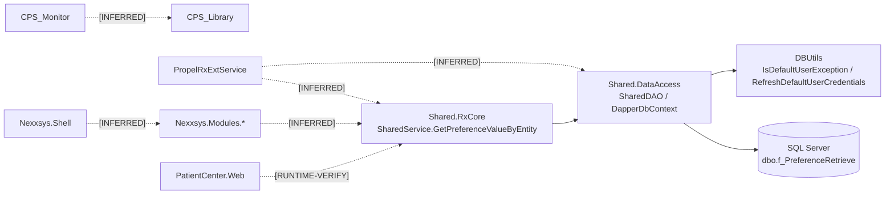

# Phase 1 Assessment (Revised): Solution Inventory, Dependency Map, Evidence Index, and Current Component Architecture

## 0) Scope, Constraints, and Sanitization
- **Phase executed:** Phase 1 only.
- **No production changes made:** No edits to production code, stored procedures, configuration, or deployment files.
- **Sensitive data handling:** Passwords/connection-string secrets are redacted; no patient-identifying values are included.
- **Evidence rule:** Every conclusion cites exact project/file/class/method/stored-procedure where available.
- **Confidence labels:** `High`, `Medium`, `Low`.
- **Runtime labels:** Unproven relationships are explicitly marked `[INFERRED]` or `[RUNTIME-VERIFY]`.

---

## 1) Solution Inventory (All 41 Projects)

> Note: For several projects, method-level symbols could not be extracted in this tool state; those entries are marked `[RUNTIME-VERIFY]` and/or `Low` confidence where method names are not directly proven from source bodies.

| # | Project (path) | Purpose | Classification | Startup / Entry | Important classes/methods | Direct dependencies | Callers / downstream | DB behavior | Threading / execution | Citations | Confidence |
|---|---|---|---|---|---|---|---|---|---|---|---|
| 1 | `Nexxsys.Modules.Misc\Nexxsys.Modules.Misc.csproj` | Misc UI workflows (attachments, scan, prompts) | UI module | `MiscModule` [INFERRED] | `MiscModule`, multiple `*ViewModel` classes | `Shared.Infrastructure.UI`, `Shared.RxCore` [INFERRED] | Loaded by shell [INFERRED] | Read/write via services [INFERRED] | WPF UI event-driven | C01,C02 | Medium |
| 2 | `Nexxsys.Validation\Shared.Validation.csproj` | Validation framework/custom validators | Library | N/A | `ValidationService`, `Validator`, `NxRequired` | Shared models/UI [INFERRED] | Used by UI/service validations [INFERRED] | None direct [INFERRED] | Synchronous library calls | C01,C03 | Medium |
| 3 | `Shared.Models\Shared.Models.csproj` | DTO/domain model contracts | Library | N/A | `AppInfo`, model classes | Consumed widely | Upstream to all layers | None direct | Data-only | C01,C04 | High |
| 4 | `Shared.RxCore\Shared.RxCore.csproj` | Core business services orchestration | Library/Service layer | Service entry methods [RUNTIME-VERIFY] | **Verified:** `SharedService.GetPreferenceValueByEntity(...)` | `Shared.DataAccess` (verified), others [INFERRED] | Called by modules/services | Read/write DB via DataAccess | Sync + async service patterns [INFERRED] | C01,C05,C06 | High |
| 5 | `Nexxsys.Modules.Workbench\Nexxsys.Modules.Workbench.csproj` | Workbench workflows, messaging/dis queues UI | UI module | `WorkbenchModule` [INFERRED] | `WorkbenchWorkflowViewModel`, `WorkbenchMessagesViewModel` | Core/shared UI libs [INFERRED] | Shell navigation [INFERRED] | RW via services [INFERRED] | WPF event-driven | C01,C07 | Medium |
| 6 | `Nexxsys.Modules.Pharmacy\Nexxsys.Modules.Pharmacy.csproj` | Pharmacy config, preferences, list maintenance | UI module | `PharmacyModule` [INFERRED] | `PharmacyViewModel`, `ListMaintenance*ViewModel` | Core/services [INFERRED] | Shell -> Pharmacy module [INFERRED] | RW via services [INFERRED] | WPF event-driven | C01,C08 | Medium |
| 7 | `Nexxsys.Modules.Province\Nexxsys.Modules.Province.csproj` | Province-specific (BC/AB/SK etc.) workflows | UI module | `ProvinceModule` [INFERRED] | `Bc*ViewModel`, `Dis*ViewModel`, `Dpin*ViewModel` | Core/services [INFERRED] | Shell/module nav [INFERRED] | RW via province service paths [INFERRED] | WPF event-driven | C01,C09 | Medium |
| 8 | `Nexxsys.Modules.Patient\Nexxsys.Modules.Patient.csproj` | Patient profile/search/clinical screens | UI module | `PatientModule` [INFERRED] | `PatientViewModel`, `PatientSearchViewModel`, `Ehr*ViewModel` | Core/services [INFERRED] | Shell/module nav [INFERRED] | RW via services [INFERRED] | WPF event-driven | C01,C10 | Medium |
| 9 | `Nexxsys.Modules.Drug\Nexxsys.Modules.Drug.csproj` | Drug master/interaction/search workflows | UI module | `DrugModule` [INFERRED] | `DrugViewModel`, `DrugSearchViewModel` | Core/services [INFERRED] | Shell/module nav [INFERRED] | RW via services [INFERRED] | WPF event-driven | C01,C11 | Medium |
|10| `Nexxsys.Modules.Inventory\Nexxsys.Modules.Inventory.csproj` | Inventory, reconciliation, shipment/order UI | UI module | `InventoryModule` [INFERRED] | `InventoryAddOrderViewModel`, `DrugReconciliationViewModel` | Core/services [INFERRED] | Shell/module nav [INFERRED] | RW via services [INFERRED] | WPF event-driven | C01,C12 | Medium |
|11| `Shared.Infrastructure.UI\Shared.Infrastructure.UI.csproj` | Shared WPF controls/events/converters | Library (UI infra) | N/A | `RegionNavigation`, `AsyncCommand`, controls | Shared.Infrastructure/Models [INFERRED] | Used by UI modules | None direct | UI threading helpers + async utilities | C01,C13 | High |
|12| `Shared.DataAccess\Shared.DataAccess.csproj` | DB access/DAO layer | Library (data access) | N/A | **Verified:** `DapperDbContext.QueryFirstOrDefault<T>()`, `ExecuteOnNewConnection<TResult>()`, `SharedDAO.GetPreferenceValueByEntity(...)`, `DBUtils.*` | SQL Server provider | Called by RxCore/services | Read/write DB | Synchronous DB calls + retry path | C01,C14,C05,C06,C15 | High |
|13| `Shared.Infrastructure\Shared.Infrastructure.csproj` | Shared utility/logging/crypto/base infra | Library | N/A | `NxLogger`, `EncryptionHelper`, `AsyncProcessor` | Cross-cutting | Used by core/UI/services | Logging DB/file [INFERRED] | Async utilities + sync helpers | C01,C16 | Medium |
|14| `Nexxsys.UserControls\Nexxsys.UserControls.csproj` | Shared UI user controls/actions | UI library | N/A | `NxAction\*` [INFERRED] | Shared UI/core [INFERRED] | Used by modules/shell [INFERRED] | None direct [INFERRED] | WPF UI | C01 | Low |
|15| `Nexxsys.Shell\Nexxsys.Shell.csproj` | Primary desktop shell host | Application (WPF) | `App.xaml/App.xaml.cs`; `BootStrapper.cs` [RUNTIME-VERIFY] | `ShellViewModel`, `BootStrapper` | Loads modules [INFERRED] | Entry to module ecosystem | Indirect via services | WPF UI dispatcher | C01,C17 | Medium |
|16| `Nexxsys.Modules.Doctor\Nexxsys.Modules.Doctor.csproj` | Doctor search/profile/PIT doctor flows | UI module | `DoctorModule` [INFERRED] | `DoctorViewModel`, `DoctorSearchViewModel` | Core/services [INFERRED] | Shell/module nav [INFERRED] | RW via services [INFERRED] | WPF event-driven | C01,C18 | Medium |
|17| `Nexxsys.Modules.RxEvaluate\Nexxsys.Modules.RxEvaluate.csproj` | Rx evaluate/interactions/compliance UI | UI module | Module registration [RUNTIME-VERIFY] | `ClinicalAnalysisSummaryViewModel`, `InteractionSummaryViewModel` | Core evaluate services [INFERRED] | Shell/module nav [INFERRED] | Read-heavy via services [INFERRED] | WPF event-driven | C01,C19 | Medium |
|18| `Nexxsys.Modules.OrderSupplier\Nexxsys.Modules.OrderSupplier.csproj` | Ordering/supplier/purchase-order UI | UI module | `OrderSupplierModule` [INFERRED] | `OrderViewModel`, `SupplierViewModel` | Core/services [INFERRED] | Shell/module nav [INFERRED] | RW via services [INFERRED] | WPF event-driven | C01,C20 | Medium |
|19| `Nexxsys.Modules.RxDetail\Nexxsys.Modules.RxDetail.csproj` | Rx detail, dispense, claim, workflow UI | UI module | `RxDetailModule` [INFERRED] | `RxDetailViewModel`, `ProcessNewRxViewModel` | Core/services [INFERRED] | Shell/module nav [INFERRED] | RW via services [INFERRED] | WPF event-driven | C01,C21 | Medium |
|20| `Nexxsys.Modules.Groups\Nexxsys.Modules.Groups.csproj` | Groups, batch manager, central fill UI | UI module | `GroupsModule` [INFERRED] | `BatchMangerViewModel`, `CentralFillViewModel` | Core/services [INFERRED] | Shell/module nav [INFERRED] | RW via services [INFERRED] | WPF event-driven | C01,C22 | Medium |
|21| `Nexxsys.Modules.Navigation\Nexxsys.Modules.Navigation.csproj` | Top-level menu/status/current-location UI | UI module | `NavigationModule` [INFERRED] | `MenuViewModel`, `StatusBarViewModel` | Shared.Infrastructure.UI | Used by shell | Read-only mostly [INFERRED] | WPF event-driven | C01,C23 | Medium |
|22| `Shared.Security\Shared.Security.csproj` | Security control blocks/session/security mgr | Library | N/A | `SecurityManager`, `ControlBlocksManager` | Shared infra/models [INFERRED] | Called by security module/core [INFERRED] | Likely read/write auth data [INFERRED] | Synchronous library | C01,C24 | Medium |
|23| `Nexxsys.Modules.Security\Nexxsys.Modules.Security.csproj` | User login/admin/security UI | UI module | Security views/viewmodels [RUNTIME-VERIFY] | `SecurityLoginViewModel`, `SecurityAdministrationViewModel` | Shared.Security/RxCore [INFERRED] | Shell entry/auth flows [INFERRED] | RW via security services [INFERRED] | WPF event-driven | C01,C25 | Medium |
|24| `Nexxsys.Modules.Reports\Nexxsys.Modules.Reports.csproj` | Report UI/viewmodels/rdlc orchestration | UI/report module | Report views entry [RUNTIME-VERIFY] | `*ReportViewModel`, `ReportUtil` | Reports library/model/core [INFERRED] | Shell/report selectors [INFERRED] | Read-heavy | WPF + report render | C01,C26 | Medium |
|25| `CPS_Library\CPS_Library.csproj` | Claims/network communication core library | Library | N/A | `CpsMain`, `Communicator*`, `ThreadManager` | Used by CPS apps/services | Downstream claim processing | RW (claims/trans queue) [INFERRED] | Multi-thread helpers present | C01,C27 | Medium |
|26| `CPS_Monitor\CPS_Monitor.csproj` | Monitor app for CPS/process queues | Application (WinForms) | `Program.cs` [INFERRED: `Main`] | `frmMonitor`, `ProcUtil` | CPS_Library [INFERRED] | Operator-facing monitor | Read/write monitoring/queue [INFERRED] | UI thread + background monitor [INFERRED] | C01,C28 | Medium |
|27| `CPS_Report\CPS_Report.csproj` | CPS reporting desktop app | Application (WinForms) | `Program.cs` [INFERRED: `Main`] | `frmLogin`, `frmLogViewer`, `frmDetail` | CPS_Library [INFERRED] | Reporting operators | Read-heavy, some updates [INFERRED] | UI thread + report ops | C01,C29 | Medium |
|28| `Nexxsys.UnitTests\Nexxsys.UnitTests.csproj` | Core regression/unit tests | Test | Test runner | `DAOUnitTests`, `PosUnitTests`, etc. | Test frameworks + solution libs | N/A | Test DB use [RUNTIME-VERIFY] | Test-runner parallelization possible | C01,C30 | High |
|29| `Shared.UnitTests\Shared.UnitTests.csproj` | Shared-core unit tests | Test | Test runner | `RxCoreServicesTests`, `PharmaNetTests` | Shared libraries | N/A | Test DB/external mocks [RUNTIME-VERIFY] | Test-runner | C01,C31 | High |
|30| `Shared.Print\Shared.Print.csproj` | Print rendering/templates/thermal print | Library | N/A | `PrintingService`, `ZebraThermalLabel` | Used by print/report services | Downstream printer devices | DB none direct [INFERRED] | Sync IO + print pipelines | C01,C32 | Medium |
|31| `Nexxsys.UnitTests.PrescribeIT\Nexxsys.UnitTests.PrescribeIT.csproj` | PrescribeIT test harness/tooling | Test/utility app | `App.xaml.cs`, `MainWindow` [INFERRED] | `EMRService`, `EMRCommunicator` | PrescribeIT models/libs [INFERRED] | N/A | Likely no production DB writes [INFERRED] | WPF + test interactions | C01,C33 | Medium |
|32| `Nexxsys.Modules.Pricing\Nexxsys.Modules.Pricing.csproj` | Pricing rules UI/reporting | UI module | `PricingModule` [INFERRED] | `PricingViewModel`, `VariablePricingRuleViewModel` | Core/services [INFERRED] | Shell/module nav [INFERRED] | RW pricing data [INFERRED] | WPF event-driven | C01,C34 | Medium |
|33| `PatientCenter.Web\PatientCenter.Web.csproj` | ASP.NET MVC/Web API patient center | Website/API | `Global.asax` / WebApi route config | `ApiControllers\*`, `Controllers\*` | Shared/core web utilities [INFERRED] | Browser/API clients | RW via backend services/DA [INFERRED] | ASP.NET request-thread model | C01,C35 | Medium |
|34| `Nexxsys.Reports\Nexxsys.Reports.csproj` | Standalone reports shell app | Application (WPF) | `App.xaml.cs`, `BootStrapper.cs` [RUNTIME-VERIFY] | `ShellViewModel`, `ReportSelectorViewModel` | `Nexxsys.Reports.Library` [INFERRED] | User launches report app | Read-heavy reporting | WPF UI + report generation | C01,C36 | Medium |
|35| `PatientCenter.Reports\PatientCenter.Reports.csproj` | Patient-center report jobs/printers | Library | N/A | `MedsCheckReportJob`, `RdlcReportPrinter`, `XfaPdfReportPrinter` | Used by web/report layers | Downstream report output | Read-heavy, document generation | Sync processing + IO | C01,C37 | Medium |
|36| `Nexxsys.Reports.Library\Nexxsys.Reports.Library.csproj` | Reporting data/adapters/scheduler | Library | N/A | `SchedulerManager`, `*ReportData`, `ReportViewerAdapters` | Used by reports UI/modules | Downstream report renderers | Read-heavy DB/report queries [INFERRED] | Mostly sync, scheduler components | C01,C38 | Medium |
|37| `PropelRxFaxService\PropelRxFaxService.csproj` | Windows service for fax processing | Service | `Program.cs` [INFERRED: service host entry] | `FaxingService`, `FaxingProcessor`, `FaxTalkFaxingProcessor` | Shared/core libs [INFERRED] | External fax systems | RW queue/status [INFERRED] | Service background workers [INFERRED] | C01,C39 | Medium |
|38| `PropelRxExtService\PropelRxExtService.csproj` | External integration/background jobs | Service/worker host | `Program.cs` [INFERRED: service host entry] | `Services.PropelRxExtService`, `MessageOutQueueProcess`, `PrescribeITProcess`, `ReportSchedulePrintProcess` | Shared.RxCore/DataAccess [INFERRED] | Timers/jobs/queues [INFERRED] | RW via shared services | Multi-process/service threads [INFERRED] | C01,C40 | Medium |
|39| `PropelRxPrintService\PropelRxPrintService.csproj` | Windows service for label printing | Service | `Program.cs` [INFERRED: service host entry] | `LabelService` | Shared.Print/core [INFERRED] | Printer pipelines | RW queue/status [INFERRED] | Service background processing | C01,C41 | Medium |
|40| `Shared.Processing\Shared.Processing.csproj` | Processing service abstraction + health checks | Library/worker support | N/A | `BaseRxAppService`, `DatabaseHealthChecker`, `LabelPrintProcess` | Used by service hosts [INFERRED] | Downstream print/processing operations | DB health/read; process RW [INFERRED] | Async/background process model | C01,C42 | Medium |
|41| `PHS\PHS.csproj` | PHS desktop application | Application (WPF) | `App.xaml.cs` [INFERRED], `MainWindow` | `MainWindow`, `AppStateModel` | Shared libs [INFERRED] | End-user app | Unknown DB interaction [RUNTIME-VERIFY] | WPF UI thread | C01,C43 | Low |

---

## 2) Verified Dependency Map and Relationship Status

### 2.1 Method-level relationships (verified)
1. `Shared.RxCore.Services.SharedService.GetPreferenceValueByEntity(...)`
   -> `Shared.DataAccess.SharedDAO.GetPreferenceValueByEntity(...)`.
2. `Shared.DataAccess.SharedDAO.GetPreferenceValueByEntity(...)`
   -> `Shared.DataAccess.DapperDbContext.QueryFirstOrDefault<T>(...)`.
3. `Shared.DataAccess.DapperDbContext.QueryFirstOrDefault<T>(...)`
   -> `Shared.DataAccess.DapperDbContext.ExecuteOnNewConnection<TResult>(...)`.
4. `ExecuteOnNewConnection<TResult>(...)` error path uses:
   - `Shared.DataAccess.DBUtils.IsDefaultUserException(...)`
   - `Shared.DataAccess.DBUtils.RefreshDefaultUserCredentials(...)`
   - `Shared.DataAccess.DBUtils.HandleAction<TResult>(...)`.
5. DB function called in this path:
   - `dbo.f_PreferenceRetrieve(...)` from SQL in `SharedDAO.GetPreferenceValueByEntity(...)`.

**Citations:** C05,C06,C14,C15.

### 2.2 Relationship verification status table
| Relationship | Status |
|---|---|
| `Shared.RxCore` -> `Shared.DataAccess` (specific preference path) | **VERIFIED** |
| `Shared.DataAccess` -> SQL Server (through Dapper/SqlConnection) | **VERIFIED** |
| `Nexxsys.Shell` -> all `Nexxsys.Modules.*` loading | `[INFERRED]` (files imply modular shell; bootstrapping code body not extracted) |
| `PropelRxExtService` -> `Shared.RxCore` service methods | `[INFERRED]` (class names suggest orchestration; calls not method-proven) |
| `CPS_Monitor` -> `CPS_Library` operational calls | `[INFERRED]` |
| `PatientCenter.Web` -> `Shared.RxCore/Shared.DataAccess` concrete method links | `[RUNTIME-VERIFY]` |
| `Nexxsys.Reports` -> `Nexxsys.Reports.Library` explicit references | `[INFERRED]` |

---

## 3) Current Component Architecture Diagram (Verified + Annotated)

---

## 4) Candidate Workflow Table (Code-Named; No invented names)

> Requirement note: workflow names below are taken from project/class/file names. Where entry method is not directly extracted, it is marked `[RUNTIME-VERIFY]`.

| Workflow name in code | Trigger type | Entry class + method | Participating projects | Business purpose | DB/External involvement | Citations | Runtime verification | Priority |
|---|---|---|---|---|---|---|---|---|
| `MessageOutQueueProcess` | Queue/job [INFERRED] | `PropelRxExtService.ServiceImplementations.MessageOutQueueProcess` + entry method `[RUNTIME-VERIFY]` | PropelRxExtService, Shared.RxCore, Shared.Models | Outbound communication/message dispatch | DB queue + external comms [INFERRED] | C40,C44,C04 | Required for trigger/method path | High |
| `PrescribeITProcess` | Timer/job [INFERRED] | `PropelRxExtService.ServiceImplementations.PrescribeITProcess` + entry method `[RUNTIME-VERIFY]` | PropelRxExtService, Shared.RxCore, Shared.Models | PrescribeIT integration processing | DB + PrescribeIT external endpoints [INFERRED] | C40,C44,C04 | Required | High |
| `ReportSchedulePrintProcess` | Scheduled job [INFERRED] | `PropelRxExtService.ServiceImplementations.ReportSchedulePrintProcess` + entry method `[RUNTIME-VERIFY]` | PropelRxExtService, Shared.RxCore, Nexxsys.Modules.Reports, Shared.Print | Scheduled report/print execution | DB + print devices/filesystems [INFERRED] | C40,C26,C32 | Required | High |
| `BatchService` | Service call [INFERRED] | `Shared.RxCore.Services.BatchService` + method `[RUNTIME-VERIFY]` | Shared.RxCore, Nexxsys.Modules.Groups, Nexxsys.Modules.Province | Batch operations | DB read/write [INFERRED] | C44,C22,C09 | Required | High |
| `PrescriptionService` | UI command/service call [INFERRED] | `Shared.RxCore.Services.PrescriptionService` + method `[RUNTIME-VERIFY]` | Shared.RxCore, Nexxsys.Modules.RxDetail, Nexxsys.Modules.Patient | Prescription lifecycle handling | DB RW + external adjudication [INFERRED] | C44,C21,C10 | Required | High |
| `PharmacyService` | UI command/service call [INFERRED] | `Shared.RxCore.Services.PharmacyService` + method `[RUNTIME-VERIFY]` | Shared.RxCore, Nexxsys.Modules.Pharmacy | Pharmacy preferences/master data | DB RW | C44,C08 | Required | Medium |
| `InventoryService` | UI command/service call [INFERRED] | `Shared.RxCore.Services.InventoryService` + method `[RUNTIME-VERIFY]` | Shared.RxCore, Nexxsys.Modules.Inventory | Inventory/order/reconciliation | DB RW + supplier integrations [INFERRED] | C44,C12,C20 | Required | High |
| `DoctorService` | UI command/service call [INFERRED] | `Shared.RxCore.Services.DoctorService` + method `[RUNTIME-VERIFY]` | Shared.RxCore, Nexxsys.Modules.Doctor | Doctor profile/search maintenance | DB RW | C44,C18 | Required | Medium |
| `SecurityLoginViewModel` / `LogonViewModel` | User login | `Nexxsys.Modules.Security.ViewModel.SecurityLoginViewModel` methods `[RUNTIME-VERIFY]` | Nexxsys.Modules.Security, Shared.Security, Shared.RxCore | Authentication/authorization | DB auth/access reads+writes [INFERRED] | C25,C24,C44 | Required | High |
| `ReportSelectorViewModel` / `ScheduleReportsViewModel` | User/report scheduler | `Nexxsys.Reports.ViewModel.ReportSelectorViewModel` methods `[RUNTIME-VERIFY]` | Nexxsys.Reports, Nexxsys.Reports.Library, Nexxsys.Modules.Reports | Reporting workflow execution | DB reads + report rendering outputs | C36,C38,C26 | Required | Medium |
| `GetPreferenceValueByEntity` | Service call | **Verified:** `SharedService.GetPreferenceValueByEntity(...)` | Shared.RxCore, Shared.DataAccess | Retrieve preference value by entity | DB function `dbo.f_PreferenceRetrieve` | C05,C06 | Method-level already verified | Medium (cross-cutting) |

---

## 5) Cross-Cutting Infrastructure (Separate from Business Workflow Priority)

### Preference retrieval + credential refresh
This is intentionally tracked as **cross-cutting infrastructure**, not automatically treated as primary business workflow.

**Verified path:**
- `Shared.RxCore.Services.SharedService.GetPreferenceValueByEntity(...)`
- `Shared.DataAccess.SharedDAO.GetPreferenceValueByEntity(...)`
- `Shared.DataAccess.DapperDbContext.QueryFirstOrDefault<T>(...)`
- `Shared.DataAccess.DapperDbContext.ExecuteOnNewConnection<TResult>(...)`
- `DBUtils.IsDefaultUserException(...)` / `RefreshDefaultUserCredentials(...)` / `HandleAction(...)`
- DB scalar function: `dbo.f_PreferenceRetrieve(...)`

**Citations:** C05,C06,C14,C15.

---

## 6) Five Strongest Architecture Findings

1. **Shared service/data choke point is method-verified.**
   - `SharedService.GetPreferenceValueByEntity(...)` -> `SharedDAO` -> `DapperDbContext` is proven.
   - Citation: C05,C06,C14.

2. **Data-access reliability behavior is centralized in `Shared.DataAccess` rather than module-specific handlers.**
   - Exception classification, credential refresh, and retry are in `DBUtils` and `DapperDbContext`.
   - Citation: C14,C15.

3. **The solution is strongly modular at UI layer (`Nexxsys.Modules.*`) with a shell host.**
   - Multiple domain modules exist with module classes and rich viewmodel/view sets.
   - Citation: C01,C02,C07,C08,C09,C10,C11,C12,C18,C19,C20,C21,C22,C23,C25,C34.

4. **Service ecosystem is split into specialized Windows services (`Ext`, `Fax`, `Print`) and shared processing libraries.**
   - Service host and process classes are present for messaging/printing/fax workloads.
   - Citation: C39,C40,C41,C42.

5. **Reporting architecture is multi-layered and substantial (UI shell + report library + report job library).**
   - `Nexxsys.Reports`, `Nexxsys.Reports.Library`, `PatientCenter.Reports`, and `Nexxsys.Modules.Reports` are all present.
   - Citation: C26,C36,C37,C38.

---

## 7) Five Most Important Missing Pieces of Evidence

1. Exact module registration/navigation map in:
   - `Nexxsys.Shell\BootStrapper.cs`, `ShellViewModel.cs`, `App.xaml.cs`.
   - **Status:** `[RUNTIME-VERIFY]`.

2. Exact service host startup call chains in:
   - `PropelRxExtService\Program.cs`, `Services\PropelRxExtService.cs`, `MessageOutQueueProcess.cs`.
   - **Status:** `[RUNTIME-VERIFY]`.

3. Exact CPS monitor execution model and queue interactions in:
   - `CPS_Monitor\Program.cs`, `frmMonitor.cs`, `ProcUtil.cs`.
   - **Status:** `[RUNTIME-VERIFY]`.

4. Exact web-controller -> service/DAO method mappings in:
   - `PatientCenter.Web\ApiControllers\*.cs`, `Controllers\*.cs`.
   - **Status:** `[RUNTIME-VERIFY]`.

5. Proven project-reference dependency graph from `.csproj` (not just file presence).
   - **Status:** `[RUNTIME-VERIFY]`.

---

## 8) Five Real Workflows Recommended for Detailed Analysis

1. `MessageOutQueueProcess` (PropelRxExtService)
2. `PrescribeITProcess` (PropelRxExtService)
3. `ReportSchedulePrintProcess` (PropelRxExtService + reporting stack)
4. `BatchService` (Shared.RxCore + Groups/Province modules)
5. `PrescriptionService` (Shared.RxCore + RxDetail/Patient modules)

**Citations:** C40,C44,C22,C09,C21,C10,C26,C36,C38.

---

## 9) Best First Workflow for Scalability Analysis (Business Workflow)

### Recommended first: `MessageOutQueueProcess`
**Why:**
- It is queue-oriented/background service behavior (likely sustained throughput and burst sensitivity).
- It spans service host, shared services, and communication models (`PropelRxExtService` + `Shared.RxCore` + `Shared.Models`).
- It is most likely to expose backpressure, retry, dead-letter, and operational scaling constraints.

**Citations:** C40,C44,C04.

> This selection is independent from the cross-cutting preference/credential infrastructure section.

---

## 10) Separate Recommendation: SQL Login Failure Investigation

Treat SQL login failure as an **infrastructure reliability track**:
1. Confirm runtime credential source path used by `DapperDbContext.ExecuteOnNewConnection<TResult>(...)`.
2. Validate `DBUtils.IsDefaultUserException(...)` classification and refresh behavior from `DBUtils.RefreshDefaultUserCredentials(...)`.
3. Verify post-refresh retry via `DBUtils.HandleAction<TResult>(...)` under live service conditions.
4. Validate SQL-side login status and least-privilege mapping for service identities (secrets redacted in this report).

**Method-level citations:** C14,C15,C05,C06.

---

## 11) Evidence Index

- **C01**: `get_projects_in_solution` (41 projects listed).
- **C02**: `get_files_in_project(Nexxsys.Modules.Misc...)`.
- **C03**: `get_files_in_project(Nexxsys.Validation...)`.
- **C04**: `get_files_in_project(Shared.Models...)`.
- **C05**: Call-stack source: `Shared.RxCore\Services\SharedService.cs` `GetPreferenceValueByEntity(...)`.
- **C06**: Call-stack source: `Shared.DataAccess\Implementation\SharedDAO.cs` `GetPreferenceValueByEntity(...)` with SQL `SELECT dbo.f_PreferenceRetrieve(...)`.
- **C07**: `get_files_in_project(Nexxsys.Modules.Workbench...)`.
- **C08**: `get_files_in_project(Nexxsys.Modules.Pharmacy...)`.
- **C09**: `get_files_in_project(Nexxsys.Modules.Province...)`.
- **C10**: `get_files_in_project(Nexxsys.Modules.Patient...)`.
- **C11**: `get_files_in_project(Nexxsys.Modules.Drug...)`.
- **C12**: `get_files_in_project(Nexxsys.Modules.Inventory...)`.
- **C13**: `get_files_in_project(Shared.Infrastructure.UI...)`.
- **C14**: Symbol/source: `Shared.DataAccess\DapperDbContext.cs` methods `QueryFirstOrDefault<T>()`, `ExecuteOnNewConnection<TResult>()`.
- **C15**: Symbols: `Shared.DataAccess.DBUtils.IsDefaultUserException`, `RefreshDefaultUserCredentials`, `HandleAction`.
- **C16**: `get_files_in_project(Shared.Infrastructure...)`.
- **C17**: `get_files_in_project(Nexxsys.Shell...)`.
- **C18**: `get_files_in_project(Nexxsys.Modules.Doctor...)`.
- **C19**: `get_files_in_project(Nexxsys.Modules.RxEvaluate...)`.
- **C20**: `get_files_in_project(Nexxsys.Modules.OrderSupplier...)`.
- **C21**: `get_files_in_project(Nexxsys.Modules.RxDetail...)`.
- **C22**: `get_files_in_project(Nexxsys.Modules.Groups...)`.
- **C23**: `get_files_in_project(Nexxsys.Modules.Navigation...)`.
- **C24**: `get_files_in_project(Shared.Security...)`.
- **C25**: `get_files_in_project(Nexxsys.Modules.Security...)`.
- **C26**: `get_files_in_project(Nexxsys.Modules.Reports...)`.
- **C27**: `get_files_in_project(CPS_Library...)`.
- **C28**: `get_files_in_project(CPS_Monitor...)`.
- **C29**: `get_files_in_project(CPS_Report...)`.
- **C30**: `get_files_in_project(Nexxsys.UnitTests...)`.
- **C31**: `get_files_in_project(Shared.UnitTests...)`.
- **C32**: `get_files_in_project(Shared.Print...)`.
- **C33**: `get_files_in_project(Nexxsys.UnitTests.PrescribeIT...)`.
- **C34**: `get_files_in_project(Nexxsys.Modules.Pricing...)`.
- **C35**: `get_files_in_project(PatientCenter.Web...)`.
- **C36**: `get_files_in_project(Nexxsys.Reports...)`.
- **C37**: `get_files_in_project(PatientCenter.Reports...)`.
- **C38**: `get_files_in_project(Nexxsys.Reports.Library...)`.
- **C39**: `get_files_in_project(PropelRxFaxService...)`.
- **C40**: `get_files_in_project(PropelRxExtService...)`.
- **C41**: `get_files_in_project(PropelRxPrintService...)`.
- **C42**: `get_files_in_project(Shared.Processing...)`.
- **C43**: `get_files_in_project(PHS...)`.
- **C44**: `get_files_in_project(Shared.RxCore...)`.

---

## 12) Explicit Exclusion
- “Open Patient” was **not** used as an assumed workflow in this revision.