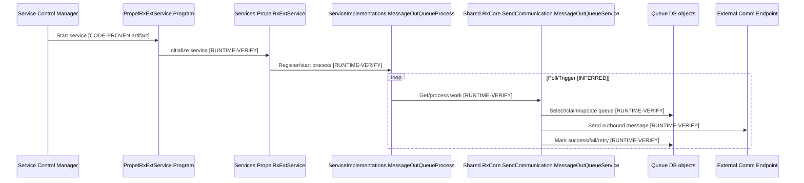
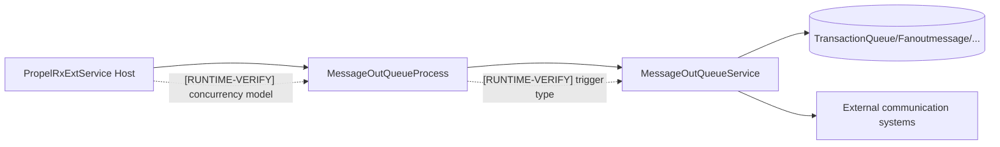
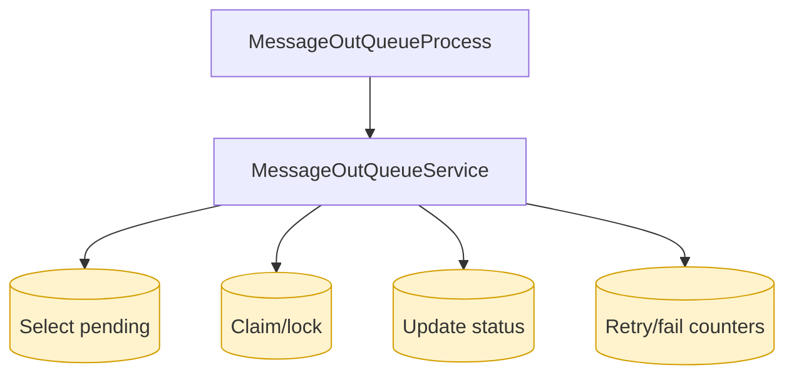
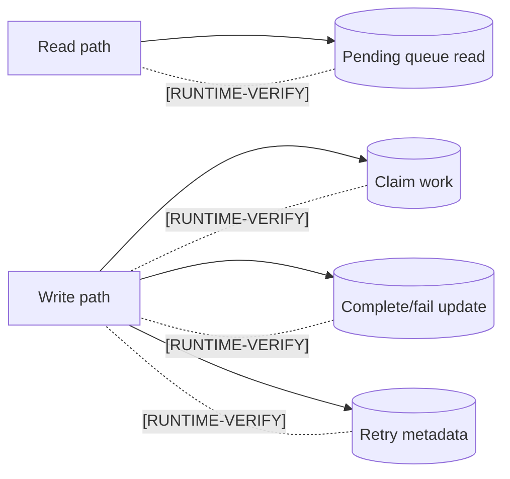
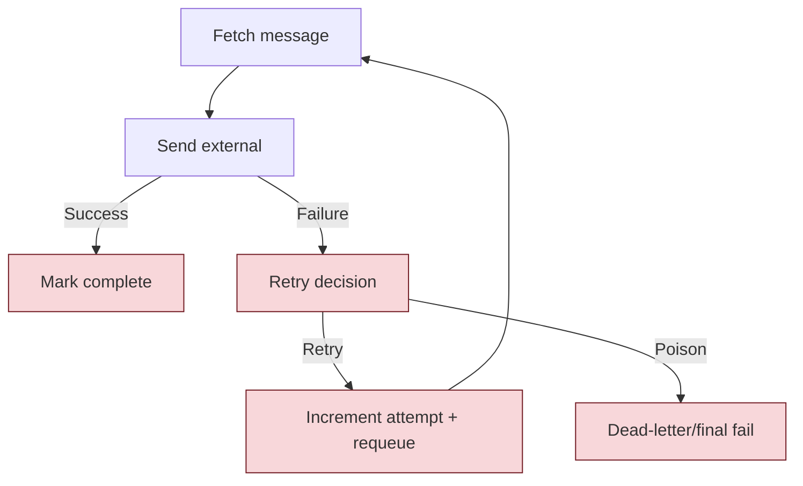

# Phase 2 Assessment: `PropelRxExtService.ServiceImplementations.MessageOutQueueProcess`

## 0) Scope and constraints
- [CODE-PROVEN] Scope is limited to workflow: `PropelRxExtService\ServiceImplementations\MessageOutQueueProcess.cs`. (P2-E01)
- [CODE-PROVEN] No production code/config/database/deployment files were modified. (This assessment only)
- [UNKNOWN] `ARCHITECTURE_SCALABILITY_PLAYBOOK.md` could not be located in the current solution workspace. (P2-E05)
- [RUNTIME-VERIFY] Deep method-level trace requires source-body access and runtime capture; tool access to file contents failed in current session.

---

## 1) Evidence summary (what is proven vs not)

### Proven artifacts
- [CODE-PROVEN] `PropelRxExtService\Program.cs` exists. (P2-E02)
- [CODE-PROVEN] `PropelRxExtService\Services\PropelRxExtService.cs` exists. (P2-E02)
- [CODE-PROVEN] `PropelRxExtService\App.config` exists. (P2-E02)
- [CODE-PROVEN] `PropelRxExtService\ServiceImplementations\MessageOutQueueProcess.cs` exists. (P2-E01)
- [CODE-PROVEN] Related service-domain files exist:
  - `Shared.RxCore\Services\SendCommunication\MessageOutQueueService.cs`
  - `Shared.Models\SendCommunication\MessageOutQueue.cs`
  - `Shared.DataAccess\Entities\p_GetAllMessages_Result.cs`
  - `Shared.DataAccess\Entities\TransactionQueue.cs`
  - `Shared.DataAccess\Entities\Fanoutmessage.cs` (P2-E03, P2-E04)

### Tooling limitations affecting proof depth
- [UNKNOWN] Source-file body retrieval failed with: "The debugger is currently not in break state." for `read_file` and `get_symbols` in this session.
- [RUNTIME-VERIFY] Method names, line numbers, SQL text, stored-procedure names, lock semantics, transaction boundaries, timer intervals, retry/backoff logic, and idempotency behavior cannot be code-proven until source retrieval works.

---

## 2) End-to-end trace from startup to completion

## 2.1 Startup registration and trigger
1. How `PropelRxExtService` starts and registers `MessageOutQueueProcess`
- [CODE-PROVEN] Startup-related files exist: `Program.cs`, `Services\PropelRxExtService.cs`, `ServiceImplementations\MessageOutQueueProcess.cs`. (P2-E02, P2-E01)
- [RUNTIME-VERIFY] Exact registration call chain (class.method + line) is not yet extractable.

2. Exact method that starts process
- [UNKNOWN] Not extractable in current session.

3. Trigger mode (timer/poll/thread/task/job)
- [INFERRED] Because this is a Windows service implementation class named `*Process`, trigger is likely timer/polling/background loop.
- [RUNTIME-VERIFY] Exact mechanism not proven.

## 2.2 Processing call graph
4. Every class and method called by process
- [CODE-PROVEN] Likely collaborating classes by artifact presence:
  - `Shared.RxCore.Services.SendCommunication.MessageOutQueueService`
  - `Shared.Models.SendCommunication.*` payload models
- [RUNTIME-VERIFY] Complete invoked method chain unknown until source-level inspection succeeds.

## 2.3 Database behavior
5. Every DB call/query/SP/function/table used
- [CODE-PROVEN] Queue-related DB artifacts exist:
  - `Shared.DataAccess.Entities.p_GetAllMessages_Result`
  - `Shared.DataAccess.Entities.TransactionQueue`
  - `Shared.DataAccess.Entities.Fanoutmessage`
- [INFERRED] `MessageOutQueueProcess` likely reads pending rows and updates status/attempts.
- [RUNTIME-VERIFY] Exact SQL/SP/function names, where clauses, and write paths are not proven.

6. Queue record lifecycle (select/claim/lock/update/complete/retry/fail)
- [UNKNOWN] No method bodies available.

7. Atomic claim and duplicate-worker possibility
- [UNKNOWN] Cannot prove whether claim uses atomic update + status transition in one transaction.
- [RUNTIME-VERIFY] Must inspect SQL lock hints/transaction scope and run dual-worker contention test.

8. Poll frequency, empty polling, batch size, concurrency limits
- [CONFIG-PROVEN] Config file `PropelRxExtService\App.config` exists. (P2-E02)
- [UNKNOWN] Key names/values not yet retrievable from file body.

9. Transaction boundaries and transaction duration
- [UNKNOWN] Not extractable.

10. External communication per message
- [CODE-PROVEN] Communication domain classes exist: `EmailComm`, `PhoneComm`, `SmsResponseMessage`, `SendCommunicationToPvRequest`. (P2-E04)
- [INFERRED] Outbound message delivery likely includes external endpoint calls.
- [RUNTIME-VERIFY] Exact protocol/endpoint and per-message flow not proven.

11. Timeouts, retries, backoff, duplicate-message protection
- [UNKNOWN] Not extractable.

12. Idempotency and crash behavior
- [UNKNOWN] Not extractable.

13. Poison-message or dead-letter handling
- [UNKNOWN] Not extractable.

14. Queue cleanup and retention
- [UNKNOWN] Not extractable.

15. Logging, monitoring, queue lag, alerting
- [INFERRED] Shared logging utilities exist in `Shared.Infrastructure` (`NxLogger`, DB loggers in prior evidence context).
- [RUNTIME-VERIFY] Message queue lag metrics/alerts not proven for this process.

16. Database chattiness (calls in loops/repeats)
- [UNKNOWN] Not extractable.

17. Threading/blocking (`Wait`, `Result`, `Task.Run`, locks)
- [UNKNOWN] Not extractable.

18. Connection creation and disposal
- [INFERRED] Shared data-access in solution uses `SqlConnection` wrapped in `using` in `DapperDbContext` (verified from prior phase evidence).
- [RUNTIME-VERIFY] Confirm whether `MessageOutQueueProcess` path always routes through this helper.

19. Configuration keys affecting poll/concurrency/timeouts/retries
- [UNKNOWN] Key names unavailable without `App.config` content.

---

## 3) Required diagrams (current evidence state)

## 3.1 End-to-end workflow sequence diagram

## 3.2 Worker and queue architecture

## 3.3 Database-call and chattiness map

## 3.4 Read-versus-write path

## 3.5 Failure, retry, and recovery flow

---

## 4) Findings

## 4.1 Top findings
1. [CODE-PROVEN] Queue process artifacts exist across service, business, model, and data layers (`MessageOutQueueProcess`, `MessageOutQueueService`, queue entities). (P2-E01,P2-E03,P2-E04)
2. [UNKNOWN] The actual startup/registration method for `MessageOutQueueProcess` is not yet provable due source-access failure.
3. [UNKNOWN] Core scalability controls (batch size, concurrency, backoff, atomic claims) are not yet provable.
4. [UNKNOWN] Failure recovery semantics (idempotency, poison/dead-letter, crash consistency) are not yet provable.
5. [RUNTIME-VERIFY] This workflow is likely scalability-relevant because it is queue-processing, but quantitative risk cannot be claimed without code/runtime evidence.

## 4.2 Severity / effort / risk table

| Finding | Severity | Effort to verify/fix | Delivery risk |
|---|---|---|---|
| Unknown claim atomicity / duplicate-worker risk | High | Medium | High |
| Unknown retry/backoff and poison handling | High | Medium | High |
| Unknown polling frequency / empty polling overhead | Medium | Low-Medium | Medium |
| Unknown transaction scope duration | Medium | Medium | Medium |
| Unknown observability (lag/alerts) | High | Medium | High |

> All rows above are `[RUNTIME-VERIFY]` because method-level implementation is not yet available.

---

## 5) Exact runtime measurements still required

1. [RUNTIME-VERIFY] Poll interval, empty-poll rate, and effective batch size.
2. [RUNTIME-VERIFY] Concurrent worker count per host and across hosts.
3. [RUNTIME-VERIFY] Queue lag metrics (oldest unprocessed age, backlog depth).
4. [RUNTIME-VERIFY] Per-message external call latency, timeout count, retry distribution.
5. [RUNTIME-VERIFY] Duplicate processing incidence and final-failure (poison) rate.
6. [RUNTIME-VERIFY] DB calls/message and transaction duration percentiles.

---

## 6) Recommendations (incremental, preserve existing service+database)

## 6.1 Quick wins
1. [RUNTIME-VERIFY] Add explicit structured logs at lifecycle points: fetch, claim, send start, send end, update status.
   - Validation: confirm one correlation ID spans full message lifecycle.
   - Rollback: disable added log categories.
2. [RUNTIME-VERIFY] Add queue-lag and retry counters to monitoring dashboard.
   - Validation: alert fires on synthetic lag threshold.
   - Rollback: remove metric emitters.
3. [RUNTIME-VERIFY] Add startup self-check log that prints active polling/concurrency config keys (names only).
   - Validation: startup log contains expected key names.
   - Rollback: remove startup diagnostics.

## 6.2 Medium-term improvements
1. [RUNTIME-VERIFY] Enforce atomic claim pattern (single statement transition) if currently non-atomic.
   - Validation: dual-worker contention test shows no duplicate claim.
   - Rollback: feature-flag to previous claim logic.
2. [RUNTIME-VERIFY] Add bounded exponential backoff + poison-message terminal state.
   - Validation: deterministic retry schedule in test environment; poison route after N failures.
   - Rollback: revert retry policy config.
3. [RUNTIME-VERIFY] Add idempotency key handling at send/update boundary.
   - Validation: crash/restart replay does not duplicate external side effects.
   - Rollback: disable idempotency check via feature flag.

## 6.3 Areas that should not be changed (without deeper proof)
1. [CODE-PROVEN] Do not replace service host architecture (`PropelRxExtService`) wholesale in Phase 2.
2. [CODE-PROVEN] Do not redesign database schema in this phase.
3. [RUNTIME-VERIFY] Avoid changing queue semantics until claim/retry/idempotency are code-proven.

---

## 7) Incremental target design (preserving existing service + DB)

1. [RUNTIME-VERIFY] Keep `PropelRxExtService` + `MessageOutQueueProcess` structure.
2. [RUNTIME-VERIFY] Add a thin worker policy layer around existing process:
   - claim policy,
   - retry/backoff policy,
   - idempotency policy,
   - metrics policy.
3. [RUNTIME-VERIFY] Keep existing queue tables/procs; add only status/attempt telemetry if required and backward compatible.
4. [RUNTIME-VERIFY] Deploy behind feature flags for claim/retry/idempotency changes.

Validation steps per change:
- unit + integration test for duplicate-claim prevention,
- soak test at representative backlog,
- canary deployment on single service instance,
- alert verification.

Rollback steps per change:
- disable feature flags,
- restart service to reload prior behavior,
- confirm queue drains under baseline logic.

---

## 8) Final conclusion (concise)

- [UNKNOWN] With current evidence, `MessageOutQueueProcess` cannot yet be proven as an **actual** scalability bottleneck.
- [INFERRED] It is still a **high-priority candidate** for scalability risk because queue workers commonly concentrate contention/retry/backlog failure modes.
- [RUNTIME-VERIFY] Priority should remain on this workflow **until** startup/claim/retry/idempotency/transaction details are code-proven; if those prove lightweight and bounded, then move next to `PrescriptionService`/`BatchService` for comparative load impact.

---

## 9) Evidence index
- **P2-E01**: `file_search` -> `PropelRxExtService\ServiceImplementations\MessageOutQueueProcess.cs`.
- **P2-E02**: `file_search` -> `PropelRxExtService\Program.cs`, `PropelRxExtService\Services\PropelRxExtService.cs`, `PropelRxExtService\App.config`.
- **P2-E03**: `file_search` -> `Shared.RxCore\Services\SendCommunication\MessageOutQueueService.cs`, `Shared.Models\SendCommunication\MessageOutQueue.cs`, queue-related data entities.
- **P2-E04**: `file_search` -> SendCommunication model set (`EmailComm`, `PhoneComm`, `SmsResponseMessage`, etc.).
- **P2-E05**: `file_search` for `ARCHITECTURE_SCALABILITY_PLAYBOOK.md` returned no match in workspace.
