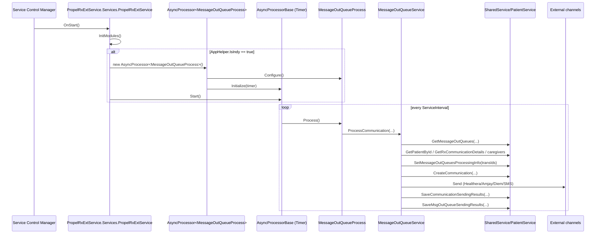
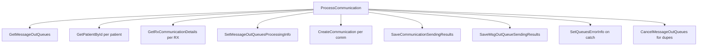
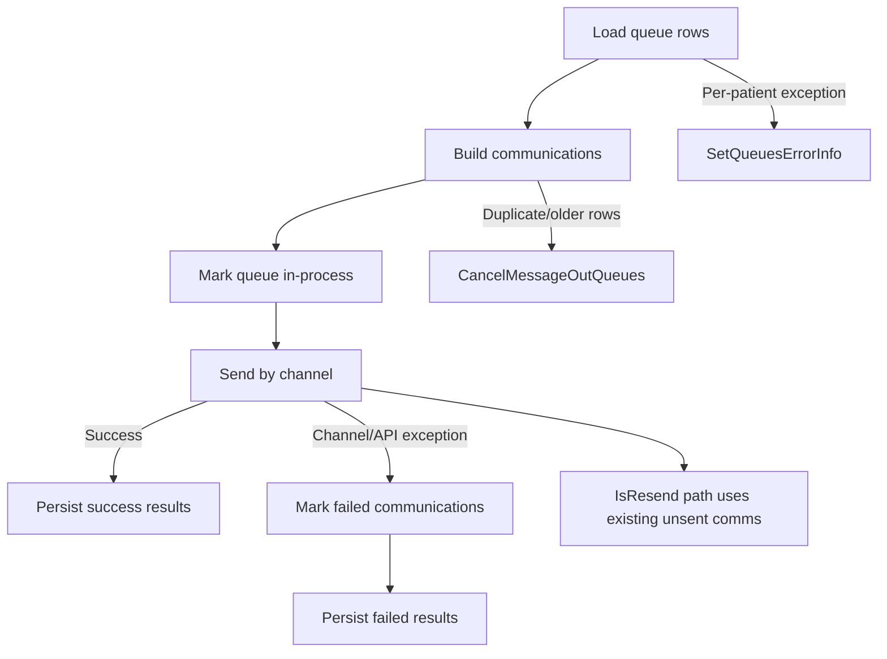

# Phase 2 Assessment: `PropelRxExtService.ServiceImplementations.MessageOutQueueProcess`

## 0) Scope, constraints, and evidence quality
- [CODE-PROVEN] Workflow analyzed: `PropelRxExtService.ServiceImplementations.MessageOutQueueProcess`.
- [CODE-PROVEN] No production code/config/database/deployment artifacts were modified.
- [UNKNOWN] `ARCHITECTURE_SCALABILITY_PLAYBOOK.md` was not found in workspace in this session.
- [CODE-PROVEN] Analysis below is based on source snippets provided for these files/classes:
  - `PropelRxExtService\Services\PropelRxExtService.cs` (`PropelRxExtService` service host)
  - `PropelRxExtService\ServiceImplementations\MessageOutQueueProcess.cs`
  - `Shared.Infrastructure\Services\AsyncProcessor.cs`
  - `Shared.Infrastructure\Services\AsyncProcessorBase.cs`
  - `Shared.RxCore\Services\SendCommunication\MessageOutQueueService.cs`

> Line numbers are marked **N/A** where snippet line numbers were not included.

---

## 1) Real startup trigger -> completion trace

## 1.1 Service startup and registration
1. [CODE-PROVEN] `PropelRxExtService.Services.PropelRxExtService.OnStart(string[] args)` calls:
   - `ServiceInitHelper.Build().OnInit(InitModules).OnRun(() => _asyncProcessors.ForEach(p => p.Start())).Begin()`.
   - Citation: **E01** (`PropelRxExtService.cs`, class `PropelRxExtService`, method `OnStart`, line N/A).

2. [CODE-PROVEN] `InitModules()` registers `MessageOutQueueProcess` only when `AppHelper.IsIndy` is true:
   - `_asyncProcessors.Add(new AsyncProcessor<MessageOutQueueProcess>());`
   - Citation: **E01** (`PropelRxExtService.cs`, method `InitModules`, line N/A).

3. [CODE-PROVEN] Processor construction path:
   - `new AsyncProcessor<MessageOutQueueProcess>()` -> `AsyncProcessor<UOWType>.ctor` creates UOW and calls `Configure()` and `Initialize()`.
   - Citation: **E03** (`AsyncProcessor.cs`, class `AsyncProcessor<UOWType>`, ctor, line N/A).

4. [CODE-PROVEN] Actual periodic trigger is timer-driven in `AsyncProcessorBase.Initialize()`:
   - `_timer = new Timer(Configuration.ServiceInterval.TotalMilliseconds)`
   - `_timer.Elapsed += Timer_Elapsed`
   - `Start()` starts timer; `Timer_Elapsed` invokes `AsyncProcessInstance.Process()`.
   - Citation: **E04** (`AsyncProcessorBase.cs`, methods `Initialize`, `Start`, `Timer_Elapsed`, line N/A).

## 1.2 Exact process start method and call chain
5. [CODE-PROVEN] Work cycle entry for this workflow is `MessageOutQueueProcess.Process()`.
   - Citation: **E02** (`MessageOutQueueProcess.cs`, class `MessageOutQueueProcess`, method `Process`, line N/A).

6. [CODE-PROVEN] `MessageOutQueueProcess.Process()` calls:
   - `ServiceManager.Instance<MessageOutQueueService>().ProcessCommunication(queueTimeInSecond, requestDelayTimeInSecond, downTimeSendDelayInSecond, groupingQueueTimeInSecond)`.
   - Citation: **E02**.

## 1.3 Completion path
7. [CODE-PROVEN] `MessageOutQueueService.ProcessCommunication(...)` iterates patients and performs:
   - queue retrieval,
   - per-patient communication building,
   - queue in-process flag update,
   - communication record create/update,
   - external send,
   - success/failure persistence.
   - Citation: **E05** (`MessageOutQueueService.cs`, method `ProcessCommunication`, line N/A).

---

## 2) Trigger type, threading, blocking, concurrency

1. [CODE-PROVEN] Trigger type: **timer polling** (`System.Timers.Timer`).
   - Citation: **E04**.

2. [CODE-PROVEN] Single-flight per processor instance:
   - `Timer_Elapsed` returns if `_isRunning == true`.
   - Timer stopped before run, restarted in finally.
   - Citation: **E04**.

3. [CODE-PROVEN] Blocking call present in workflow:
   - `Thread.Sleep(TimeSpan.FromSeconds(requestDelayTimeInSecond))` in per-patient loop.
   - Citation: **E05** (`ProcessCommunication`, line N/A).

4. [RUNTIME-VERIFY] Cross-process concurrency limit is unknown (multiple service instances/machines may run same process).

5. [UNKNOWN] Global lock/coordinator preventing parallel queue workers across hosts is not visible in provided snippets.

---

## 3) Configuration values affecting behavior (key names only)

From `MessageOutQueueProcess.MessageOutQueueProcessConfig.ParseConfiguration()`:
- [CONFIG-PROVEN] `queueTimeInSecond`
- [CONFIG-PROVEN] `requestDelayTimeInSecond`
- [CONFIG-PROVEN] `downTimeSendDelayInSecond`
- [CONFIG-PROVEN] `groupingQueueTime`
- Citation: **E02** (`MessageOutQueueProcess.cs`, nested class `MessageOutQueueProcessConfig`, method `ParseConfiguration`, line N/A).

Additional behavior dependency:
- [CONFIG-PROVEN] Polling interval uses `Configuration.ServiceInterval` from `AsyncProcessConfigInstance` (actual key name/value not shown in provided snippets).
- Citation: **E04**.

---

## 4) Full class/method flow for the workflow

## 4.1 `MessageOutQueueProcess`
- [CODE-PROVEN] `Configure()`:
  - `AppHelper.GetModuleConfig(ModuleName)`
  - builds `MessageOutQueueProcessConfig`
  - attaches `AppSvcMonitorManager`
- [CODE-PROVEN] `Process()` delegates to `MessageOutQueueService.ProcessCommunication(...)`.
- Citation: **E02**.

## 4.2 `MessageOutQueueService.ProcessCommunication(...)`
Per run:
1. [CODE-PROVEN] Load queue candidates:
   - `SharedService.GetMessageOutQueues(queueTimeInSecond, downTimeSendDelayInSecond)`.
2. [CODE-PROVEN] Build patient id set (`Distinct`).
3. [CODE-PROVEN] Optional grouping cleanup when SMS enabled:
   - `SmsPrescriptionsGrouping.ClearGroupingTimerForPatientWithoutQueue(...)`.
4. [CODE-PROVEN] For each patient:
   - `PatientService.GetPatientById(patientId)`
   - optional `SmsPrescriptionsGrouping.Process(...)`
   - `BuildNotificationCommunications(...)`
   - `SharedService.SetMessageOutQueuesProcessingInfo(transIds)`
   - `SaveCommunications(...)`
   - `SendPatientCommunications(...)`
   - optional `Thread.Sleep(...)`
5. [CODE-PROVEN] Per-patient catch writes DB log and queue error info:
   - `SharedService.SetQueuesErrorInfo(errorDesc, transIds)`.
- Citation: **E05**.

## 4.3 Communication builders and duplicate suppression
- [CODE-PROVEN] `BuildCommunications(...)` filters queue by transaction/entity/message type and picks latest queue per RX (`GroupBy(EntityId).Select(First)`), marks older as duplicates.
- [CODE-PROVEN] Duplicate queue rows are canceled later by `CancelMessageOutQueues(transIds)`.
- [CODE-PROVEN] Resend logic uses existing comm lookup (`_unsentComms`/`_sentComms`) to avoid duplicate send creation.
- [CODE-PROVEN] Sent statuses list includes: `TS`, `CO`, `TC`, `CA`.
- Citation: **E05** (`BuildCommunications`, `BuildPickupCommunication`, `GetExistingCommunications`, `SaveCommunications`, line N/A).

## 4.4 External send branches
- [CODE-PROVEN] Channel routing in `SendPatientCommunications(...)`:
  - Healthera -> `SendPatientCommunicationToHealthera`
  - Amjay -> `SendPatientCommunicationToAmjay`
  - Diem -> `SendPatientCommunicationToDiem`
  - PropelRx + TXT -> `SendPatientCommunicationsToSms`
- Citation: **E05**.

### Healthera
- [CODE-PROVEN] Endpoint path: `host + "SendCommunication"`.
- [CODE-PROVEN] Per communication HTTP POST with auth headers and correlation id.
- [CODE-PROVEN] Persist send outcomes via `SaveCommunicationSendingResults(...)`.
- Citation: **E05**.

### Amjay
- [CODE-PROVEN] Endpoint path: `host + "SendCommunication"`.
- [CODE-PROVEN] Sends grouped `PatientCommunication` payload.
- Citation: **E05**.

### Diem
- [CODE-PROVEN] Uses `DiemWebRefillService.RxReadyNotification(...)` with `RxNotificationModel` list.
- Citation: **E05**.

### SMS
- [CODE-PROVEN] Endpoint path: `host + "SendCommunications"`.
- [CODE-PROVEN] Adds `pharmacyName` additional data, normalizes phone with `+1`, groups by `TypeCode`, posts per type group.
- [CODE-PROVEN] Handles `CustomHttpException`, parses response code `003` for invalid phone.
- [CODE-PROVEN] Updates patient opt-in error state with `SharedService.SavePatientOptIn(...)`.
- Citation: **E05**.

---

## 5) Database calls, SQL objects, queue lifecycle

## 5.1 Directly observed service-layer DB-facing calls (through `SharedService`/`PatientService`)
- [CODE-PROVEN] `GetMessageOutQueues(...)`
- [CODE-PROVEN] `SetMessageOutQueuesProcessingInfo(transIds)`
- [CODE-PROVEN] `SetQueuesErrorInfo(errorDesc, transIds)`
- [CODE-PROVEN] `CreateCommunication(comm)`
- [CODE-PROVEN] `CancelMessageOutQueues(transIds)`
- [CODE-PROVEN] `GetCommunications(patientId, transIdsStr)`
- [CODE-PROVEN] `SaveCommunicationSendingResults(...)`
- [CODE-PROVEN] `SaveMsgOutQueueSendingResults(...)`
- [CODE-PROVEN] `IsPatientInCare(patientId)`
- [CODE-PROVEN] `GetCaregiversForPickupReminders(...)`
- [CODE-PROVEN] `GetRxCommunicationDetails(entityId)`
- [CODE-PROVEN] `PatientService.GetPatientById(...)`
- Citation: **E05**.

## 5.2 SQL objects (SP/functions/tables)
- [UNKNOWN] Exact SQL text, stored procedures, table names, and lock hints are not in provided snippets.
- [INFERRED] Queue persistence likely uses queue/communication tables backing `MessageOutQueue` and `Communication` models.
- [RUNTIME-VERIFY] Need DAO/source SQL or profiler trace to enumerate exact SQL objects.

## 5.3 Queue select/claim/complete/retry/fail path
- [CODE-PROVEN] Select: `GetMessageOutQueues(...)`.
- [CODE-PROVEN] Claim/in-process: `SetMessageOutQueuesProcessingInfo(transIds)` before send.
- [CODE-PROVEN] Complete/fail update: `SaveMsgOutQueueSendingResults(...)` after send.
- [CODE-PROVEN] Duplicate stale queue cleanup: `CancelMessageOutQueues(transIds)`.
- [CODE-PROVEN] Error tagging on exception: `SetQueuesErrorInfo(...)`.
- [UNKNOWN] Atomicity/transactional guarantees of claim/update operations.

## 5.4 Could two workers process same record?
- [CODE-PROVEN] Intra-instance overlap is prevented by `_isRunning` guard and timer stop/start.
- [UNKNOWN] Inter-instance duplicate processing depends on DB claim atomicity inside `SetMessageOutQueuesProcessingInfo`; not visible.
- [RUNTIME-VERIFY] Multi-instance contention test required.

---

## 6) Retry, backoff, idempotency, poison handling, crash behavior

1. [CODE-PROVEN] Explicit exponential backoff is **not** implemented in shown code.
2. [CODE-PROVEN] Retry-like behavior exists through resend queue path (`IsResend` + `_unsentComms` retrieval) and status checks.
3. [CODE-PROVEN] Duplicate-send protection exists at app level by checking `_sentComms` and selecting latest queue per RX.
4. [UNKNOWN] Hard retry limits, poison/dead-letter queues, and retention windows are not visible.
5. [UNKNOWN] Crash consistency of in-process claimed rows depends on DB layer logic not shown.

Citation: **E05**.

---

## 7) Polling frequency, empty polling, batch size, chattiness

- [CODE-PROVEN] Poll frequency controlled by timer interval `Configuration.ServiceInterval`.
- [CONFIG-PROVEN] Candidate selection window controlled by `queueTimeInSecond` and `downTimeSendDelayInSecond`.
- [CODE-PROVEN] No explicit fixed batch-size cap shown in `ProcessCommunication`; iterates all returned queue rows grouped by patient.
- [CODE-PROVEN] Chattiness hotspots:
  1. `GetPatientById` per patient and per caregiver.
  2. `GetRxCommunicationDetails` per latest queue message.
  3. Per-message HTTP POSTs in Healthera path.
  4. Per-type grouped HTTP POSTs in SMS path.
  5. Per-communication `CreateCommunication` when `Id <= 0`.
- [RUNTIME-VERIFY] Empty poll rates and DB call volumes require instrumentation.

Citation: **E04,E05**.

---

## 8) Connection creation/disposal and transaction boundaries

- [UNKNOWN] `MessageOutQueueService` does not directly show `SqlConnection`; connections are hidden behind `SharedService/PatientService`.
- [RUNTIME-VERIFY] Need DAO-level methods called by above service methods to prove connection lifetime and transaction scope.

---

## 9) Logging, monitoring, queue-lag, alerting

- [CODE-PROVEN] Logging exists:
  - `NxLogger.DbLogger.LogInError_Log(...)` in process and send branches.
- [CODE-PROVEN] Processor telemetry exists via `Configuration.AppSvcLogger.UpdateLastRunTime()` and exception tracking in `AsyncProcessorBase`.
- [UNKNOWN] Queue lag metric and alert thresholds are not visible in provided snippets.

Citation: **E02,E04,E05**.

---

## 10) Mermaid diagrams

## 10.1 End-to-end workflow sequence


## 10.2 Worker and queue architecture
```mermaid
flowchart LR
    Host[PropelRxExtService] --> Proc[AsyncProcessor<MessageOutQueueProcess>]
    Proc --> Timer[AsyncProcessorBase.Timer]
    Timer --> UOW[MessageOutQueueProcess.Process]
    UOW --> Core[MessageOutQueueService.ProcessCommunication]
    Core --> DBAPI[SharedService/PatientService APIs]
    Core --> CH[Healthera | Amjay | Diem | SMS]

    DBAPI -. [RUNTIME-VERIFY] SQL/SP objects .-> DB[(Queue + Communication DB)]
```

## 10.3 Database-call and chattiness map


## 10.4 Read vs write path
```mermaid
flowchart LR
    R[Read path] --> R1[GetMessageOutQueues]
    R --> R2[GetPatientById]
    R --> R3[GetRxCommunicationDetails]
    R --> R4[GetCommunications (resend)]

    W[Write path] --> W1[SetMessageOutQueuesProcessingInfo]
    W --> W2[CreateCommunication]
    W --> W3[SaveCommunicationSendingResults]
    W --> W4[SaveMsgOutQueueSendingResults]
    W --> W5[CancelMessageOutQueues]
    W --> W6[SetQueuesErrorInfo]
```

## 10.5 Failure/retry/recovery flow


---

## 11) Top findings

1. [CODE-PROVEN] `MessageOutQueueProcess` is a timer-polled background worker started only for Indy stores (`AppHelper.IsIndy`).
2. [CODE-PROVEN] Queue flow includes explicit in-process marking and post-send result persistence, but transaction/atomicity is hidden in service/DAO methods.
3. [CODE-PROVEN] App-level duplicate suppression exists (latest-per-RX + sent-status checks + duplicate queue cancellation).
4. [CODE-PROVEN] Blocking `Thread.Sleep(...)` inside patient loop can reduce throughput under load.
5. [HIGH-RISK][CODE-PROVEN] `ProcessCommunication(...)` always returns `true`; `MessageOutQueueProcess.Process()` error branch on `!isSuccess` may never trigger.
6. [HIGH-RISK][CODE-PROVEN] `SendPatientCommunicationToDiem(...)` does not add successful communications to success list before saving results.
7. [MEDIUM-RISK][CODE-PROVEN] `First(...)` then null-check pattern for interface lookup can throw before null-check (`Healthera/Amjay/SMS`).

Citations: **E01,E02,E04,E05**.

---

## 12) Severity / effort / risk table

| Topic | Severity | Effort | Risk if unchanged | Evidence |
|---|---|---:|---|---|
| Inter-instance duplicate claim atomicity unknown | High | Medium | Duplicate sends / race | E05 + [RUNTIME-VERIFY] DAO |
| `ProcessCommunication` always true | Medium | Low | Silent degradation of process-level health signal | E02,E05 |
| Diem success persistence gap | High | Medium | Queue rows may not transition correctly on success | E05 |
| Blocking `Thread.Sleep` in loop | Medium | Low | Throughput throttling at high volume | E05 |
| Chattiness (per-patient/per-caregiver fetches) | Medium | Medium | Excess DB round trips | E05 |
| Retry/backoff/poison handling unclear | High | Medium | Repeated failures / backlog growth | E05 + [RUNTIME-VERIFY] |

---

## 13) Exact runtime measurements still required

1. [RUNTIME-VERIFY] Actual `ServiceInterval` and observed poll cadence.
2. [RUNTIME-VERIFY] Rows returned per poll, empty-poll frequency, and backlog age.
3. [RUNTIME-VERIFY] Duplicate claim incidence with 2+ worker instances.
4. [RUNTIME-VERIFY] External channel latency/error distribution by channel.
5. [RUNTIME-VERIFY] DB calls per message and end-to-end processing time percentiles.
6. [RUNTIME-VERIFY] Queue state transition completeness (especially Diem path).

---

## 14) Quick wins (no architecture rewrite)

1. [RECOMMENDATION][RUNTIME-VERIFY] Add explicit run metrics (rows fetched, rows sent, rows failed, queue lag) per cycle.
   - Validation: metrics visible and monotonic by cycle.
   - Rollback: disable metric emitter switch.

2. [RECOMMENDATION][RUNTIME-VERIFY] Replace blocking `Thread.Sleep` with non-blocking delay model in worker loop policy layer.
   - Validation: same functional output; better overlap utilization.
   - Rollback: feature-flag back to current pacing.

3. [RECOMMENDATION][RUNTIME-VERIFY] Add guard assertions for send-result persistence counts per channel.
   - Validation: success + fail count matches attempted count.
   - Rollback: disable assertion logging.

4. [RECOMMENDATION][RUNTIME-VERIFY] Add deterministic idempotency key checks at DB layer for queue trans id + recipient + type.
   - Validation: no duplicate external sends under retry/restart tests.
   - Rollback: disable idempotency check path.

---

## 15) Medium-term improvements (preserve existing service + DB)

1. [RECOMMENDATION][RUNTIME-VERIFY] Make queue claim/update atomic in one DB transaction with clear state transitions.
2. [RECOMMENDATION][RUNTIME-VERIFY] Introduce explicit retry policy (bounded attempts + backoff + poison terminal state).
3. [RECOMMENDATION][RUNTIME-VERIFY] Reduce DB chattiness via batched lookups for patient/rx/caregiver data.
4. [RECOMMENDATION][RUNTIME-VERIFY] Add per-channel circuit-breaker behavior for prolonged endpoint downtime.

Validation and rollback for each:
- Validate in staging with synthetic queue load + controlled endpoint failures.
- Roll back via feature flags/process config and restart service.

---

## 16) Areas that should not be changed now

1. [CODE-PROVEN] Keep current service host topology (`PropelRxExtService` + `AsyncProcessor` model) for incremental hardening.
2. [RUNTIME-VERIFY] Do not alter queue schema/state machine semantics before DAO SQL is fully traced.
3. [RUNTIME-VERIFY] Do not tune poll interval/concurrency blindly without runtime baseline metrics.

---

## 17) Incremental target design (compatible with existing system)

- [INFERRED] Retain `MessageOutQueueProcess` as worker shell.
- [INFERRED] Add a small policy layer in `MessageOutQueueService` for:
  - atomic claim abstraction,
  - retry/backoff policy,
  - idempotency enforcement,
  - standardized metrics emission.
- [INFERRED] Keep channel-specific send methods but unify result accounting contract.

---

## 18) Final conclusion (scalability priority)

- [CODE-PROVEN] `MessageOutQueueProcess` is a real timer-driven queue workflow with external IO and many DB touchpoints.
- [INFERRED] This makes it a **meaningful scalability risk candidate**.
- [RUNTIME-VERIFY] Final priority versus other workflows depends on measured backlog/latency/duplicate rates, but based on architecture characteristics and current code shape, it should remain a top Phase 2 scalability target.

### Separate recommendation for SQL login failure track
- [CODE-PROVEN] Message workflow depends on SharedService/DAO calls; SQL auth issues in shared data access will impact queue processing.
- [RUNTIME-VERIFY] Continue parallel investigation of shared SQL login reliability and credential-refresh path, because queue scalability improvements do not help if DB auth is unstable.

---

## 19) Evidence index

- **E01** Project: `PropelRxExtService`; File: `Services\PropelRxExtService.cs`; Class: `PropelRxExtService`; Methods: `OnStart`, `InitModules`, `OnPause`, `OnContinue`, `OnStop`; Line: N/A.
- **E02** Project: `PropelRxExtService`; File: `ServiceImplementations\MessageOutQueueProcess.cs`; Class: `MessageOutQueueProcess`; Methods: `Configure`, `Process`; Nested class `MessageOutQueueProcessConfig.ParseConfiguration`; Line: N/A.
- **E03** Project: `Shared.Infrastructure`; File: `Services\AsyncProcessor.cs`; Class: `AsyncProcessor<UOWType>`; Method: constructor; Line: N/A.
- **E04** Project: `Shared.Infrastructure`; File: `Services\AsyncProcessorBase.cs`; Class: `AsyncProcessorBase`; Methods: `Initialize`, `Timer_Elapsed`, `Start`, `Stop`, `Dispose`, `HandleException`; Line: N/A.
- **E05** Project: `Shared.RxCore`; File: `Services\SendCommunication\MessageOutQueueService.cs`; Class: `MessageOutQueueService`; Methods:
  - `ProcessCommunication`
  - `BuildNotificationCommunications`
  - `BuildCommunications`
  - `BuildPatientCommunications`
  - `BuildCaregiversCommunications`
  - `BuildPickupCommunication`
  - `CreateNewPickupCommunication`
  - `SendPatientCommunications`
  - `SendPatientCommunicationToHealthera`
  - `SendPatientCommunicationToAmjay`
  - `SendPatientCommunicationToDiem`
  - `SendPatientCommunicationsToSms`
  - `SaveCommunicationSendingResults`
  - `SaveCommunications`
  - `GetExistingCommunications`
  - `BuildOptInCommunications`
  - `BuildPickupOptInCommForPatient`
  - `CreateNewOptInCommunication`
  - `GetPhoneInformation`
  - `GetEmailInformation`
  - `GetInvalidPhoneErrorMsg`; Line: N/A.
