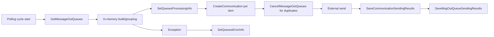
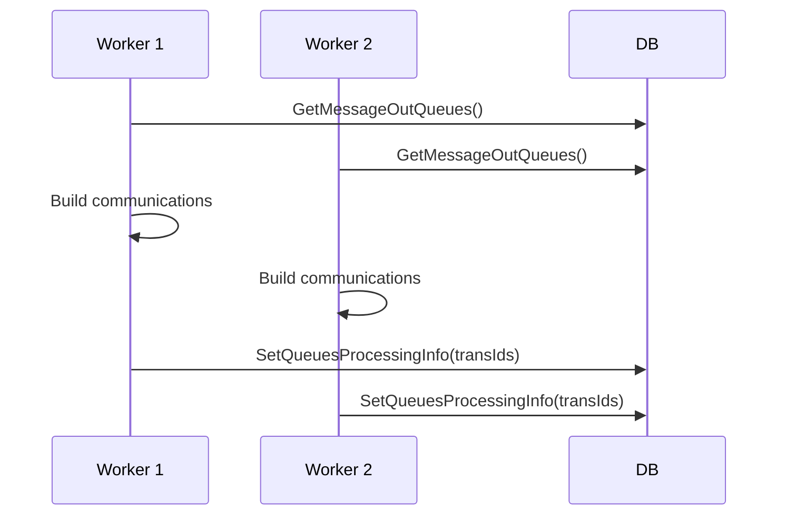

# Phase 2B — MessageOutQueueProcess DAO/SQL Gap Assessment (Completed Re-Run)

## Scope and status
This is a cohesive rewrite using direct source tracing plus SQL definitions provided in-session.

### Source files traced
- `Shared.DataAccess\Implementation\SharedDAO.cs`
- `Shared.DataAccess\Implementation\PatientDAO.cs`
- `Shared.DataAccess\Interfaces\ISharedDAO.cs`
- `Shared.DataAccess\Interfaces\IPatientDAO.cs`
- `Shared.DataAccess\DapperDbContext.cs`
- `Shared.RxCore\Services\SendCommunication\MessageOutQueueService.cs`
- `Shared.RxCore\Services\SendCommunication\CancelCommunicationService.cs`

### SQL definition availability
Definitions provided and used:
- `dbo.p_ExtendedService_GetQueues`
- `dbo.p_ExtendedService_SaveCommunicationSendingResults`
- `dbo.p_ExtendedService_SaveMsgOutQueueSendingResults`
- `dbo.p_GreenLight_SetQueuesErrorInfo`
- `dbo.p_NexApi_CancelMessageOutQueues`
- `dbo.p_GreenLight_SetQueuesProcessingInfo`
- `dbo.p_NexApi_GetCommunications`
- `dbo.p_NexApi_PTSAPI_GetRxCommunicationDetails`
- `dbo.p_NexApi_PTSAPI_GetCaregiversForPickupReminders`
- `dbo.f_IsPatientInCare`

Not found in repository search and not provided:
- None in the required method set.

---

## DAO and SQL evidence table

| Method | Project/File/Class/Line | SQL text or procedure | Params | Objects touched | R/W | Connection behavior | Transaction behavior | Call granularity | Error/retry behavior |
|---|---|---|---|---|---|---|---|---|---|
| `GetMessageOutQueues` | `Shared.DataAccess/Implementation/SharedDAO.cs` `SharedDAO.GetMessageOutQueues` `4420-4428` | `EXEC dbo.p_ExtendedService_GetQueues @QueueTimeInSec, @DownTimeSendDelayInSec` | `queueTimeInSec`, `downTimeSendDelayInSec` | `MessageOutQueue`, `Prescription`, `Patient`, `PrescriptionWorkflow`, `Communication`, `f_isMTS`, `f_preferenceRetrieve` | Read | `Query<T>` (`DapperDbContext` `101-110`) -> `ExecuteOnNewConnection` (`557-565`) | No app-layer shared transaction | Once per polling cycle (`MessageOutQueueService` `76-79`) | No local catch/retry |
| `SetQueuesProcessingInfo` | `Shared.DataAccess/Implementation/SharedDAO.cs` `4411-4418` | `EXEC dbo.p_GreenLight_SetQueuesProcessingInfo @TransactionIds` | CSV `TransactionIds` | Updates `MessageOutQueue` via `string_split`; sets `Status='I'`, `ProcessStartTime=GETDATE()`; uses `f_IsNumeric` | Write | New connection per call | Proc-local only; no conditional status predicate | Per patient iteration (`127-130`), and cancellation flow (`CancelCommunicationService` `28-31`) | No local catch/retry |
| `SetQueuesErrorInfo` | `Shared.DataAccess/Implementation/SharedDAO.cs` `4544-4552` | `EXEC dbo.p_GreenLight_SetQueuesErrorInfo @TransactionIds, @ErrorDesc` | CSV IDs, `errorDesc` | Updates `MessageOutQueue` via `string_split`; sets `Status='F'`; increments attempts; uses `f_IsNumeric` | Write | New connection per call | Proc-local only | Error path per patient (`MessageOutQueueService` `146-154`) and cancel flow (`48-55`) | No local retry |
| `CreateCommunication` | `Shared.DataAccess/Implementation/SharedDAO.cs` `4440-4468` | `EXEC dbo.p_Communication_Insert ... @NewId OUTPUT` | ~20 input params + output `@NewId` | Validates `MessageOutQueueTransId`, checks `MessageOutQueue` existence, may check `PrescriptionWorkflow` (`PIC`) and skip insert, inserts into `Communication`, logs via `p_LogNexxsysSrvMsg`/`p_LogApplicationMessage` | Write | `Execute` (`235-244`) -> new connection (`557-565`) | Proc explicitly states caller manages transaction; proc itself does not begin/commit/rollback | Per communication (`MessageOutQueueService` `1210-1217`) | Proc raises errors via `RAISERROR` on validation/insert failures; no retry logic |
| `CancelMessageOutQueues` | `Shared.DataAccess/Implementation/SharedDAO.cs` `4479-4487` | `EXEC dbo.p_NexApi_CancelMessageOutQueues @MessageOutQueueTransIds, @ReasonText` | trans IDs, reason text | Updates `MessageOutQueue`; sets `Status='C'`; uses `f_IsNumeric` | Write | New connection per call | Proc-local only | Per patient when duplicates exist (`1221-1225`) | No local retry |
| `GetCommunications` | `Shared.DataAccess/Implementation/SharedDAO.cs` `4430-4438` | `EXEC dbo.p_NexApi_GetCommunications @PatientId, @MessageOutQueueTransIds` | `patientId`, trans IDs | Reads `Communication`; filters by `MessageOutQueueTransId`, `PatientId/OnBehalfOfPatientId`; uses `string_split`, `f_IsNumeric` | Read | New connection per call | No app-layer shared transaction | Conditional resend branch (`1237-1244`) | No local retry |
| `SaveCommunicationSendingResults` | `Shared.DataAccess/Implementation/SharedDAO.cs` `4496-4506` | `EXEC dbo.p_ExtendedService_SaveCommunicationSendingResults ...` | success IDs, failed IDs, correlation, delivered flag | Updates `Communication`; failed => `FL`; success => `TS` or `CO` | Write | New connection per call | Proc-local only | Per send-result batch (`1160-1201`) | No local retry |
| `SaveMsgOutQueueSendingResults` | `Shared.DataAccess/Implementation/SharedDAO.cs` `4508-4518` | `EXEC dbo.p_ExtendedService_SaveMsgOutQueueSendingResults ...` | success trans IDs, failed trans IDs, program code, delivered flag | Reads `APPLICATIONDEF`; updates `MessageOutQueue`; uses `f_IsNumeric` | Write | New connection per call | Proc-local only | Per send-result batch (`1160-1201`) | No local retry |
| `IsPatientInCare` | `Shared.DataAccess/Implementation/SharedDAO.cs` `4520-4529` | `SELECT dbo.f_IsPatientInCare(@PatientId)` | `patientId` | Function checks `f_GetLatestConsentForPicRelationships(@PatientId,1)` for active non-expired `CGV` consent and returns bit | Read | New connection per call | No app-layer shared transaction | Per candidate communication requiring caregiver resolution (`737`) | No local retry |
| `GetCaregiversForPickupReminders` | `Shared.DataAccess/Implementation/SharedDAO.cs` `4531-4542` | `EXEC dbo.p_NexApi_PTSAPI_GetCaregiversForPickupReminders ...` | `picPatientId`, reminder/sensitive flags | Reads `Preference`, `Patient`, `PatientProgramEnrollment`; uses function `f_GetLatestConsentForPicRelationships`; filters active consent and sensitivity rules | Read | New connection per call | No app-layer shared transaction | Per eligible communication (`741-747`) | No local retry |
| `GetRxCommunicationDetails` | `Shared.DataAccess/Implementation/SharedDAO.cs` `4470-4477` | `EXEC dbo.p_NexApi_PTSAPI_GetRxCommunicationDetails @RxId` | `rxId` | Reads `Preference`, `Prescription`, `Drug`, `PrescriptionIVR` | Read | New connection per call | No app-layer shared transaction | Per latest queue item per Rx (`274-283`) | No local retry |
| `PatientDAO.GetPatient` | `Shared.DataAccess/Implementation/PatientDAO.cs` `1103-1279`, wrapper `1283-1291` | Inline patient `SELECT` + conditional dependent queries by `PatientDataPoint` | `patientId`, `loadDataPoint`/`eagerLoad` | `Patient`, `PatientNMS`, `AddressRole`, `Address`, `f_DecryptString` + additional conditional objects | Read | Each internal Dapper call opens new connection | No single transaction across full load | Per patient and per caregiver lookup | No method-level retry |

---

## Required determinations (1–11)

1. `GetMessageOutQueues` select-only vs claim behavior: **SELECT-ONLY**.
2. Selection and `SetQueuesProcessingInfo` as separate DB ops: **YES**.
3. Two workers can select same records before in-process mark: **POSSIBLE**.
4. `SetQueuesProcessingInfo` atomic conditional update: **NO**. Update is set-based for provided IDs, but has no conditional predicate (e.g., no `Status='Q'` guard).
5. Status mapping: `Q` pending, `I` in-process, `F` failed/retryable (<=3 attempts), `S/D` success completed, `C` canceled.
6. Abandoned in-process crash recovery: **No recovery logic evidenced in provided SQL set** for `I` rows; failed/down recovery exists.
7. Max batch size in queue query: **NOT EVIDENCED**.
8. DB connections opened separately per DAO call: **YES**.
9. Multiple writes for one patient share transaction: **NO APP-LAYER SHARED TRANSACTION EVIDENCE**; additionally, `p_Communication_Insert` explicitly states transaction management is caller-owned.
10. External network call while DB transaction open: **NO APP-LAYER EVIDENCE**.
11. Static DB-call-count formula: see model below.

---

## Queue status-transition table

| From | To | Trigger method | Condition |
|---|---|---|---|
| `Q/F/C` | `I` | `SetQueuesProcessingInfo` | For passed IDs, proc sets `Status='I'` and `ProcessStartTime=GETDATE()` |
| `Q/F` | `S` | `SaveMsgOutQueueSendingResults` | Success list and `@IsDelivered=0` |
| `Q/F` | `D` | `SaveMsgOutQueueSendingResults` | Success list and `@IsDelivered=1` |
| `Q/F` | `F` | `SaveMsgOutQueueSendingResults` / `SetQueuesErrorInfo` | Failed list or catch path |
| `*` | `C` | `CancelMessageOutQueues` | Duplicate queue cancellation |
| `F` | eligible retry | `GetMessageOutQueues` | `SendAttemptNumber <= 3`; includes downtime-delay branches |

---

## Transaction-boundary diagram

---

## Multi-worker race timeline

---

## Crash/restart analysis

- Retry filter: `Status='F'` with `SendAttemptNumber <= 3`.
- Downtime resend branch exists via `@DownTimeDelayDate`.
- No provided SQL path reselects `Status='I'` rows; stale in-process items require separate recovery mechanism not yet provided.

---

## Database-call-count model

Variables: `P`, `R`, `C`, `M`, `G`.

`Calls_min = 1`

`Calls_typical = 1 + P + P + R + R + R + C + M + 2G`

`Calls_worst = 1 + P + P + R + R + R + C + P + M + P + 2G + P`

---

## Defect revalidation: D-001 / D-002 / D-003

| Defect | Revalidation result | Exact citations |
|---|---|---|
| `D-001` | **Confirmed** (selection/claim split) | `MessageOutQueueService.cs` `76-79`, `127-130`; `SharedDAO.cs` `4420-4428`, `4411-4418`; `p_ExtendedService_GetQueues` is select-only |
| `D-002` | **Confirmed** (duplicate-selection window possible) | `MessageOutQueueService.cs` `76-130`, `225-320`; `p_GreenLight_SetQueuesProcessingInfo` has no conditional claim predicate |
| `D-003` | **Confirmed** (no app-layer shared transaction across multi-write flow) | `DapperDbContext.cs` `101-110`, `235-244`, `557-565`; `MessageOutQueueService.cs` `1210-1225`, `1184-1200` |

---

## Revised findings and recommendations

Findings:
1. Queue fetch is select-only; claim is separate.
2. Pre-claim race window exists.
3. Queue status evidence confirms `Q/I/F/S/D/C` including explicit in-process `I`.
4. Retry and downtime-resend logic is SQL-proven.
5. DAO behavior is connection-per-call without cross-call app transaction.

Recommendations:
1. Add conditional/atomic claim semantics to queue claim path (e.g., guard current status and return claimed rows in one operation).
2. Add stale `I` recovery strategy (timeout-based requeue to `F` or `Q`) with explicit criteria.
3. Add per-cycle telemetry (selected/claimed/duplicate/retry counts).
4. Validate current retry/downtime thresholds operationally.

_End of report._