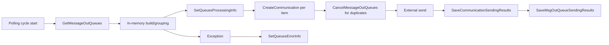
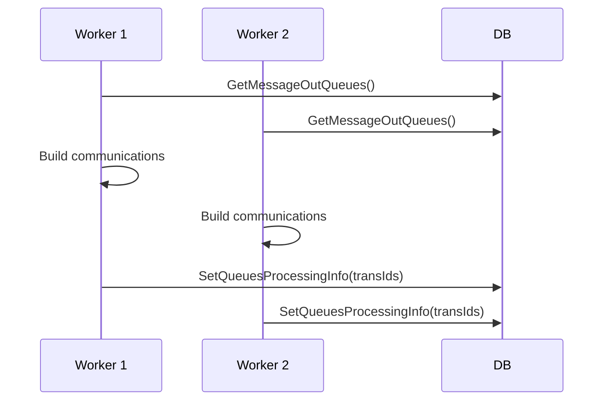

# Phase 2B — MessageOutQueueProcess DAO/SQL Gap Assessment (Completed Re-Run)

## Scope and status
This is a cohesive rewrite using direct source tracing plus SQL definitions provided in-session.

### Source files traced
- `Shared.DataAccess\Implementation\SharedDAO.cs`
- `Shared.DataAccess\Implementation\PatientDAO.cs`
- `Shared.DataAccess\Interfaces\ISharedDAO.cs`
- `Shared.DataAccess\Interfaces\IPatientDAO.cs`
- `Shared.DataAccess\DapperDbContext.cs`
- `Shared.RxCore\Services\SendCommunication\MessageOutQueueService.cs`
- `Shared.RxCore\Services\SendCommunication\CancelCommunicationService.cs`

### SQL definition availability
Definitions provided and used:
- `dbo.p_ExtendedService_GetQueues`
- `dbo.p_ExtendedService_SaveCommunicationSendingResults`
- `dbo.p_ExtendedService_SaveMsgOutQueueSendingResults`
- `dbo.p_GreenLight_SetQueuesErrorInfo`
- `dbo.p_NexApi_CancelMessageOutQueues`
- `dbo.p_GreenLight_SetQueuesProcessingInfo`
- `dbo.p_NexApi_GetCommunications`
- `dbo.p_NexApi_PTSAPI_GetRxCommunicationDetails`
- `dbo.p_NexApi_PTSAPI_GetCaregiversForPickupReminders`
- `dbo.f_IsPatientInCare`

Not found in repository search and not provided:
- None in the required method set.

---

## DAO and SQL evidence table

| Method | Project/File/Class/Line | SQL text or procedure | Params | Objects touched | R/W | Connection behavior | Transaction behavior | Call granularity | Error/retry behavior |
|---|---|---|---|---|---|---|---|---|---|
| `GetMessageOutQueues` | `Shared.DataAccess/Implementation/SharedDAO.cs` `SharedDAO.GetMessageOutQueues` `4420-4428` | `EXEC dbo.p_ExtendedService_GetQueues @QueueTimeInSec, @DownTimeSendDelayInSec` | `queueTimeInSec`, `downTimeSendDelayInSec` | `MessageOutQueue`, `Prescription`, `Patient`, `PrescriptionWorkflow`, `Communication`, `f_isMTS`, `f_preferenceRetrieve` | Read | Each DAO operation creates/opens its own connection scope and produces a separate database round trip; ADO.NET pooling may reuse an existing physical SQL connection. | No app-layer shared transaction | Once per polling cycle (`MessageOutQueueService` `76-79`) | No local catch/retry |
| `SetQueuesProcessingInfo` | `Shared.DataAccess/Implementation/SharedDAO.cs` `4411-4418` | `EXEC dbo.p_GreenLight_SetQueuesProcessingInfo @TransactionIds` | CSV `TransactionIds` | Updates `MessageOutQueue` via `string_split`; sets `Status='I'`, `ProcessStartTime=GETDATE()`; uses `f_IsNumeric` | Write | Each DAO operation creates/opens its own connection scope and produces a separate database round trip; ADO.NET pooling may reuse an existing physical SQL connection. | Proc-local only; no conditional status predicate | Per patient iteration (`127-130`), and cancellation flow (`CancelCommunicationService` `28-31`) | No local catch/retry |
| `SetQueuesErrorInfo` | `Shared.DataAccess/Implementation/SharedDAO.cs` `4544-4552` | `EXEC dbo.p_GreenLight_SetQueuesErrorInfo @TransactionIds, @ErrorDesc` | CSV IDs, `errorDesc` | Updates `MessageOutQueue` via `string_split`; sets `Status='F'`; increments attempts; uses `f_IsNumeric` | Write | Each DAO operation creates/opens its own connection scope and produces a separate database round trip; ADO.NET pooling may reuse an existing physical SQL connection. | Proc-local only | Error path per patient (`MessageOutQueueService` `146-154`) and cancel flow (`48-55`) | No local retry |
| `CreateCommunication` | `Shared.DataAccess/Implementation/SharedDAO.cs` `4440-4468` | `EXEC dbo.p_Communication_Insert ... @NewId OUTPUT` | ~20 input params + output `@NewId` | Validates `MessageOutQueueTransId`, checks `MessageOutQueue` existence, may check `PrescriptionWorkflow` (`PIC`) and skip insert, inserts into `Communication`, logs via `p_LogNexxsysSrvMsg`/`p_LogApplicationMessage` | Write | Each DAO operation creates/opens its own connection scope and produces a separate database round trip; ADO.NET pooling may reuse an existing physical SQL connection. | Proc explicitly states caller manages transaction; proc itself does not begin/commit/rollback | Per communication (`MessageOutQueueService` `1210-1217`) | Proc raises errors via `RAISERROR` on validation/insert failures; no retry logic |
| `CancelMessageOutQueues` | `Shared.DataAccess/Implementation/SharedDAO.cs` `4479-4487` | `EXEC dbo.p_NexApi_CancelMessageOutQueues @MessageOutQueueTransIds, @ReasonText` | trans IDs, reason text | Updates `MessageOutQueue`; sets `Status='C'`; uses `f_IsNumeric` | Write | Each DAO operation creates/opens its own connection scope and produces a separate database round trip; ADO.NET pooling may reuse an existing physical SQL connection. | Proc-local only | Per patient when duplicates exist (`1221-1225`) | No local retry |
| `GetCommunications` | `Shared.DataAccess/Implementation/SharedDAO.cs` `4430-4438` | `EXEC dbo.p_NexApi_GetCommunications @PatientId, @MessageOutQueueTransIds` | `patientId`, trans IDs | Reads `Communication`; filters by `MessageOutQueueTransId`, `PatientId/OnBehalfOfPatientId`; uses `string_split`, `f_IsNumeric` | Read | Each DAO operation creates/opens its own connection scope and produces a separate database round trip; ADO.NET pooling may reuse an existing physical SQL connection. | No app-layer shared transaction | Conditional resend branch (`1237-1244`) | No local retry |
| `SaveCommunicationSendingResults` | `Shared.DataAccess/Implementation/SharedDAO.cs` `4496-4506` | `EXEC dbo.p_ExtendedService_SaveCommunicationSendingResults ...` | success IDs, failed IDs, correlation, delivered flag | Updates `Communication`; failed => `FL`; success => `TS` or `CO` | Write | Each DAO operation creates/opens its own connection scope and produces a separate database round trip; ADO.NET pooling may reuse an existing physical SQL connection. | Proc-local only | Per send-result batch (`1160-1201`) | No local retry |
| `SaveMsgOutQueueSendingResults` | `Shared.DataAccess/Implementation/SharedDAO.cs` `4508-4518` | `EXEC dbo.p_ExtendedService_SaveMsgOutQueueSendingResults ...` | success trans IDs, failed trans IDs, program code, delivered flag | Reads `APPLICATIONDEF`; updates `MessageOutQueue`; uses `f_IsNumeric` | Write | Each DAO operation creates/opens its own connection scope and produces a separate database round trip; ADO.NET pooling may reuse an existing physical SQL connection. | Proc-local only | Per send-result batch (`1160-1201`) | No local retry |
| `IsPatientInCare` | `Shared.DataAccess/Implementation/SharedDAO.cs` `4520-4529` | `SELECT dbo.f_IsPatientInCare(@PatientId)` | `patientId` | Function checks `f_GetLatestConsentForPicRelationships(@PatientId,1)` for active non-expired `CGV` consent and returns bit | Read | Each DAO operation creates/opens its own connection scope and produces a separate database round trip; ADO.NET pooling may reuse an existing physical SQL connection. | No app-layer shared transaction | Per candidate communication requiring caregiver resolution (`737`) | No local retry |
| `GetCaregiversForPickupReminders` | `Shared.DataAccess/Implementation/SharedDAO.cs` `4531-4542` | `EXEC dbo.p_NexApi_PTSAPI_GetCaregiversForPickupReminders ...` | `picPatientId`, reminder/sensitive flags | Reads `Preference`, `Patient`, `PatientProgramEnrollment`; uses function `f_GetLatestConsentForPicRelationships`; filters active consent and sensitivity rules | Read | Each DAO operation creates/opens its own connection scope and produces a separate database round trip; ADO.NET pooling may reuse an existing physical SQL connection. | No app-layer shared transaction | Per eligible communication (`741-747`) | No local retry |
| `GetRxCommunicationDetails` | `Shared.DataAccess/Implementation/SharedDAO.cs` `4470-4477` | `EXEC dbo.p_NexApi_PTSAPI_GetRxCommunicationDetails @RxId` | `rxId` | Reads `Preference`, `Prescription`, `Drug`, `PrescriptionIVR` | Read | Each DAO operation creates/opens its own connection scope and produces a separate database round trip; ADO.NET pooling may reuse an existing physical SQL connection. | No app-layer shared transaction | Per latest queue item per Rx (`274-283`) | No local retry |
| `PatientDAO.GetPatient` | `Shared.DataAccess/Implementation/PatientDAO.cs` `1103-1279`, wrapper `1283-1291` | Inline patient `SELECT` + conditional dependent queries by `PatientDataPoint` | `patientId`, `loadDataPoint`/`eagerLoad` | `Patient`, `PatientNMS`, `AddressRole`, `Address`, `f_DecryptString` + additional conditional objects | Read | Each DAO operation creates/opens its own connection scope and produces a separate database round trip; ADO.NET pooling may reuse an existing physical SQL connection. | No single transaction across full load | Per patient and per caregiver lookup | No method-level retry |

---

## Required determinations (1–11)

1. `[CODE-PROVEN]` `GetMessageOutQueues` select-only vs claim behavior: **SELECT-ONLY**.
2. `[CODE-PROVEN]` Selection and `SetQueuesProcessingInfo` as separate DB ops: **YES**.
3. `[CODE-PROVEN]` Two workers can select same records before in-process mark: **POSSIBLE when more than one worker/service instance is running concurrently**. `[RUNTIME-VERIFY]` concurrent deployment/instance count.
4. `[CODE-PROVEN]` `SetQueuesProcessingInfo` atomic conditional update: **NO**. Update is set-based for provided IDs, but has no conditional predicate (e.g., no `Status='Q'` guard).
5. `[CODE-PROVEN]` Status mapping: `Q` pending, `I` in-process, `F` failed/retryable (<=3 attempts), `S/D` success completed, `C` canceled.
6. `[INFERRED]` Abandoned in-process crash recovery: **No stale-`I` recovery was found in the analyzed path; solution-wide recovery remains `[RUNTIME-VERIFY]`.**
7. `[CODE-PROVEN]` Max batch size in queue query: **NOT EVIDENCED**.
8. `[CODE-PROVEN]` Connection behavior: **Each DAO operation creates/opens its own connection scope and produces a separate database round trip. ADO.NET pooling may reuse an existing physical SQL connection.**
9. `[CODE-PROVEN]` Multiple writes for one patient share transaction: **NO APP-LAYER SHARED TRANSACTION EVIDENCE**; additionally, `p_Communication_Insert` explicitly states transaction management is caller-owned.
10. `[INFERRED]` External network call while DB transaction open: **NO APP-LAYER EVIDENCE**.
11. `[CODE-PROVEN]` Static DB-call-count formula: see model below.

---

## Queue status-transition table

| From | To | Trigger method | Condition |
|---|---|---|---|
| `Any status for passed IDs` | `I` | `SetQueuesProcessingInfo` | Procedure does not restrict prior status; in analyzed send path IDs come from rows selected by `GetMessageOutQueues` (typically `Q/F/C` in provided queue SQL). |
| `Unrestricted by procedure` (analyzed path usually `I`) | `S` | `SaveMsgOutQueueSendingResults` | Success ID list, `@IsDelivered=0`; procedure does not filter previous status. |
| `Unrestricted by procedure` (analyzed path usually `I`) | `D` | `SaveMsgOutQueueSendingResults` | Success ID list, `@IsDelivered=1`; procedure does not filter previous status. |
| `Unrestricted by procedure` (analyzed path usually `I`) | `F` | `SaveMsgOutQueueSendingResults` | Failed ID list; procedure does not filter previous status. |
| `Any status for passed IDs` | `F` | `SetQueuesErrorInfo` | Catch-path update; procedure does not filter previous status and increments attempt count. |
| `Any status for passed IDs` | `C` | `CancelMessageOutQueues` | Duplicate queue cancellation; procedure does not filter previous status. |
| `F` | eligible retry | `GetMessageOutQueues` | `SendAttemptNumber <= 3`; includes downtime-delay branches |

---

## Transaction-boundary diagram

---

## Multi-worker race timeline

---

## Crash/restart analysis

- Retry filter: `Status='F'` with `SendAttemptNumber <= 3`.
- Downtime resend branch exists via `@DownTimeDelayDate`.
- No stale-`I` recovery was found in the analyzed path; solution-wide recovery remains `[RUNTIME-VERIFY]`.

---

## Database-call-count model

Variables:
- `P`: patients returned by queue poll
- `R`: latest queue rows processed for Rx/candidate communication logic
- `C`: caregiver patient IDs returned/loaded
- `M`: communications inserted (`CreateCommunication`)
- `G`: outbound result-save batches (each batch writes comm + queue results)
- `X`: patient-iteration exceptions that execute `SetQueuesErrorInfo` (`0..P`)
- `U`: patients that execute resend fetch (`GetCommunications`) (`0..P`)
- `D`: patients with duplicate queues cancelled (`CancelMessageOutQueues`) (`0..P`)

### Multiplier map (static)

| Call site | Multiplier |
|---|---|
| `GetMessageOutQueues` | `1` per polling cycle |
| `PatientService.GetPatientById` (primary patient) | `P` |
| `SetMessageOutQueuesProcessingInfo` | up to `P` |
| `GetRxCommunicationDetails` | up to `R` |
| `IsPatientInCare` | up to `R` |
| `GetCaregiversForPickupReminders` | up to `R` (conditional) |
| `PatientService.GetPatientById` (caregiver load) | `C` |
| `GetCommunications` (resend path) | `U` |
| `CreateCommunication` | `M` |
| `CancelMessageOutQueues` | `D` |
| `SaveCommunicationSendingResults` | `G` |
| `SaveMsgOutQueueSendingResults` | `G` |
| `SetQueuesErrorInfo` | `X` |

### Statically guaranteed minimum
`Calls_min = 1`  (queue poll only; occurs even when no rows are returned)

### Conditional symbolic formula
`Calls_cycle = 1 + P + P + R + R + R + C + U + M + D + G + G + X`

Equivalent:
`Calls_cycle = 1 + 2P + 3R + C + U + M + D + 2G + X`

### Loop-dependent upper-bound formula (structure only)
Given `U<=P`, `D<=P`, `X<=P`:
`Calls_upper = 1 + 5P + 3R + C + M + 2G`

Assumptions:
- Upper bound is structural and still data-dependent; no runtime cardinalities were measured.
- `PatientDAO.GetPatient` internally executes additional conditional DB calls by `PatientDataPoint`; those nested calls are not expanded into fixed coefficients here.

---

## Defect revalidation: D-001 / D-002 / D-003

| Defect | Revalidation result | Exact citations |
|---|---|---|
| `D-001` | **Confirmed** (`ProcessCommunication(...)` always returns `true`) | `MessageOutQueueService.cs` `66-158`, especially unconditional `return true` at `157`; caller false-path check exists at `PropelRxExtService/ServiceImplementations/MessageOutQueueProcess.cs` `52-55`. |
| `D-002` | **Confirmed** (successful Diem communications may not be added to success list) | `MessageOutQueueService.cs` `935-977`: initializes `successCommunications` at `944`, only assigns failures at `968-970`, then saves results at `971-977` without any success add path. |
| `D-003` | **Confirmed** (`First(...)` followed by ineffective null check) | `MessageOutQueueService.cs` `811-816` and `887-892`: `First(...)` is used, then `if (programOutboundInterface == null)` check follows; null check is unreachable when no match because `First` throws. |

---

## Additional architecture/scalability findings (separate from D-001..D-003)

| ID | Finding | Evidence |
|---|---|---|
| `F-101` | Queue selection and claim are separate operations. | `MessageOutQueueService.cs` `76-79`, `127-130`; `p_ExtendedService_GetQueues` is select-only. |
| `F-102` | Duplicate-selection race window exists if multiple worker/service instances run concurrently. | `MessageOutQueueService.cs` `76-130`, `225-320`; claim update has no status guard in `p_GreenLight_SetQueuesProcessingInfo`. |
| `F-103` | Claim update is unconditional for passed IDs. | `p_GreenLight_SetQueuesProcessingInfo`: updates by ID list with no prior-status predicate. |
| `F-104` | Potentially abandoned `I` rows in analyzed path. | Queue-selection SQL filters `Q` and `F` retry paths; no stale-`I` recovery was found in the analyzed path, while solution-wide recovery remains `[RUNTIME-VERIFY]`. |
| `F-105` | Each DAO operation creates/opens its own connection scope and produces a separate database round trip. ADO.NET pooling may reuse an existing physical SQL connection. | `DapperDbContext.cs` `101-110`, `235-244`, `557-565`. |
| `F-106` | Workflow is DB-chatty due to per-patient/per-Rx/per-caregiver/per-communication loops. | `MessageOutQueueService.cs` `85-155`, `274-320`, `732-756`, `1210-1217`, `1160-1201`. |

---

## Revised findings and recommendations

Findings:
1. `D-001`: `ProcessCommunication(...)` always returns `true` (`MessageOutQueueService.cs` `157`).
2. `D-002`: successful Diem sends can miss success-list population (`935-977`).
3. `D-003`: `First(...)` followed by ineffective null check (`811-816`, `887-892`).
4. `F-101/F-102/F-103`: queue claim path is split, concurrency-sensitive, and unconditional by status.
5. `F-104/F-105/F-106`: analyzed path shows potential stale-`I` handling gap, one DAO round trip per operation, and loop-driven chattiness.

Recommendations:
1. Preserve and track original defects `D-001..D-003` separately from queue architecture items.
2. For `F-101/F-102/F-103`, implement conditional/atomic claim semantics (status guard + claimed-row return) if multi-instance runtime is confirmed.
3. For `F-104`, add stale-`I` recovery strategy (timeout-based requeue with criteria), then verify solution-wide behavior.
4. For `F-106`, use the multiplier map to prioritize chattiness reduction and instrument real cardinalities before changing batching logic.

_End of report._

_End of report._