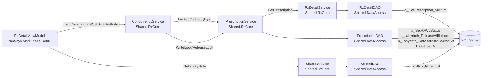
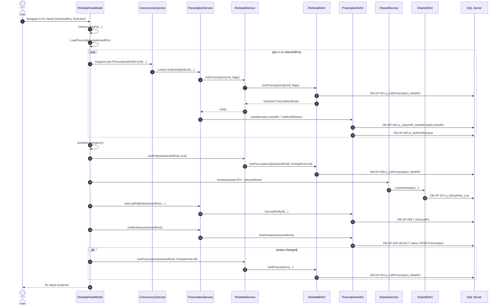
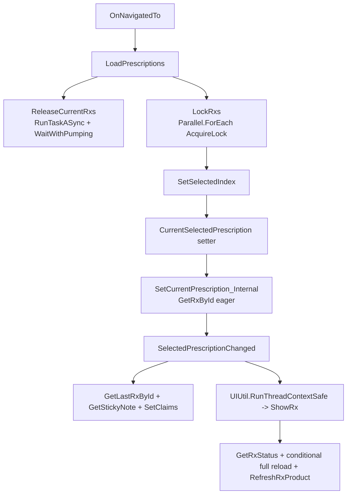
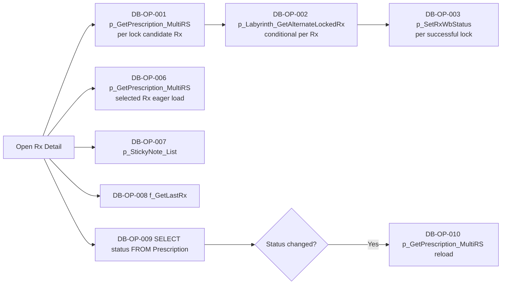
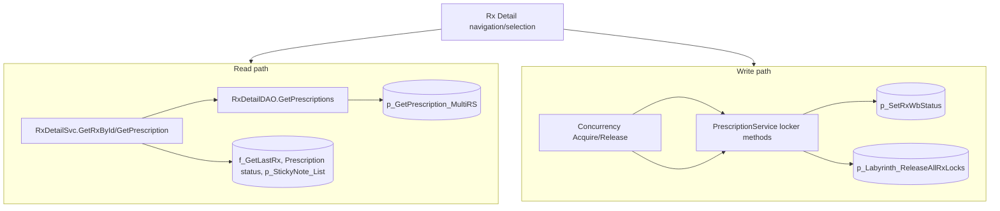
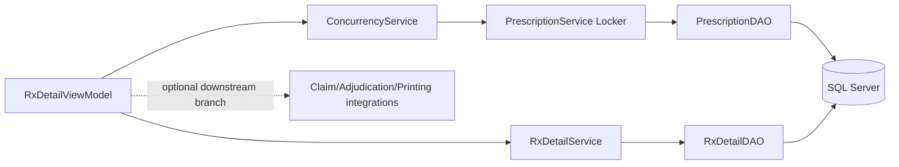

# Phase3 RxDetail Prescription Workflow Assessment

## Scope and Guardrails
- [CODE-PROVEN] This assessment is read-only and based on repository traces from RxDetail module registration, `RxDetailViewModel`, `ProcessNewRxViewModel`, `PrescriptionService`, `RxDetailService`, `ConcurrencyService`, `RxDetailDAO`, `PrescriptionDAO`, and `SharedDAO`.
- [CODE-PROVEN] Evidence labels and citation expectations were taken from `Architecture_Scalibility_playbook.md:64-74`, `:75-90`, `:91-111`, `:237-257`, `:259-367`, `:632-723`, `:900-1043`.
- [UNKNOWN] SQL definitions for several invoked objects are not present in accessible `*.sql` files in this workspace (for example `dbo.p_GetPrescription_MultiRS`, `dbo.p_SetRxWbStatus`, `dbo.p_Labyrinth_ReleaseAllRxLocks`, `dbo.p_Labyrinth_GetAlternateLockedRx`, `dbo.p_UpdateRxReadyTimeAndPriority`).

---

## 1) Real User-Initiated Workflows Discovered (from code terminology)

| Workflow name (derived from code) | Exact UI command/event | Entry class + method | Business purpose | Service methods called from entry path | Read/Write | Claim/Adjudication/Printing/Queue involvement | Evidence |
|---|---|---|---|---|---|---|---|
| Rx Detail Navigation Load | Prism navigation event (`OnNavigatedTo`) | `Nexxsys.Modules.RxDetail/ViewModels/RxDetailViewModel.cs:2075-2265`, `RxDetailViewModel.OnNavigatedTo(...)` | Load selected Rx summary set into Rx detail, handle workflow manager control, route by action (rebill/refill delayed/new delayed) | `LoadPrescriptions(...)`; workflow manager methods (`SetupCurrentStep`, `StartWithoutNavigate`, `ReleasePreviousResources`) | Read + Lock write | [INFERRED] Can lead into claim/refill flows based on `RxAction`; not always claim submit | `RxDetailViewModel.cs:2095-2170`, `:2227-2242` |
| Rx Lock + Rx List Hydration | Selection load path (called by navigation) | `RxDetailViewModel.LoadPrescriptions(...)` | Acquire/release Rx concurrency locks and populate ordered current Rx list | `ConcurrencySvc.AcquireLock<PrescriptionModel>(...)`, `ConcurrencySvc.ReleaseLock<PrescriptionModel>(...)`, selection path to `RxDetailSvc.GetRxById(...)` | Read + Write lock state | No direct claim/print; foundational gate for subsequent claim/print | `RxDetailViewModel.cs:3147-3242`, `:3192-3200`, `:3215-3221`, `:11253-11257`, `:11228-11231` |
| Rx Selection Change -> Full Rx Display Evaluation | Selection change side-effect (`CurrentSelectedPrescription` setter) | `RxDetailViewModel.CurrentSelectedPrescription` -> `SetCurrentPrescription_Internal` -> `SelectedPrescriptionChanged` -> `ShowRx` | Load full Rx model and initialize display/business state | `RxDetailSvc.GetRxById(..., true)`, `SharedSvc.GetStickyNote(...)`, `PrescriptionSvc.GetLastRxById(...)`, `PrescriptionSvc.GetRxStatus(...)`, `RxDetailSvc.GetPrescription(..., RxDataPoint.All)` (conditional), `DrugService.GetMixtureRecipe(...)` | Mostly read; can trigger derived writes in downstream paths | Claim state is loaded/selected (`SetClaims`); may branch to transfer popup; later actions may print/queue | `RxDetailViewModel.cs:11213-11222`, `:11228-11246`, `:11886-11940`, `:12066-12120`, `:12172-12175`, `:4958-4993`, `:9001-9017` |
| Rx Save/Refuse/Rebill Context-Menu Workflow | Context menu Save/Refuse/Rebill action | `RxDetailViewModel.SaveContextMenuButtonClicked(...)` -> `SaveMenuButtonEventHandler()` | Persist Rx changes, optionally continue refuse/rebill paths | `PrescriptionSvc.Save(...)`, `ConcurrencySvc.ReleaseLock<PrescriptionModel>(...)`, optional `PrescriptionService.GetLastRxById(...)` and additional save in rebill branch | Write-heavy | Claim handling appears in rebill/refuse branches; queue/print not directly proven in this handler | `RxDetailViewModel.cs:4923-4936`, `:3292-3321`, `:3326-3370`, `:3349-3361` |
| Move Intake Rx to ToDo (staging) | `TodoClickCommand` | `Nexxsys.Modules.RxDetail/ViewModels/ProcessNewRxViewModel.cs:37`, `OnTodoClicked(...)` at `:960-1016` | Save/Update staging Rx and move intake item out of current processing list | `PrescriptionService.GetPrescriptionStagingRx(...)`, `SavePrescriptionStaging(...)`, `UpdateRxReadyTimeAndPriority(...)`, `SharedService.SaveStickyNote(...)`, attachment save methods | Read + Write | Queue-like workbench staging semantics; no direct adjudication/print proven here | `ProcessNewRxViewModel.cs:970-1015`; `PrescriptionService.cs:11946-11954`, `:5447-5449`; `PrescriptionDAO.cs:3177-3194`, `:1595-1603`; `SharedService.cs:138-160`; `SharedDAO.cs:3796-3826` |
| Process New Rx Batch (OK) | Modal OK action | `ProcessNewRxViewModel.OnOkClick(...)` + `ProcessOkClick(...)` | Validate all Rx items then create/process each selected new Rx item | Per-item `newRxItem.RxItem.CreateRxs()` in loop; OCR post-save update via `OcrService.SaveSingleOcrRxDrugInfo(...)` | Read + Write | [INFERRED] downstream create paths may touch claims and queues; command itself loops item creation | `ProcessNewRxViewModel.cs:1674-1753`, `:1764-1821`, `:1774-1797`, `:1800-1804` |
| Split Rx in intake | `SplitRxCommand` / split-reasons popup confirm | `ProcessNewRxViewModel.OnSplitCommand(...)` + `SpliltRx()` | Split intake item and assign/update split-group reason metadata | `PrescriptionService.GenerateSplitRxGroupId()` (when needed) | Write to in-memory state, possible downstream persistence later | No direct claim/print/queue proven in this method | `ProcessNewRxViewModel.cs:610-613`, `:616-636`, `:742-769`, `:761-766` |
| Intake sticky note | `StickyNoteCommand` | `ProcessNewRxViewModel.OnStickyNoteClicked(...)` | Open/edit sticky note linked to intake/staging/workbench entity | `PrescriptionService.GetStickyNoteCodeFromWorkbenchCode(...)`, sticky-note popup action, later `SharedService.SaveStickyNote(...)` in ToDo flow | Read + Write | No claim/adjudication/print; note side-effect | `ProcessNewRxViewModel.cs:38`, `:1024-1044`, `:1030-1033`, `:960-1014`; `PrescriptionService.cs:12008-12014` |

---

## 2) Selected Broadest-Impact Workflow

## Workflow Selected
**`Rx Detail Navigation Load` + `Rx Selection Change -> Full Rx Display Evaluation` composite path**

### Why this one
- [CODE-PROVEN] It is the default Rx-detail entry path and drives screen load from navigation to selected Rx evaluation (`OnNavigatedTo` -> `LoadPrescriptions` -> `SetSelectedIndex` -> selection setter chain). Evidence: `RxDetailViewModel.cs:2075-2265`, `:3147-3181`, `:11253-11257`, `:11213-11222`.
- [CODE-PROVEN] It includes concurrency lock reads/writes per Rx (`AcquireLock` / `ReleaseLock`) and full-Rx hydration with eager data flags. Evidence: `RxDetailViewModel.cs:3215-3221`, `:3192-3200`, `:11230`; `RxDetailService.cs:62-67`.
- [CODE-PROVEN] Full Rx hydration routes to `RxDetailDAO.GetPrescriptions(...)` executing `dbo.p_GetPrescription_MultiRS`, with 67 documented result sets parsed. Evidence: `RxDetailDAO.cs:31-107`, `:251-320`.
- [INFERRED] This path has the largest user-latency exposure because it runs during primary Rx detail loading and can repeat when selection changes.

---

## 3) End-to-End Trace (UI -> Services -> DAO -> SQL)

## 3.1 UI command/event and navigation path
1. [CODE-PROVEN] Prism route enters `RxDetailViewModel.OnNavigatedTo(...)`. `RxAction`, `SelectedRxs`, workflow-manager flags, and navigation source are parsed. `RxDetailViewModel.cs:2095-2107`.
2. [CODE-PROVEN] Branches can call workflow-manager setup/start without direct Rx reload (`SetupCurrentStep`, `StartWithoutNavigate`) or proceed to load. `RxDetailViewModel.cs:2120-2122`, `:2165-2169`, `:2202-2204`, `:2220-2242`.
3. [CODE-PROVEN] `LoadPrescriptions(rxSummaries)` is called for most non-rebill flows and conditional rebill reload. `RxDetailViewModel.cs:2233-2242`.

## 3.2 View-model initialization and property-loading sequence
1. [CODE-PROVEN] `LoadPrescriptions(...)` calls `ReleaseCurrentRxs()` then `LockRxs(...)` (unless workflow manager controls locking). `RxDetailViewModel.cs:3149-3155`.
2. [CODE-PROVEN] `ReleaseCurrentRxs` uses `RunTaskASync(...).WaitWithPumping()` and `Parallel.ForEach` to unlock existing Rx IDs. `RxDetailViewModel.cs:3190-3200`.
3. [CODE-PROVEN] `LockRxs` uses `Parallel.ForEach` and per-Rx `ConcurrencySvc.AcquireLock<PrescriptionModel>(...)`, including a path that passes extra `RxDataPoint` flags. `RxDetailViewModel.cs:3206-3222`.
4. [CODE-PROVEN] Selection uses `SetSelectedIndex(...)` -> `CurrentSelectedPrescription` setter -> `SetCurrentPrescription_Internal(...)`. `RxDetailViewModel.cs:3177-3181`, `:11253-11257`, `:11218-11222`.
5. [CODE-PROVEN] `SetCurrentPrescription_Internal` calls `RxDetailSvc.GetRxById(rxQS.Id, true)` and `SharedSvc.GetStickyNote("RX", id)` then assigns `SelectedPrescription`. `RxDetailViewModel.cs:11228-11246`.
6. [CODE-PROVEN] `SelectedPrescriptionChanged()` executes broad initialization and further calls: `PrescriptionSvc.GetLastRxById`, `RxDetailSvc.TranslateSIG`, optional SK-specific service calls, `SetClaims`, `RxDetailSvc.GetCourierList` (lazy first load), then `ShowRx()` on UI thread. `RxDetailViewModel.cs:11886-12175`.
7. [CODE-PROVEN] `ShowRx()` starts with `PrescriptionSvc.GetRxStatus(currentRx.Id)`, may force full reload with `RxDetailSvc.GetPrescription(currentRx.Id, RxDataPoint.All)`, retrieves mixture recipe and refreshes product/package data. `RxDetailViewModel.cs:4958-4993`, `:4966`, `:4988-4991`.

## 3.3 Service and DAO expansion
- [CODE-PROVEN] `RxDetailService.GetRxById(..., eagerLoad:true)` uses `RxDataPoint.All` and routes to `GetPrescription` -> `GetPrescriptions` -> `RxDetailDAO.GetPrescriptions(...)`. `RxDetailService.cs:62-67`, `:88-96`.
- [CODE-PROVEN] `RxDetailDAO.GetPrescriptions(...)` executes `EXEC dbo.p_GetPrescription_MultiRS @rxIds, @dataPoints, @includeDeleted` and deserializes many result sets. `RxDetailDAO.cs:251-320`.
- [CODE-PROVEN] Lock acquisition flows through `ConcurrencyService.AcquireLock_Internal` -> `EvaluateLock` -> locker `GetEntityById(...)`; for `PrescriptionModel` locker is in `PrescriptionService` and returns `RxDetailService.GetPrescription(entityId, itemsToLoad)`. `ConcurrencyService.cs:356-383`, `:457-487`; `PrescriptionService.cs:12236-12249`.
- [CODE-PROVEN] Lock write persists via `PrescriptionDAO.SetRxWbStatus(...)` (exec `dbo.p_SetRxWbStatus`). `PrescriptionService.cs:12265-12268`; `PrescriptionDAO.cs:1531-1541`.
- [CODE-PROVEN] Lock release persists via `PrescriptionDAO.RemoveAllPrescriptionLocks(...)` (stored procedure `dbo.p_Labyrinth_ReleaseAllRxLocks`). `PrescriptionService.cs:12271-12283`; `PrescriptionDAO.cs:3000-3013`.
- [CODE-PROVEN] Complex lock evaluation reads alternate locked Rx using `dbo.p_Labyrinth_GetAlternateLockedRx` and additional prescription/batch queries. `PrescriptionService.cs:12303-12356`; `PrescriptionDAO.cs:3017-3060`.

---

## 4) Database Call Model (Auditable, DB-OP IDs)

Let:
- `N` = number of `SelectedRxs` passed into `OnNavigatedTo`
- `M` = number of `CurrentPrescriptions` being released before load
- `K` = number of user selection changes after initial load (each triggers full selection chain)

### 4.1 Initial load call set
| DB-OP ID | Operation | Object(s) | Layer/method | Cardinality |
|---|---|---|---|---|
| DB-OP-001 | Load lock candidate entity for each Rx during `AcquireLock` | `dbo.p_GetPrescription_MultiRS` (via `GetPrescription`) | `ConcurrencyService.EvaluateLock` -> `PrescriptionService.GetEntityForILockableEntityLocker` -> `RxDetailService.GetPrescription` -> `RxDetailDAO.GetPrescriptions` | `N` times (one per Rx in lock loop) |
| DB-OP-002 | Evaluate alternate lock chain (complex lock) | `dbo.p_Labyrinth_GetAlternateLockedRx`, `Prescription`, `Batch` | `PrescriptionService.EvaluateComplexLock` -> `PrescriptionDAO.GetAlternateLockedRx` | up to `N` times (conditional per lock eval) |
| DB-OP-003 | Persist lock mark | `dbo.p_SetRxWbStatus` | `PrescriptionService.ILockableEntityLocker.WriteLock` -> `PrescriptionDAO.SetRxWbStatus` | up to `N` times (successful locks) |
| DB-OP-004 | Release previous lock entities lookup | `dbo.p_GetPrescription_MultiRS` (optimized load args path) | `ConcurrencyService.ReleaseLock` -> locker `GetEntityById` | `M` times |
| DB-OP-005 | Release lock row(s) | `dbo.p_Labyrinth_ReleaseAllRxLocks` | `PrescriptionService.ILockableEntityLocker.ReleaseLock` -> `PrescriptionDAO.RemoveAllPrescriptionLocks` | `M` times |
| DB-OP-006 | Load selected current Rx (eager) | `dbo.p_GetPrescription_MultiRS` | `SetCurrentPrescription_Internal` -> `RxDetailSvc.GetRxById(..., true)` | 1 per selected index change |
| DB-OP-007 | Load sticky note for Rx | `dbo.p_StickyNote_List` | `SharedService.GetStickyNote` -> `SharedDAO.ListStickyNotes` | 1 per selected index change |
| DB-OP-008 | Last Rx chain lookup | `dbo.f_GetLastRx` | `PrescriptionService.GetLastRxById` -> `PrescriptionDAO.GetLastRxById` | 1 per selected index change |
| DB-OP-009 | Status lookup | `Prescription.Status` | `PrescriptionService.GetRxStatus` -> `PrescriptionDAO.GetRxStatus` | >=1 per selected index change |
| DB-OP-010 | Conditional full Rx reload | `dbo.p_GetPrescription_MultiRS` | `ShowRx`: `RxDetailSvc.GetPrescription(..., RxDataPoint.All)` when status changed | 0..1 per selected index change |
| DB-OP-011 | Conditional courier list reference load | DAO method behind `RxDetailSvc.GetCourierList()` | `SelectedPrescriptionChanged` | 0..1 per view-model lifecycle (lazy when null) |

### 4.2 Static call-count envelope
- [INFERRED] Minimum statically visible calls for first selected Rx: `DB-OP-001..003` for each locked Rx + `DB-OP-006..009` for selected Rx.
- [INFERRED] Maximum calls increase by:
  - additional alternate-lock checks (`DB-OP-002`) per Rx,
  - conditional reload (`DB-OP-010`) on status mismatch,
  - per-selection repeats for `K` selection changes.
- [RUNTIME-VERIFY] Exact SQL count, latency, and branch frequency require runtime tracing.

---

## 5) Queries, SPs, Functions, Tables, Views Observed

## 5.1 Proven SQL objects in selected workflow path
- [CODE-PROVEN] `dbo.p_GetPrescription_MultiRS` (`RxDetailDAO.cs:251`).
- [CODE-PROVEN] `dbo.p_SetRxWbStatus` (`PrescriptionDAO.cs:1540`, `:1555`).
- [CODE-PROVEN] `dbo.p_Labyrinth_ReleaseAllRxLocks` (`PrescriptionDAO.cs:3011`).
- [CODE-PROVEN] `dbo.p_Labyrinth_GetAlternateLockedRx` (`PrescriptionDAO.cs:3021`, `:3073`).
- [CODE-PROVEN] `dbo.f_GetLastRx` (`PrescriptionDAO.cs:1253`).
- [CODE-PROVEN] `dbo.p_StickyNote_List` and `dbo.p_StickyNote_Save` (`SharedDAO.cs:3825`, `:3799`).

## 5.2 Proven table-level access in selected path
- [CODE-PROVEN] `Prescription` table queried directly for status and lock checks (`PrescriptionDAO.cs:1790-1791`, `:3037`, `:3051`, `:3092-3105`).
- [CODE-PROVEN] `Batch` queried during alternate lock evaluation (`PrescriptionDAO.cs:3058-3059`, `:3111-3113`).
- [CODE-PROVEN] `PrescriptionStaging`/`BcPpmDownloadRx` are used in ProcessNewRx workflows (`PrescriptionDAO.cs:3192-3210`).
- [UNKNOWN] Full inner SQL object set for `dbo.p_GetPrescription_MultiRS` is not available in this workspace.

---

## 6) Required Analysis Checklist (Items 1-18)

1. **UI command/event + navigation path**
   - [CODE-PROVEN] `OnNavigatedTo` is the entry and calls load logic; command/event chain documented above. `RxDetailViewModel.cs:2075-2265`.

2. **Initialization/property-loading sequence**
   - [CODE-PROVEN] `LoadPrescriptions` -> selection setters -> `SelectedPrescriptionChanged` -> `ShowRx`. `RxDetailViewModel.cs:3147-3181`, `:11213-11246`, `:11886-12175`, `:4958-4993`.

3. **Every service/DAO method called**
   - [CODE-PROVEN] Expanded in sections 3 and 4 with citations.

4. **Every query/SP/function/table/view**
   - [CODE-PROVEN] Listed in section 5 where discoverable.
   - [UNKNOWN] Full internals of `p_GetPrescription_MultiRS` not available.

5. **Database calls inside loops**
   - [CODE-PROVEN] `LockRxs` uses `Parallel.ForEach` and each item calls `AcquireLock`, which evaluates and may load Rx from DB and write lock. `RxDetailViewModel.cs:3206-3222`; `ConcurrencyService.cs:356-370`, `:457-477`; `PrescriptionService.cs:12248`, `:12267`.
   - [CODE-PROVEN] `ReleaseCurrentRxs` loops `CurrentPrescriptions` and calls release lock per Rx. `RxDetailViewModel.cs:3195-3200`.

6. **Repeated or duplicate calls with identical parameters**
   - [CODE-PROVEN] `GetRxStatus(currentRx.Id)` is called in multiple paths including `ShowRx` and other status checks. `RxDetailViewModel.cs:4963`, `:6472`, `:4794`; `PrescriptionService.cs:6101-6103`.
   - [INFERRED] Re-selecting same Rx or repeated navigation may repeat full multi-RS hydration unless caller caching exists (not visible in this path).

7. **Calls caused by property getters/binding/selection/render**
   - [CODE-PROVEN] Setting `CurrentSelectedPrescription` triggers `SetCurrentPrescription_Internal`, which loads DB-backed Rx. `RxDetailViewModel.cs:11213-11222`, `:11228-11231`.
   - [CODE-PROVEN] `SelectedPrescriptionChanged` triggers broad property updates and calls (`SetClaims`, courier-list lazy load, `ShowRx`). `RxDetailViewModel.cs:12066-12175`.

8. **Synchronous DB/network work on UI thread**
   - [CODE-PROVEN] `ShowRx()` is invoked inside `UIUtil.RunThreadContextSafe(...)` and performs service calls including `GetRxStatus`, conditional full Rx reload, mixture/package retrieval. `RxDetailViewModel.cs:12172-12175`, `:4958-4993`.

9. **`.Wait()`, `.Result`, `Thread.Sleep`, `Task.Run`, `Task.Run`, locks, dispatcher**
   - [CODE-PROVEN] `WaitWithPumping` used after async wrappers in load/release paths (`RxDetailViewModel.cs:3192-3200`, `:2209-2218`).
   - [CODE-PROVEN] `ProcessNewRxViewModel.ProcessOkClick` uses `RunTaskASync(...).WaitWithPumping()` around create loop. `ProcessNewRxViewModel.cs:1770-1805`.
   - [CODE-PROVEN] Concurrency shared state uses lock registries and lock origin tracking. `ConcurrencyService.cs:24-27`.

10. **Read-versus-write behavior**
   - Read-dominant: Rx load/hydration (`p_GetPrescription_MultiRS`, `GetRxStatus`, `f_GetLastRx`, sticky-note read).
   - Write side effects: lock write (`p_SetRxWbStatus`), lock release (`p_Labyrinth_ReleaseAllRxLocks`), optional sticky-note save in intake workflow.

11. **Transaction boundaries**
   - [UNKNOWN] Explicit transaction scopes are not visible in traced methods; SP internals may contain transactions.
   - [RUNTIME-VERIFY] Confirm transaction boundaries via SQL Profiler/XEvent and SP definitions.

12. **External claim/adjudication/external calls, timeout/retry**
   - [INFERRED] Claim-related behaviors are present in Rx detail flows (`SetClaims`, claim commands), but timeout/retry policy not proven in selected load path from retrieved snippets.
   - [RUNTIME-VERIFY] Need runtime traces for adjudication/integration latency and retries.

13. **Printing and queue side effects**
   - [INFERRED] RxDetail area contains print request DAO methods (`p_lblInsertPrintLabelRequest`, `p_InsertRxREGPrintRequest`, `p_InsertRxTHLPrintRequest`) and workflow queue status updates in same DAO class. `RxDetailDAO.cs` grep evidence from implementation.
   - [UNKNOWN] Not proven executed in this selected load path unless downstream user actions occur.

14. **Post-save refreshes reloading data**
   - [CODE-PROVEN] `ShowRx` can force full reload (`RxDetailSvc.GetPrescription(..., RxDataPoint.All)`) if status changed. `RxDetailViewModel.cs:4963-4967`.

15. **Hidden tabs/controls loaded early**
   - [INFERRED] `RxDataPoint.All` eager load and 67 result set parsing can pre-load data not immediately visible.
   - [CODE-PROVEN] Eager load is explicitly requested in `GetRxById(..., true)`. `RxDetailViewModel.cs:11230`; `RxDetailService.cs:66`.

16. **Connection scopes and DB round trips**
   - [CODE-PROVEN] `RxDetailDAO` opens a connection and uses one `QueryMultiple` for multi-result hydration. `RxDetailDAO.cs:249-259`.
   - [CODE-PROVEN] Additional separate calls occur for status, last-rx, sticky note, lock procedures.

17. **Cancellation and stale-result handling**
   - [UNKNOWN] No cancellation tokens observed in traced methods.
   - [INFERRED] `WaitWithPumping` keeps UI responsive while waiting but does not demonstrate cancellation semantics.

18. **Error paths and partial-success behavior**
   - [CODE-PROVEN] Lock acquisition captures failed locks, supports override action, and surfaces concurrency messages. `RxDetailViewModel.cs:3225-3235`.
   - [CODE-PROVEN] `SetCurrentPrescription_Internal` closes Rx if Rx not found. `RxDetailViewModel.cs:11232-11236`.

---

## 7) Diagrams

## 7.1 Component / Call-Chain Diagram

## 7.2 Workflow Sequence Diagram (Selected)

## 7.3 UI Loading Timeline

## 7.4 Database Chattiness Map

## 7.5 Read-versus-Write Diagram

## 7.6 Transaction + External Integration Diagram

- [UNKNOWN] Explicit transaction boundaries are not visible in traced C# methods.
- [RUNTIME-VERIFY] Confirm whether lock SPs and multi-RS SP use explicit transactions or hold locks for long durations.

---

## 8) Confirmed Defects / Risks

| ID | Finding | Classification | Severity | Evidence |
|---|---|---|---|---|
| RXD-D-001 | Potential N+1 lock hydration: `LockRxs` iterates Rx list and each `AcquireLock` can load Rx via `GetPrescription` and run complex lock checks | [CODE-PROVEN] | High | `RxDetailViewModel.cs:3206-3222`; `ConcurrencyService.cs:356-370`, `:457-477`; `PrescriptionService.cs:12241-12249`, `:12315`; `PrescriptionDAO.cs:3021-3054` |
| RXD-D-002 | UI-path synchronous waits: `WaitWithPumping` used around asynchronous/parallel work in load flow | [CODE-PROVEN] | Medium-High | `RxDetailViewModel.cs:3192-3200`, `:2209-2218`; `ProcessNewRxViewModel.cs:1770-1805` |
| RXD-D-003 | Repeated status/refresh pattern can trigger extra full Rx reloads (`RxDataPoint.All`) | [CODE-PROVEN] | Medium | `RxDetailViewModel.cs:4963-4967`, `:11230`; `RxDetailService.cs:66` |
| RXD-D-004 | Heavy eager payload during selected Rx load (67 result sets documented in DAO contract) | [CODE-PROVEN] | High | `RxDetailDAO.cs:31-107`, `:251-320` |
| RXD-D-005 | Missing observability for transaction and SQL execution counts on this workflow | [RUNTIME-VERIFY] | High | No explicit telemetry counters in traced path |

---

## 9) Runtime Measurements Required

| Metric | Why | How to measure | Label |
|---|---|---|---|
| SQL calls per RxDetail open (`N`, `K`) | Validate static chattiness model and N+1 behavior | SQL Extended Events filtered by workstation/session + correlation tag around `OnNavigatedTo` | [RUNTIME-VERIFY] |
| `p_GetPrescription_MultiRS` p50/p95/p99 duration | Quantify primary latency contributor | Query Store or Extended Events duration histogram | [RUNTIME-VERIFY] |
| Lock SP duration/failure rate | Validate contention impact | Capture `p_SetRxWbStatus`, `p_Labyrinth_GetAlternateLockedRx`, `p_Labyrinth_ReleaseAllRxLocks` exec count + duration + error | [RUNTIME-VERIFY] |
| UI time to first meaningful render | User-latency KPI | Client-side timers around `OnNavigatedTo` entry and first render-complete signal | [RUNTIME-VERIFY] |
| Branch frequency for conditional full reload | Verify frequency of `GetPrescription(...All)` reload | Instrument branch at `ShowRx` status mismatch path | [RUNTIME-VERIFY] |

---

## 10) Severity / Effort / Risk Table

| Recommendation ID | Change | Severity addressed | Effort | Implementation risk |
|---|---|---|---|---|
| RXD-R-001 | Add workflow-level instrumentation (correlation ID, DB-op counters, timing) in RxDetail load path | High | Low | Low |
| RXD-R-002 | Reduce lock-time load payload for `AcquireLock` path where safe (minimum required `RxDataPoint`) | High | Medium | Medium |
| RXD-R-003 | Prevent duplicate eager reloads on unchanged selection/status | Medium | Medium | Medium |
| RXD-R-004 | Defer non-critical post-load data to after first render (for example optional lists/tabs) | Medium | Medium | Medium |
| RXD-R-005 | Review/optimize `p_GetPrescription_MultiRS` after runtime evidence | High | Medium-High | Medium-High |

---

## 11) Quick Wins

1. **RXD-QW-001**: Add timing + SQL-op counters around `OnNavigatedTo` -> `LoadPrescriptions` -> `SelectedPrescriptionChanged` -> `ShowRx`.
   - Linked findings: RXD-D-001, D-002, D-005.
   - Change area: `RxDetailViewModel` only.
   - Rollback: remove instrumentation toggles.

2. **RXD-QW-002**: Guard against redundant `GetRxStatus`/reload invocation when current state already validated in the same selection cycle.
   - Linked findings: RXD-D-003.
   - Change area: `RxDetailViewModel.ShowRx` orchestration.

3. **RXD-QW-003**: Add runtime log marker when `LockRxs` count > threshold to expose large-batch UI opens.
   - Linked findings: RXD-D-001.

---

## 12) Medium-Term Improvements

1. **RXD-MT-001**: Introduce a workflow-scoped read facade for RxDetail load that consolidates mandatory first-render data and defers secondary data.
2. **RXD-MT-002**: Rework lock evaluation to avoid expensive full entity hydration per candidate where lock metadata can be checked cheaply first.
3. **RXD-MT-003**: Validate and optimize `p_GetPrescription_MultiRS` internals with Query Store plans and targeted indexing only for proven hotspots.
4. **RXD-MT-004**: Add cancellation/stale-result protection for superseded selection changes during rapid user navigation.

All medium-term items must preserve current UI behavior and service/database contracts.

---

## 13) Areas Not to Change (for now)

- [CODE-PROVEN] Do not redesign Prism module composition or region mappings; current registrations are stable and explicit in `RxDetailModule`. `RxDetailModule.cs:12-85`.
- [INFERRED] Do not replace service/DAO layering wholesale; focus on hotspot path adjustments only.
- [RUNTIME-VERIFY] Do not alter SQL object semantics before measuring real production-like workload behavior.

---

## 14) Incremental Target (Preserving Existing UI/Service/DB)

**Stage 0**: Instrument current path (no behavior change).  
**Stage 1**: Remove duplicate calls and unnecessary eager reload branches.  
**Stage 2**: Defer non-critical loads and tighten lock-path payload.  
**Stage 3**: SQL tuning for verified expensive operations only.  
**Stage 4**: Re-measure and iterate.

This keeps Prism UI, service layer contracts, and database object interfaces intact.

---

## 15) Open Questions / Missing Evidence

1. [UNKNOWN] Definitions of `dbo.p_GetPrescription_MultiRS`, `dbo.p_SetRxWbStatus`, `dbo.p_Labyrinth_ReleaseAllRxLocks`, `dbo.p_Labyrinth_GetAlternateLockedRx`, `dbo.p_UpdateRxReadyTimeAndPriority` were not accessible in repository SQL files.
2. [RUNTIME-VERIFY] Real branch frequency and contention profile for lock and reload paths are not statically knowable.
3. [RUNTIME-VERIFY] External adjudication/printing timing impact from this workflow requires runtime telemetry.

---

## 16) Appendix: Evidence Index

- Module registration: `Nexxsys.Modules.RxDetail/RxDetailModule.cs:12-85`
- RxDetail navigation + load: `Nexxsys.Modules.RxDetail/ViewModels/RxDetailViewModel.cs:2075-2265`, `:3147-3242`
- Selection chain: `RxDetailViewModel.cs:11213-11257`, `:11886-12175`, `:4958-4993`
- Lock services: `Shared.RxCore/Services/ConcurrencyService.cs:156-260`, `:356-487`
- Prescription locker implementation: `Shared.RxCore/Services/PrescriptionService.cs:12235-12356`
- Rx retrieval service: `Shared.RxCore/Services/RxDetailService.cs:62-96`
- Multi-RS DAO load: `Shared.DataAccess/Implementation/RxDetailDAO.cs:31-107`, `:247-320`
- Lock/staging SQL invocations: `Shared.DataAccess/Implementation/PrescriptionDAO.cs:1531-1541`, `:1595-1603`, `:3000-3013`, `:3017-3118`, `:3177-3194`
- Sticky notes: `Shared.RxCore/Services/SharedService.cs:128-160`; `Shared.DataAccess/Implementation/SharedDAO.cs:3796-3826`
- Intake workflows: `Nexxsys.Modules.RxDetail/ViewModels/ProcessNewRxViewModel.cs:36-40`, `:50-154`, `:960-1016`, `:1024-1044`, `:1674-1821`
