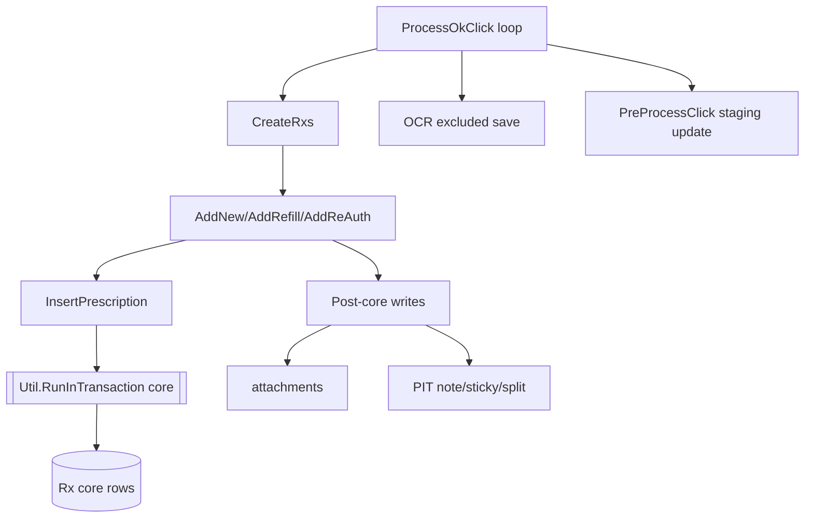
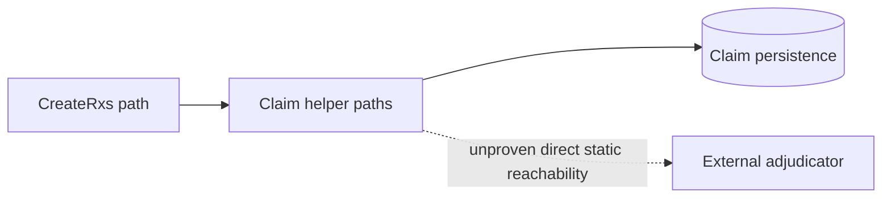

# Phase4 ProcessNewRx CreateRxs Assessment

## Scope
- [CODE-PROVEN] This report covers the create workflow from `ProcessNewRxViewModel.OnOkClick(...)` -> `ProcessOkClick(...)` -> runtime `newRxItem.RxItem.CreateRxs()` implementations.
- [CODE-PROVEN] No production code was changed.

## Required variable definitions (exact)
- `B` = items submitted in the batch.
- `R` = prescriptions created.
- `PL` = insurance/drug plans processed.
- `CL` = claim or adjudication attempts.
- `A` = attachments processed.
- `L` = labels or print requests.
- `V` = validation operations.
- `PIT` = PrescribeIT items.
- `ACT` = `_newRxActions` closures.
- `LK` = lock operations.
- `OCR` = OCR records processed.

## Call-count model (corrected)

### 1) Database round trips
`DBRT ≈ DBRT_validation + DBRT_create + DBRT_post + DBRT_retry`

- `DBRT_validation`: per-item validation (`ValidateForProcess`) + cross-item validation (`ValidateAllRxs`) and closure build (`_newRxActions`).
- `DBRT_create`: each executed `ACT` closure calling `AddNewRx/AddRefill/AddReAuthRx` and `InsertPrescription/Save` chain.
- `DBRT_post`: post-create operations (PIT extras, OCR excluded updates, selected-item preprocess staging updates).
- `DBRT_retry`: additional round trips if user retries after partial failure.

### 2) Stored procedures
`SPX ≈ SPX_core + SPX_staging + SPX_claim + SPX_print + SPX_other`

- [CODE-PROVEN] Staging SP wrappers exist (`p_AddPrescriptionStaging`, `p_UpdatePrescriptionStaging`).
- [CODE-PROVEN] Core status/workbench SP wrappers exist (`p_SetRxWbStatus`).
- [CODE-PROVEN] Claim persistence path exists (`SaveClaims` -> DAO).
- [INFERRED] Print SP invocation from this exact create chain is not statically proven.

### 3) External network calls
`NET ≈ NET_PIT + NET_BC + NET_unknown`

- [CODE-PROVEN] PIT service interactions are reachable in this workflow context.
- [CODE-PROVEN] BC/PharmaNet integration points are reachable in add-new path.
- [RUNTIME-VERIFY] Transport-level network behavior for all service wrappers.

### 4) Attachments and OCR
`AttachmentOps = A_regular + A_photo + A_pit + A_passthrough`

- [CODE-PROVEN] Regular: staging attachments pre-add and Rx attachments post-success.
- [CODE-PROVEN] Photo: additional-info attachments post-success.
- [CODE-PROVEN] PIT: attachment insertions in PIT create path.
- [CODE-PROVEN] Passthrough: existing Rx attachment saves.

`OCR = OCR_excluded + OCR_other`

- [CODE-PROVEN] Excluded OCR save (`IsRecognized = false`) occurs in `ProcessOkClick` after loop.

### 5) Labels/print requests
`L = L_direct + L_indirect`

- [CODE-PROVEN] DAO methods exist for:
  - `p_Labyrinth_InsertRxPrintRequest`
  - `p_InsertRxPrintRequest`
  - `p_InsertOpioidPrintRequest`
- [INFERRED] Direct invocation from this exact Phase4 chain is not proven by static trace alone.

### 6) UI blocking waits
`UIW = 1` per entered `ProcessOkClick` execution path that reaches wait.

- [CODE-PROVEN] `RunTaskASync(..., true).WaitWithPumping()` is used.

---

## Runtime item type and `CreateRxs()` mapping

- [CODE-PROVEN] Runtime type selected by `ProcessNewRxNavigator.GetRxItem(...)`.
- [CODE-PROVEN] Implementations used:
  - Regular -> `RegularProcessNewRxUIItem` (inherits base `CreateRxs` dispatch).
  - Photo -> `PhotoRxProcessNewRxUIItem` (inherits base `CreateRxs`, overrides add behavior).
  - PIT -> `PITRxProcessNewRxUIItem.CreateRxs()` override + PIT post-create actions.
  - Passthrough existing -> `PassthroughExistingRxProcessNewRxUIItem.CreateRxs()` override (attachment-only + return existing Rx).

---

## Partial failure deep analysis (item1 success, item2 failure)

### Proven control flow
1. Item1 create can persist writes.
2. Item2 create returns failure.
3. `allNewRxs.Clear()` executes; loop breaks.
4. Excluded OCR updates still run.
5. `ReadyToProcessRxs` becomes empty; `CancelOkClick = true`; method returns.
6. Modal remains open (base modal does not close when `CancelOkClick` is true).

### What remains committed
- [CODE-PROVEN] Clearing `allNewRxs` is in-memory only and does not roll back prior persisted writes.
- [CODE-PROVEN] Prior item writes can include prescription persistence, audit/history, and type-specific side effects (attachments, PIT note/sticky/split).

### What does not run after early return
- [CODE-PROVEN] Selected-item follow-up loop (`SkippedInCreateRx`, `PreProcessClick`) is skipped when return occurs at empty `ReadyToProcessRxs` branch.

### Retry behavior and duplicate risk
- [CODE-PROVEN] User can retry because modal stays open.
- [CODE-PROVEN] `ValidateUniqueAuthChains` guards authorization-chain duplicates only.
- [RUNTIME-VERIFY] Broader idempotency/duplicate outcome risk (Rx/claims/attachments) requires runtime trace.

### Partial failure table

| Step | Item1 | Item2 | In-memory list | Persisted state | Modal |
|---|---|---|---|---|---|
| Start | pending | pending | empty | none | open |
| After item1 | success | pending | has item1 | may be committed | open |
| Item2 fails | success already persisted | fail | cleared | item1 remains | open |
| Return branch | unchanged | fail | `ReadyToProcessRxs` empty | unchanged | open (`CancelOkClick=true`) |

```mermaid
sequenceDiagram
	participant U as User
	participant VM as ProcessNewRxViewModel
	participant I1 as Item1
	participant I2 as Item2
	participant DB as DB

	U->>VM: OK
	VM->>I1: CreateRxs()
	I1->>DB: commit
	VM->>I2: CreateRxs()
	I2-->>VM: failure
	VM->>VM: allNewRxs.Clear(); break
	VM->>VM: ReadyToProcessRxs empty
	VM->>VM: CancelOkClick=true
	VM-->>U: stays open
	U->>VM: OK (retry)
```

---

## Transaction boundaries (regular/photo/PIT/passthrough)

- [CODE-PROVEN] Core boundary exists around `InsertPrescription` via `Util.RunInTransaction`.
- [CODE-PROVEN] Entire item processing is **not** one transaction; multiple post-core writes are outside that shared boundary.

| Item type | Core prescription write | Post-core side effects | Fully single-tx per item? |
|---|---|---|---|
| Regular | inside core tx | attachments and related writes outside shared boundary | No |
| Photo | inside core tx | additional-info attachments outside shared boundary | No |
| PIT | base create may use core tx path | split/attachments/note/sticky post-actions outside shared boundary | No |
| Passthrough | no new core insert | attachment save path only | No |



---

## Claims/adjudication trace (strict)

- [CODE-PROVEN] Claim generation/persistence helpers are reachable in refill branch paths.
- [CODE-PROVEN] `SaveClaims` path exists and writes through DAO.
- [INFERRED] Direct external adjudicator submit/response/retry/reversal path is not proven by the traced static chain for this exact Phase4 flow.
- [RUNTIME-VERIFY] Required for definitive external adjudication behavior.



---

## Printing/queue reachability (strict)

- [CODE-PROVEN] Print request SP wrappers exist in DAO.
- [INFERRED] Direct reachability from this exact create workflow is not proven by traced static calls.
- [CODE-PROVEN] Workbench status transition API exists (`SetRxWbStatus`) and is callable, but this does not prove direct print queue insertion in this path.

---

## UI execution model and duplicate-submit risk

- [CODE-PROVEN] Workflow uses blocking async with busy indicator + dispatcher pumping wait.
- [CODE-PROVEN] Dispatcher pumping means message loop continues during wait.
- [RUNTIME-VERIFY] Need UI automation/logging to confirm whether command re-entrancy or close-during-processing can trigger duplicate submission behavior in real runtime.

---

## Consolidated consistency table

| Domain | Partial failure effect | Risk on retry |
|---|---|---|
| Prescription | prior-item commits may remain | duplicate create if idempotency not enforced |
| Claims | branch-dependent persisted claims may remain | duplicate/extra claim attempts |
| Staging | selected-item preprocess can be skipped by early return | divergence across retries |
| Attachments | prior-item attachments may remain | duplicate attachment saves |
| OCR | excluded OCR update still executes | repeated updates possible |
| Print/labels | direct path not proven statically | unknown until runtime trace |

---

## Confirmed defects vs risks

| Topic | Conclusion |
|---|---|
| Partial-success semantics | [CODE-PROVEN] behavior exists; classify as consistency risk pending product requirement decision |
| External adjudication reachability | [INFERRED] not proven in this static chain |
| Print request reachability | [INFERRED] not proven in this static chain |

---

## Performance/scalability risks

| Risk | Severity | Why |
|---|---|---|
| Per-item/per-action DB chattiness (`B`, `ACT`) | High | sequential loop + deep service/DAO chain |
| UI blocking wait with dispatcher pumping | High | UI responsiveness and re-entrancy concerns |
| Partial-failure retry amplification | Medium-High | prior commits + re-execution potential |
| Distributed lock lifecycle complexity (`LK`) | Medium | many branch-specific acquire/release paths |

---

## Quick wins and medium-term actions

### Quick wins
1. Add telemetry per attempt: `B,R,PL,CL,A,L,V,PIT,ACT,LK,OCR`.
2. Surface explicit partial-success warning when a later item fails after earlier success.
3. Add runtime trace flags for print/adjudication reachability confirmation.

### Medium-term
1. Add idempotency keys/guards for retry-safe create operations.
2. Separate persisted-state reporting from modal-close gating.
3. Refactor toward fully async (remove blocking pump wait) once behavior parity is validated.

### Do not change in this assessment
- No production behavior changes.
- No migration/re-architecture.
- No claims of adjudication/print reachability without direct call-chain proof.

---

## Runtime verification plan
1. Force scenario: item1 success + item2 failure, then retry.
2. Capture SQL/SP traces and correlate with telemetry variables.
3. Verify persisted artifacts (Rx/claims/attachments/OCR/staging/locks) before and after retry.
4. Trace actual PIT/BC network calls.
5. Confirm (or disprove) direct print SP execution in this path.
6. Run UI automation for re-entrancy and close-during-processing.

---

## Final strict conclusions
- [CODE-PROVEN] This workflow can produce partial success with committed writes from earlier items before a later failure.
- [CODE-PROVEN] `allNewRxs.Clear()` does not roll back previously committed DB state.
- [INFERRED] External adjudication and print request direct reachability are not proven from the traced static chain and require runtime verification.
