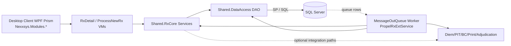
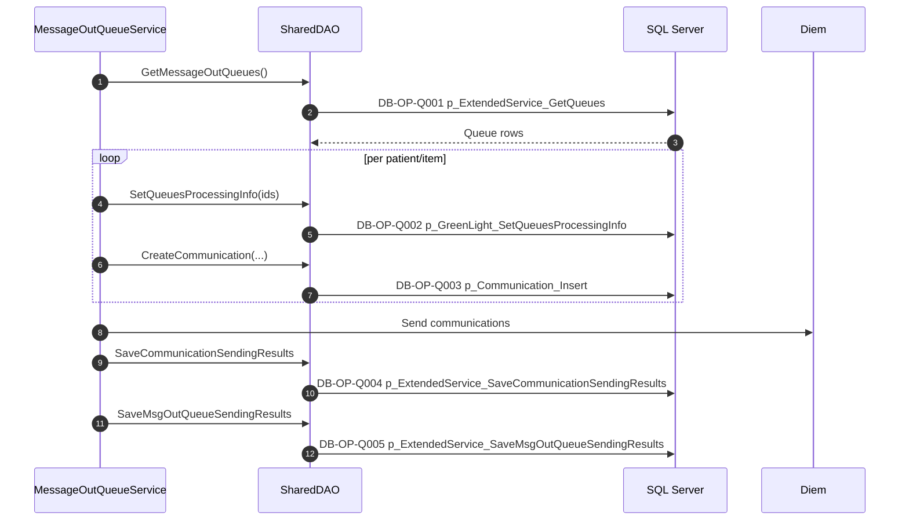
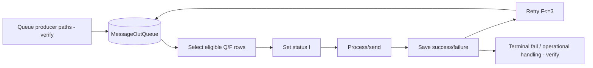
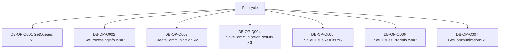
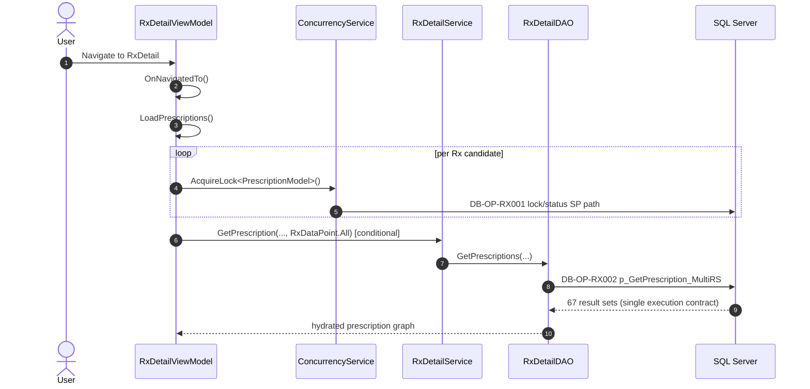
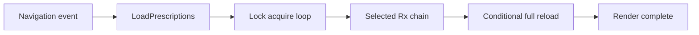
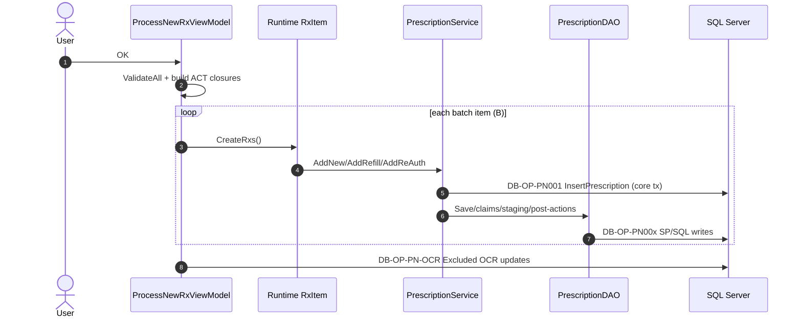
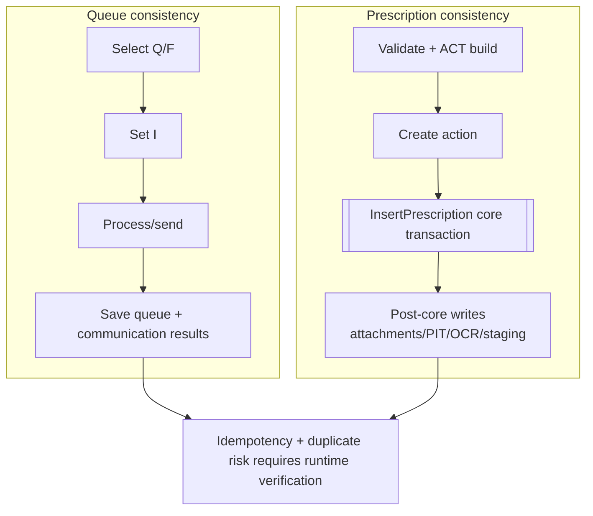
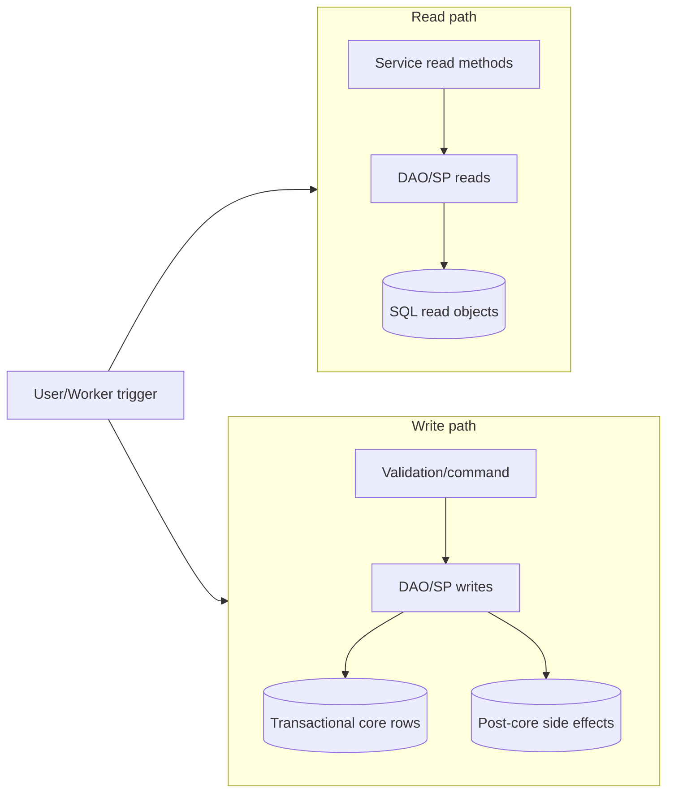
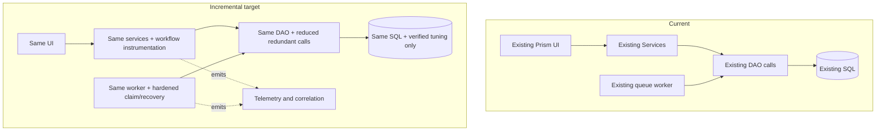

# PropelRx Architecture Scalability Assessment

## 1. Executive summary

PropelRx is a layered .NET Framework desktop solution with Prism UI modules, shared service/domain logic, DAO-based SQL access, and worker-style queue processing for outbound communication. The highest-confidence reliability defects are currently in the queue worker path, while the highest-confidence scalability risks are loop-driven database chattiness and synchronous UI-path waits in Rx workflows. [CODE-PROVEN] Evidence: `Shared.RxCore/Services/SendCommunication/MessageOutQueueService.cs:66-158`, `:935-977`, `:811-816`, `:887-892`; `Nexxsys.Modules.RxDetail/ViewModels/RxDetailViewModel.cs:3147-3242`, `:11213-11246`; `Nexxsys.Modules.RxDetail/ViewModels/ProcessNewRxViewModel.cs:1764-1822`; `Shared.Infrastructure.UI/AsyncHelpers.cs:48-59`.

Confirmed defects are limited to queue-worker correctness issues (D-001..D-003). Other concerns (RxDetail N+1-like hydration/locking, 67-result-set contract cost, dispatcher-pumping waits, ProcessNewRx partial-success and retry duplication) are treated as scalability/reliability risks until runtime measurements confirm impact. [CODE-PROVEN]/[RUNTIME-VERIFY].

Unknowns remain around deployment instance count/topology, stale `I` recovery behavior across all services, external adjudication reachability from analyzed paths, and direct print-request reachability from ProcessNewRx create flow. [UNKNOWN]/[RUNTIME-VERIFY].

Incremental improvement is appropriate because the architecture has stable module/service/DAO boundaries and known high-risk hotspots where targeted fixes and telemetry can reduce risk without platform replacement. Safest order: instrument first, fix confirmed queue defects, remove proven duplicate/waste, harden queue/prescription consistency, then optimize measured SQL/UI hotspots.

---

## 2. Current architecture

### 2.1 Component inventory (reconciled)

| Layer | Components | Status | Evidence |
|---|---|---|---|
| Desktop client UI | Prism modules, RxDetail module/viewmodels | [CODE-PROVEN] | `Nexxsys.Modules.RxDetail/RxDetailModule.cs:12-85`; `Nexxsys.Modules.RxDetail/ViewModels/RxDetailViewModel.cs:2075-2265` |
| Workflow UI | ProcessNewRx modal/batch orchestration | [CODE-PROVEN] | `Nexxsys.Modules.RxDetail/ViewModels/ProcessNewRxViewModel.cs:1674-1822` |
| Shared service layer | Prescription, RxDetail, Concurrency, Shared services | [CODE-PROVEN] | `Shared.RxCore/Services/PrescriptionService.cs:57-146`, `:7577-7770`; `Shared.RxCore/Services/RxDetailService.cs:62-67`; `Shared.RxCore/Services/ConcurrencyService.cs:356-370`, `:457-477` |
| Data access layer | DAO classes via Dapper context | [CODE-PROVEN] | `Shared.DataAccess/Implementation/RxDetailDAO.cs:31-107`, `:251-320`; `Shared.DataAccess/Implementation/PrescriptionDAO.cs:269-287`, `:689-770`; `Shared.DataAccess/DapperDbContext.cs:101-110`, `:235-244`, `:557-565` |
| Queue worker path | MessageOutQueue process/service and cancellation service | [CODE-PROVEN] | `PropelRxExtService/ServiceImplementations/MessageOutQueueProcess.cs:52-55`; `Shared.RxCore/Services/SendCommunication/MessageOutQueueService.cs:66-158`; `Shared.RxCore/Services/SendCommunication/CancelCommunicationService.cs:28-55` |
| Database dependencies | SP/function-heavy SQL interaction | [CODE-PROVEN] | `dbo.p_ExtendedService_GetQueues`, `dbo.p_GreenLight_SetQueuesProcessingInfo`, `dbo.p_ExtendedService_SaveCommunicationSendingResults`, `dbo.p_ExtendedService_SaveMsgOutQueueSendingResults`, `dbo.p_NexApi_GetCommunications`, `dbo.p_GetPrescription_MultiRS` (called), `dbo.p_SetRxWbStatus` (called) |
| External integrations | Diem, PIT, BC/PharmaNet, print/adjudication surfaces | [CODE-PROVEN]/[INFERRED] | Diem path `MessageOutQueueService.cs:935-977`; PIT/BC references `ProcessNewRxViewModel.cs:1685`, `PrescriptionService.cs:7500-7509`; adjudication/print direct path from analyzed workflows remains unproven |

### 2.2 Verified vs inferred relationships
- [CODE-PROVEN] UI -> Service -> DAO -> SQL is the primary dependency direction in analyzed workflows.
- [CODE-PROVEN] Queue worker consumes queue-table records and writes communication + queue result status via SPs.
- [INFERRED] Multiple worker instances may run concurrently in production.
- [CODE-PROVEN] Phase 1 inventory is now available at `docs/architecture/Phase1_Solution_Inventory_Assessment.md`; inventory conclusions in this report are reconciled with that file.

### 2.3 Solution/component architecture diagram (Required Diagram 1)


### 2.4 Deployment/runtime topology (Required Diagram 2)
- [CODE-PROVEN] The analyzed architecture is a desktop process plus referenced in-process libraries (Prism modules, `Shared.RxCore`, `Shared.DataAccess`), not a code-proven separate application-server tier.
  - Evidence: `Nexxsys.Shell/App.xaml.cs:147-165`, `:450-451`; `Nexxsys.Shell/BootStrapper.cs:46-71`; `Nexxsys.Modules.RxDetail/RxDetailModule.cs:40-44`; `Shared.DataAccess/DapperDbContext.cs:736-738`.
- [INFERRED] Desktop process to SQL Server connectivity is likely direct via referenced DAO/connection libraries; host counts/locations remain runtime topology `verify` items.

```mermaid
flowchart LR
	subgraph SITE[Pharmacy Client Site - verify]
		subgraph DESKTOP[PropelRx Desktop Process]
			UI[Prism UI Modules]
			SVC[Shared.RxCore libraries]
			DAO[Shared.DataAccess libraries]
			UI --> SVC --> DAO
		end
		PRINTQ[Print destination/queue host - verify]
	end

	subgraph SVC_HOSTS[Service Host(s) / Location verify]
		EXTW[PropelRxExtService process - verify]
		PRNW[PropelRxPrintService process - verify]
		FAXW[PropelRxFaxService process - verify]
		WORKERN[Worker instance count - verify]
	end

	subgraph DB_HOST[Database Host / Location verify]
		SQL[(SQL Server)]
	end

	EXT1[External messaging e.g., Diem - verify]
	EXT2[PIT/BC/PharmaNet integrations - verify]
	EXT3[External adjudication - verify]
	EXT4[External print/fax dependencies - verify]

	DAO -. [INFERRED] desktop-to-SQL .-> SQL
	EXTW --> SQL
	PRNW --> SQL
	FAXW --> SQL
	EXTW --> EXT1
	EXTW --> EXT2
	EXTW -. unproven direct path from analyzed workflows .-> EXT3
	PRNW --> EXT4
	FAXW --> EXT4
	UI --> PRINTQ
```

---

## 3. Analyzed workflows

### 3.1 MessageOutQueueProcess

**Trigger**
- [CODE-PROVEN] Service workflow executes queue polling and processing path in `ProcessCommunication(...)`.
  - Evidence: `Shared.RxCore/Services/SendCommunication/MessageOutQueueService.cs:66-158`; caller `PropelRxExtService/ServiceImplementations/MessageOutQueueProcess.cs:52-55`.

**End-to-end call path**
- [CODE-PROVEN] Poll -> mark processing -> per-patient/per-Rx communication logic -> result saves.
  - Queue poll: `SharedDAO.GetMessageOutQueues` -> `dbo.p_ExtendedService_GetQueues`.
  - Claim/mark processing: `SharedDAO.SetQueuesProcessingInfo` -> `dbo.p_GreenLight_SetQueuesProcessingInfo`.
  - Communication creation/save: `SharedDAO.CreateCommunication`, `SaveCommunicationSendingResults`, `SaveMsgOutQueueSendingResults`.
  - Citations: `SharedDAO.cs:4411-4529`; `MessageOutQueueService.cs:76-155`, `:1160-1217`.

**Read/write behavior**
- [CODE-PROVEN] Mixed read/write with queue state transitions (`Q`/`F` selection, `I` in-process, `C` cancel, failed/result statuses).

**Database and external interactions**
- [CODE-PROVEN] Primary DB objects: `p_ExtendedService_GetQueues`, `p_GreenLight_SetQueuesProcessingInfo`, `p_GreenLight_SetQueuesErrorInfo`, `p_NexApi_GetCommunications`, `p_ExtendedService_SaveCommunicationSendingResults`, `p_ExtendedService_SaveMsgOutQueueSendingResults`.
- [CODE-PROVEN] Diem send/result handling branch exists.

**Threading/UI behavior**
- [CODE-PROVEN] Worker/service path (non-UI).

**Transaction boundaries**
- [CODE-PROVEN] No app-layer shared transaction across poll/claim/process/save chain; DAO calls are separate connection-scoped operations.
  - Evidence: `Shared.DataAccess/DapperDbContext.cs:101-110`, `:235-244`, `:557-565`.

**Error and recovery behavior**
- [CODE-PROVEN] Error path updates queue error info (`SetQueuesErrorInfo`), retry filter includes `F` with attempt cap.
- [RUNTIME-VERIFY] Complete stale `I` recovery across full deployment.

**Symbolic database-call model**
- [CODE-PROVEN] This is **a symbolic lower-bound model of statically visible workflow-level DAO/database operations**: `Calls_cycle = 1 + 2P + 3R + C + U + M + D + 2G + X`; structural upper form `1 + 5P + 3R + C + M + 2G` with `U<=P`, `D<=P`, `X<=P`.
- [RUNTIME-VERIFY] Nested DAO calls, SQL functions, triggers, and stored-procedure-internal operations are not fully expanded in this model.
  - Evidence: `docs/architecture/Phase2_MessageOutQueueProcess_Assessment.md:126-167`.

**Runtime verification requirements**
- queue duplicate-selection rate; stale `I` count/age; retry distribution; lag by status; multi-instance contention.

#### MessageOutQueueProcess sequence (Required Diagram 3)


#### Queue/worker architecture (Required Diagram 4)


#### Queue DB-chattiness map (Required Diagram 5)


---

### 3.2 RxDetail navigation, locking, and selected-prescription loading

**Trigger**
- [CODE-PROVEN] Prism navigation and selection change path:
  - `RxDetailViewModel.OnNavigatedTo(...)` -> `LoadPrescriptions(...)` -> selection setter chain -> `ShowRx`.
  - Evidence: `Nexxsys.Modules.RxDetail/ViewModels/RxDetailViewModel.cs:2075-2265`, `:3147-3242`, `:11213-11246`.

**End-to-end call path**
- [CODE-PROVEN] Lock management + Rx hydration + selected Rx full evaluation path.
- [CODE-PROVEN] Full payload retrieval includes `RxDetailDAO.GetPrescriptions(...)` using `dbo.p_GetPrescription_MultiRS` and parsing 67 result sets in one execution contract.
  - Evidence: `Shared.DataAccess/Implementation/RxDetailDAO.cs:31-107`, `:251-320`.

**Read/write behavior**
- [CODE-PROVEN] Mostly read path with lock writes (`AcquireLock`/`ReleaseLock`) and status checks that can trigger extra full reload.

**Database and external interactions**
- [CODE-PROVEN] SQL-heavy internal interactions; direct external call in the selected load chain is not established.

**Threading/UI behavior**
- [CODE-PROVEN] UI path includes synchronous wait with dispatcher pumping in related load flows.
  - Evidence: `RxDetailViewModel.cs:3192-3200`, `:2209-2218`; helper `Shared.Infrastructure.UI/AsyncHelpers.cs:48-59`.

**Transaction boundaries**
- [UNKNOWN] Explicit SQL transaction scope for key lock/read SPs not available in accessible SQL definitions.

**Error and recovery behavior**
- [INFERRED] Selection and lock contention can degrade responsiveness; explicit resiliency is branch-dependent.
- [RUNTIME-VERIFY] contention and timeout rates.

**Symbolic database-call model**
- [INFERRED] `DBRT_rxdetail ≈ DBRT_nav + DBRT_lock(N) + DBRT_selected + DBRT_status + DBRT_reload(conditional)` where lock and reload terms can scale with selected list and branch frequency.
- [CODE-PROVEN] 67 result sets are result sets in one multi-result execution contract, not 67 round trips.

**Runtime verification requirements**
- SQL execution count per open; p50/p95/p99 for `p_GetPrescription_MultiRS`; lock duration/failure; first meaningful render timing.

#### RxDetail loading sequence (Required Diagram 6)


#### RxDetail UI-loading timeline (Required Diagram 7)


---

### 3.3 ProcessNewRx/CreateRxs

**Trigger**
- [CODE-PROVEN] Modal OK action: `OnOkClick(...)` and `ProcessOkClick(...)`.
  - Evidence: `Nexxsys.Modules.RxDetail/ViewModels/ProcessNewRxViewModel.cs:1674-1822`.

**End-to-end call path**
- [CODE-PROVEN] Per-item loop over `RxNavigator.Items` calling runtime `CreateRxs()` implementation, with `ACT` closure dispatch from `_newRxActions` in base item type.
  - Evidence: `ProcessNewRxViewModel.cs:1774-1797`; `BaseProcessNewRxUIItem.cs:1733-2072`, `:2278-2295`.

**Read/write behavior**
- [CODE-PROVEN] Per-item/per-action writes through `PrescriptionService.AddNewRx/AddRefill/AddReAuthRx` -> `InsertPrescription` -> `Save` and item-specific attachment/note operations.
  - Evidence: `Shared.RxCore/Services/PrescriptionService.cs:7242-7553`, `:6235-7240`, `:7864-8060`, `:7577-7770`, `:57-146`; item variants in `RegularNewRxInstance.cs`, `PhotoRxNewRxInstace.cs`, `PITNewRxInstance.cs`, `PassthroughExistingRxInstance.cs`.

**Database and external interactions**
- [CODE-PROVEN] Core/staging/claim SP wrappers reachable; print SP wrappers exist.
- [INFERRED] Direct print and external adjudication reachability from this exact chain is not statically proven.

**Threading/UI behavior**
- [CODE-PROVEN] `RunTaskASync(..., true).WaitWithPumping()` blocks with dispatcher pumping.
  - Evidence: `ProcessNewRxViewModel.cs:1770-1805`; `Shared.Infrastructure.UI/Events/EventHelper.cs:213-234`; `Shared.Infrastructure.UI/AsyncHelpers.cs:48-59`.

**Transaction boundaries**
- [CODE-PROVEN] Core create path wraps `InsertPrescription` in `Util.RunInTransaction`; non-core post-actions occur outside shared core boundary.
  - Evidence: `PrescriptionService.cs:7636-7769`; phase4 table.

**Error and recovery behavior**
- [CODE-PROVEN] If a later item fails, accumulated in-memory created list is cleared and loop breaks; prior committed writes are not rolled back by that clear.
- [CODE-PROVEN] `CancelOkClick=true` keeps the modal open after this path.
- [RUNTIME-VERIFY] Whether OK can be re-executed safely or concurrently in real UI runtime requires command/binding re-entrancy validation.
  - Evidence: `ProcessNewRxViewModel.cs:1778-1813`; `Shared.Infrastructure.UI/BaseModalViewModel.cs:42-47`.

**Symbolic database-call model**
- [CODE-PROVEN] `DBRT ≈ DBRT_validation + DBRT_create + DBRT_post + DBRT_retry` with `B,R,PL,CL,A,L,V,PIT,ACT,LK,OCR` terms and branch-dependent expansion.
  - Evidence: `docs/architecture/Phase4_ProcessNewRx_CreateRxs_Assessment.md:20-69`.

**Runtime verification requirements**
- partial-failure/retry duplicate outcomes for Rx/claim/attachment; direct print/adjudication reachability; UI re-entrancy.

#### ProcessNewRx write sequence (Required Diagram 8)


---

## 4. Confirmed defects

Only confirmed defects are queue-worker correctness defects below.

| Defect ID | Defect | Citation | Triggering execution path | Impact | Effort | Implementation risk | Test required | Rollback |
|---|---|---|---|---|---|---|---|---|
| D-001 | `ProcessCommunication(...)` always returns `true` | `Shared.RxCore/Services/SendCommunication/MessageOutQueueService.cs:66-158` (unconditional return at `:157`); caller check `PropelRxExtService/ServiceImplementations/MessageOutQueueProcess.cs:52-55` | Worker poll cycle | False-success signaling; upstream control flow cannot rely on false path | S | Low-Medium | Unit/integration test for failure path return semantics | Revert method-return logic change |
| D-002 | Successful Diem communications may not enter success list | `MessageOutQueueService.cs:935-977` (`successCommunications` initialized at `:944`, failures added at `:968-970`, save at `:971-977`) | Diem send result processing | Misreported communication outcome; downstream status/reporting inconsistency | S | Medium | Integration test with mixed success/failure send results | Revert list population/save mapping |
| D-003 | `First(...)` followed by ineffective null check | `MessageOutQueueService.cs:811-816`, `:887-892` | Program interface lookup branch | Exception risk and dead null-check branch | XS-S | Low | Unit tests for missing interface scenario | Revert LINQ selection handling |

**Not classified as confirmed defects (per requirement):**
- RxDetail N+1-like locking/hydration, 67-result-set contract cost, dispatcher-pumping waits, ProcessNewRx partial-success behavior, retry duplicate risk. These remain risk items pending runtime evidence or explicit product correctness requirements.

---

## 5. Scalability and performance risks

| Risk ID | Mechanism | Affected workflow | Evidence | Confidence | Runtime measurement needed | Incremental mitigation |
|---|---|---|---|---|---|---|
| R-001 | Queue selection and claim are separate operations | MessageOutQueueProcess | `MessageOutQueueService.cs:76-79`, `:127-130`; `p_ExtendedService_GetQueues` select-only | [CODE-PROVEN] | Duplicate-claim incidence across instances | Conditional/atomic claim with status predicate and claimed-row return |
| R-002 | Conditional multi-worker race window | MessageOutQueueProcess | `MessageOutQueueService.cs:76-130`, `:225-320`; `p_GreenLight_SetQueuesProcessingInfo` unconditional by ID | [INFERRED] multi-instance + [CODE-PROVEN] code window | Active worker count; overlap rate | Bounded concurrency + atomic claim semantics |
| R-003 | Potentially abandoned `I` records | MessageOutQueueProcess | Selection filters `Q`/`F`; no stale-`I` recovery found in analyzed path | [CODE-PROVEN] path-level / [RUNTIME-VERIFY] solution-wide | `I` record age/count and restart recovery | Timeout-based requeue policy with telemetry |
| R-004 | Per-operation DB round trips (connection scope per DAO call) | Queue + Rx workflows | `DapperDbContext.cs:101-110`, `:235-244`, `:557-565` | [CODE-PROVEN] | call counts by workflow | Consolidate redundant calls on hot paths |
| R-005 | Per-patient/Rx/caregiver/communication queue chattiness | MessageOutQueueProcess | `MessageOutQueueService.cs:85-155`, `:274-320`, `:732-756`, `:1160-1217`; symbolic model | [CODE-PROVEN] | cardinalities P,R,C,M,G,X,U,D | prioritize largest multipliers first |
| R-006 | Per-Rx lock hydration in loops | RxDetail loading | `RxDetailViewModel.cs:3206-3222`; `ConcurrencyService.cs:356-370`, `:457-477`; `PrescriptionDAO.cs:3021-3054` | [CODE-PROVEN] | lock call count + duration | reduce payload in lock path where safe |
| R-007 | Repeated selected-Rx hydration | RxDetail loading | `RxDetailViewModel.cs:4963-4967`, `:11230`; `RxDetailService.cs:66` | [CODE-PROVEN] | branch frequency for reload | suppress redundant reloads |
| R-008 | `RxDataPoint.All` + multi-result-set payload cost | RxDetail loading | `RxDetailDAO.cs:31-107`, `:251-320` | [CODE-PROVEN] contract, runtime impact unmeasured | duration/reads/result sizes/plans | defer non-critical data; SQL tuning after evidence |
| R-009 | Synchronous service/DB work on UI path | RxDetail + ProcessNewRx | `RxDetailViewModel.cs:3192-3200`; `ProcessNewRxViewModel.cs:1770-1805`; `AsyncHelpers.cs:48-59` | [CODE-PROVEN] | first render latency + UI responsiveness | convert hot sections to true async incrementally |
| R-010 | Selection-triggered loading cascades | RxDetail | `CurrentSelectedPrescription` chain `RxDetailViewModel.cs:11213-11246` | [CODE-PROVEN] | selection event frequency | throttle/coalesce superseded selection events |
| R-011 | ProcessNewRx per-item/per-action writes | ProcessNewRx/CreateRxs | `ProcessNewRxViewModel.cs:1774-1797`; `BaseProcessNewRxUIItem.cs:2278-2295`; `PrescriptionService.cs:7242-7553`, `:6235-7240`, `:7864-8060` | [CODE-PROVEN] | B,ACT,R,CL,A,OCR distributions | instrument outcomes and prune redundant actions |
| R-012 | Partial-success retry amplification | ProcessNewRx/CreateRxs | `ProcessNewRxViewModel.cs:1778-1813`; `BaseModalViewModel.cs:42-47` | [CODE-PROVEN] behavior, runtime impact unknown | retry rate + duplicate artifact checks | explicit partial-success UX + idempotency guards |

---

## 6. Data consistency and reliability

### 6.1 Queue state transitions and restart behavior
- [CODE-PROVEN] Queue process marks rows `I` via `p_GreenLight_SetQueuesProcessingInfo`, errors via `p_GreenLight_SetQueuesErrorInfo`, cancel path via `p_NexApi_CancelMessageOutQueues`, send-result saves via two save SPs.
- [RUNTIME-VERIFY] Crash/restart recovery behavior for stale `I` rows across all deployed worker services.
- [INFERRED] Atomic claim uncertainty remains until claim-select race is measured under concurrency.

### 6.2 Prescription transaction boundaries
- [CODE-PROVEN] Core create transaction exists at `InsertPrescription` (`Util.RunInTransaction`).
- [CODE-PROVEN] Staging/attachments/PIT notes/sticky/OCR and some post-create actions are outside the shared core transaction boundary.

### 6.3 Batch partial-success behavior
- [CODE-PROVEN] ProcessNewRx can commit earlier item writes before a later item failure; list clear is in-memory and does not rollback prior commits.
- [CODE-PROVEN] Modal stays open for retry when `ReadyToProcessRxs` is empty and `CancelOkClick` is set.
- [RUNTIME-VERIFY] Duplicate submission and idempotency outcomes for claims/attachments/prints.

### 6.4 Transaction and consistency boundaries (Required Diagram 10)


---

## 7. Database chattiness

### 7.1 Distinctions
- **Database round trip**: one executed command/SP/query from app to SQL.
- **Stored-procedure execution**: a specific round-trip type.
- **Result sets**: one execution can return multiple result sets.
- **Calls inside loops**: multiplicative factor by cardinality.
- **External network calls**: non-SQL calls (Diem/PIT/BC/etc.), counted separately.

### 7.2 Key workflow formulas

**Queue workflow** [CODE-PROVEN]:
- `Calls_cycle = 1 + 2P + 3R + C + U + M + D + 2G + X`
- Upper structural form: `1 + 5P + 3R + C + M + 2G`
- Evidence: `docs/architecture/Phase2_MessageOutQueueProcess_Assessment.md:126-167`.
- [RUNTIME-VERIFY] This is a symbolic lower-bound workflow-level DAO/database model; nested DAO calls, SQL functions, triggers, and stored-procedure internals are not fully expanded.

**RxDetail workflow** [INFERRED structure + CODE-PROVEN contract points]:
- `DBRT_rxdetail ≈ base_navigation + lock_ops(N) + selected_load + status_checks + conditional_reload`
- [CODE-PROVEN] `p_GetPrescription_MultiRS` returns 67 result sets in one multi-result execution contract (`RxDetailDAO.cs:251-320`).

**ProcessNewRx workflow** [CODE-PROVEN]:
- `DBRT ≈ DBRT_validation + DBRT_create + DBRT_post + DBRT_retry`
- `SPX ≈ SPX_core + SPX_staging + SPX_claim + SPX_print + SPX_other`
- `NET ≈ NET_PIT + NET_BC + NET_unknown`
- Nested operations not fully expanded: per-`ACT` branch internals and conditional claim/attachment branches.

### 7.3 Read-vs-write architecture (Required Diagram 9)


---

## 8. Required Mermaid diagrams

All required diagrams are included in this report:
1. Solution/component architecture (Section 2.3)
2. Deployment/runtime topology (Section 2.4)
3. MessageOutQueueProcess sequence (Section 3.1)
4. Queue/worker architecture (Section 3.1)
5. Queue DB-chattiness map (Section 3.1)
6. RxDetail loading sequence (Section 3.2)
7. RxDetail UI-loading timeline (Section 3.2)
8. ProcessNewRx write sequence (Section 3.3)
9. Read-versus-write architecture (Section 7.3)
10. Transaction and consistency boundaries (Section 6.4)
11. Current vs incremental target architecture (Section 16)

---

## 9. Top findings table

| Finding ID | Finding | Evidence status | Severity | Confidence | Workflow | Mechanism | Citations | Runtime verification |
|---|---|---|---|---|---|---|---|---|
| F-001 | Queue return-value defect (`always true`) | [CODE-PROVEN] | Medium | High | Queue | False-success control flow | `MessageOutQueueService.cs:66-158`; `MessageOutQueueProcess.cs:52-55` | regression tests + downstream monitoring impact validation |
| F-002 | Diem success-list omission risk | [CODE-PROVEN] | Medium-High | High | Queue | Success result not accumulated before save | `MessageOutQueueService.cs:935-977` | integration send-result tests + downstream status impact validation |
| F-003 | `First(...)` + dead null check | [CODE-PROVEN] | Medium | High | Queue | exception-prone lookup handling | `MessageOutQueueService.cs:811-816`, `:887-892` | missing-interface tests |
| F-004 | Queue select/claim race window | [CODE-PROVEN]/[INFERRED] | High | Medium | Queue | separate select then claim update | `MessageOutQueueService.cs:76-130`; `p_GreenLight_SetQueuesProcessingInfo` | multi-instance overlap test |
| F-005 | Loop-driven queue DB chattiness | [CODE-PROVEN] | High | High | Queue | per-patient/per-rx/per-communication operations | `MessageOutQueueService.cs:85-155`, `:1160-1217`; formula table | production-like cardinality capture |
| F-006 | RxDetail lock/hydration cost risk | [CODE-PROVEN] | Medium-High | Medium | RxDetail | per-Rx lock path + full hydration branches | `RxDetailViewModel.cs:3206-3222`, `:11230`; `ConcurrencyService.cs:356-370` | lock duration and SQL count |
| F-007 | 67-result-set payload can increase load latency | [CODE-PROVEN]/[RUNTIME-VERIFY] | Medium-High | Medium | RxDetail | broad multi-result contract | `RxDetailDAO.cs:31-107`, `:251-320` | XE/QueryStore p95/p99, reads/rows |
| F-008 | UI path blocking with pumping waits | [CODE-PROVEN] | Medium-High | Medium | RxDetail + ProcessNewRx | synchronous wait on async work | `RxDetailViewModel.cs:3192-3200`; `ProcessNewRxViewModel.cs:1770-1805`; `AsyncHelpers.cs:48-59` | UI responsiveness telemetry |
| F-009 | ProcessNewRx partial-success + retry amplification | [CODE-PROVEN]/[RUNTIME-VERIFY] | Medium-High | Medium | ProcessNewRx | prior commits remain; modal remains open; retry outcome safety unknown | `ProcessNewRxViewModel.cs:1778-1813`; `BaseModalViewModel.cs:42-47` | duplicate artifact audit after retry + UI re-entrancy tests |
| F-010 | Print/adjudication reachability gap for analyzed create path | [INFERRED]/[RUNTIME-VERIFY] | Informational | Low-Medium | ProcessNewRx | method existence without direct static chain proof | `PrescriptionDAO.cs:2027-2054`; phase4 reachability notes | runtime trace correlation |

High-severity justification:
- [CODE-PROVEN]/[INFERRED] **F-004 High** is justified because non-atomic select/claim can allow duplicate work ownership under multi-worker runtime, which can materially affect queue correctness and throughput.
- [CODE-PROVEN] **F-005 High** is justified because multiplicative per-patient/per-Rx/per-communication DAO operations create direct scalability pressure as workload cardinality grows.

---

## 10. Recommendations table

| Rec ID | Linked findings | Proposed incremental change | Expected qualitative benefit | Effort | Delivery risk | Prerequisites | Validation | Rollout | Rollback | Exact change area |
|---|---|---|---|---|---|---|---|---|---|---|
| RQ-001 | F-001,F-002,F-003 | Validate and remediate queue worker logic defects (return semantics, success-list accumulation, safe lookup) | Reliability correctness in outbound processing | S | Low-Med | scoped engineering validation package approved | targeted unit + integration tests for queue result paths | feature-flag or staged service deploy | revert worker code change | `Shared.RxCore/Services/SendCommunication/MessageOutQueueService.cs` |
| RQ-002 | F-004,F-005 | Add queue telemetry: selected/claimed/completed/failed, lag, stale `I` age | Makes race/lag measurable and operable | XS-S | Low | log schema + correlation ID | telemetry verification and dashboard checks | deploy instrumentation first | disable telemetry switches | worker + shared telemetry wrappers |
| RQ-003 | F-004 | Implement conditional claim semantics (status guard + claimed-row return) | Reduce duplicate claim race risk under scale-out | M | Medium | validate DB object contract impacts | concurrent worker simulation | limited rollout per worker group | revert SP/app guard usage | queue claim call path + SQL object |
| RQ-004 | F-006,F-007,F-008 | Instrument RxDetail load timeline and SQL operation counts | Quantifies true hotspots before behavior changes | XS-S | Low | correlation propagation in UI/service | compare p95 baseline pre/post | client rollout by site group | disable instrumentation | `RxDetailViewModel` + service call wrappers |
| RQ-005 | F-006,F-007 | Reduce redundant selected-Rx reloads and defer non-critical data | Lower first render latency and DB load | M | Medium | runtime evidence for safe deferral | UX regression + SQL call count diff | enable per-workflow toggle | toggle off and revert branch | `RxDetailViewModel.ShowRx` orchestration |
| RQ-006 | F-009,F-010 | Expose partial-success outcomes explicitly and add retry-safe idempotency safeguards where feasible | Improves consistency and duplicate protection | M | Medium | product decision on expected behavior | forced item2-fail retry test matrix | staged to ProcessNewRx workflow only | revert idempotency guard layer | `ProcessNewRxViewModel` + `PrescriptionService` boundaries |

---

## 11. Quick wins

Only low-disruption, evidence-supported items:
1. **Targeted tests and engineering validation for D-001/D-002/D-003** in `MessageOutQueueService`.
2. **Add workflow correlation/timing** for queue, RxDetail, ProcessNewRx paths.
3. **Record queue selected/claimed/completed/failed counts** and stale `I` age.
4. **Measure RxDetail first-render timing and SQL executions** (`OnNavigatedTo` to render-complete).
5. **Expose ProcessNewRx partial-success outcomes** clearly in UI result messaging.

Not quick wins: major async rewrites, schema redesign, or stored procedure redesign.

---

## 12. Medium-term incremental changes

Evaluate and stage:
- conditional atomic queue claiming;
- stale in-process recovery policy;
- targeted queue batching where telemetry proves benefit;
- reducing per-Rx lock hydration cost;
- avoiding redundant selected-Rx reloads;
- deferring secondary RxDetail data;
- retry-safe/idempotent prescription creation;
- improved partial-success reconciliation;
- SQL tuning based on Query Store/execution plans only.

Preserve existing Prism UI, service layer, DAO layer, Windows services, and database boundaries unless evidence proves a required boundary change.

---

## 13. Areas not to change

- Stable module composition and Prism registration boundaries (no evidence of architecture-level defect).
- Service/DAO contract surfaces without hotspot evidence.
- Database objects lacking runtime evidence as bottlenecks.
- Vendor/integration boundaries unless proven failure mode requires change.
- Business/regulatory logic embedded in prescription workflows.
- Components outside measured critical paths.

---

## 14. Runtime-verification plan

Privacy-safe requirement: use random workflow correlation IDs and aggregate counts/timings/statuses only. Do not log patient IDs, prescription IDs, or hashed forms of those identifiers.

| Verification target | Method / tool | Test shape | Metrics |
|---|---|---|---|
| Queue instance count + deployment topology | service inventory + runtime host discovery | production-like environment | active worker count, host mapping |
| Duplicate queue selection | concurrent worker simulation + DB traces | 2+ worker instances | overlap rate, duplicate claim count |
| Stale `I` records | scheduled SQL telemetry query | normal + crash/restart windows | count, max age, recovery time |
| Queue lag/retry distribution | queue status telemetry | sustained load sample | lag by status, retry histogram |
| RxDetail SQL executions + time to first meaningful render | client timers + Extended Events/Query Store | representative Rx open scenarios | SQL ops/open, render p50/p95/p99 |
| `p_GetPrescription_MultiRS` duration/reads/result sizes/plans | Query Store + XE | varied patient/Rx complexity | duration, logical reads, rowset sizes, plan variants |
| Lock contention | SP execution telemetry around lock paths | concurrent access scenarios | lock wait/duration/failure |
| ProcessNewRx partial failure then retry | targeted scenario tests | item1 success + item2 fail + retry | duplicate Rx/claim/attachment indicators |
| Duplicate create side effects | DB/audit diff checks | repeated submit and retry | duplicate artifact counts |
| Adjudication/printing reachability | correlated app+SQL+integration tracing | ProcessNewRx create path | direct call-chain proof or absence |

---

## 15. Prioritized roadmap

- **Stage 0: verify and instrument**
  - Add correlation/timing/count telemetry for queue, RxDetail, ProcessNewRx.
  - Establish baseline metrics and runtime unknowns.
- **Stage 1: correct confirmed defects**
  - Deliver D-001/D-002/D-003 queue fixes with regression tests.
- **Stage 2: remove proven waste and duplicate work**
  - RxDetail redundant reload suppression; queue chattiness reductions with evidence.
- **Stage 3: harden queue and prescription consistency**
  - Atomic claim/recovery hardening; ProcessNewRx idempotency + partial-success reconciliation.
- **Stage 4: optimize verified SQL/UI hotspots**
  - Tune verified expensive SQL paths and UI blocking points only.
- **Stage 5: remeasure and reassess**
  - Compare metrics to baseline, update findings and next-stage priorities.

---

## 16. Incremental target architecture

### What remains unchanged
- Prism module structure, service layer, DAO layer, worker model, SQL platform.

### What changes incrementally
- instrumentation added at workflow boundaries;
- queue claiming/recovery hardened;
- RxDetail loading reduced/deferred where safe;
- ProcessNewRx retries made safer with clearer outcomes.

### Current vs incremental target architecture (Required Diagram 11)


Deployment can occur workflow-by-workflow (queue first for confirmed defects, then RxDetail, then ProcessNewRx hardening).

---

## 17. Decision summary

**Approve investigation/instrumentation now**
1. Stage 0 instrumentation plan.
2. Targeted runtime measurement program for queue, RxDetail, and ProcessNewRx risk validation.

**Approve scoped engineering validation now**
1. CareRx can approve a scoped engineering work package to validate, test, and remediate D-001/D-002/D-003.
2. Validation scope includes unit, regression, and integration test coverage plus rollback-ready change packaging.

**Approve implementation only after validation**
1. Production deployment of D-001/D-002/D-003 remediation requires code review, regression testing, integration testing, and rollout/rollback approval.
2. Queue claim hardening, retry/idempotency safeguards, and SQL/UI behavior changes proceed only after validation gates pass.

**Defer until runtime evidence exists**
- Atomic queue claim redesign scope.
- RxDetail SQL/object tuning specifics.
- ProcessNewRx idempotency strategy breadth and print/adjudication reachability claims.
- Major architecture rewrites, framework migrations, and broad schema redesigns.

**First three implementation candidates**
1. Queue defect fix package (D-001/D-002/D-003).
2. Queue + RxDetail + ProcessNewRx telemetry/correlation package.
3. RxDetail redundant reload suppression guarded by metrics.

**First three measurements to establish**
1. Queue overlap/lag/stale-`I` baseline.
2. RxDetail SQL-per-open and first-render latency baseline.
3. ProcessNewRx partial-failure/retry duplicate artifact baseline.

---

## Appendix: evidence and limitation notes

- [CODE-PROVEN] Phase 1 solution inventory is available at `docs/architecture/Phase1_Solution_Inventory_Assessment.md` and was used to reconcile the final inventory and architecture sections.
- [CODE-PROVEN] This consolidated report preserves cited phase evidence where available and does not convert inferred behavior into fact.
