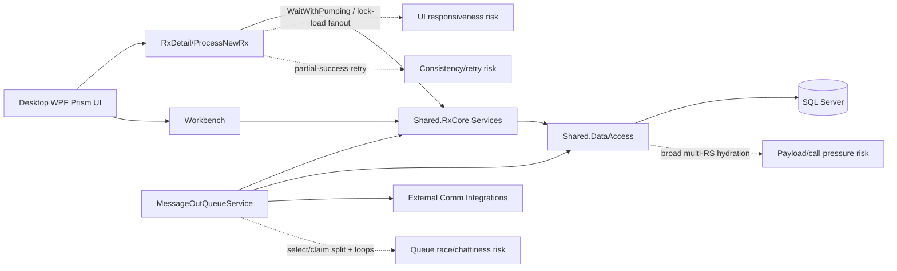
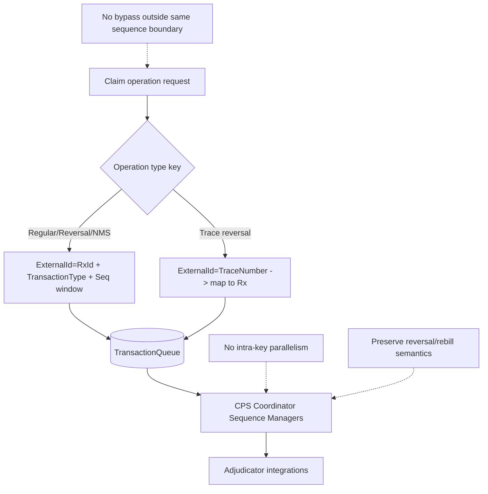
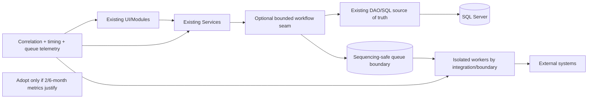

# PropelRx Solution-Wide Performance Roadmap

## 1. Executive Summary (One Page)

This report provides an assessment-only, evidence-based, solution-wide performance and scalability roadmap for PropelRx (`Labyrinth.sln`, .NET Framework 4.8-heavy desktop + service architecture). It is explicitly constrained by patient-safety, claim-ordering, regulatory/audit correctness, and incremental delivery feasibility for a two-developer team.

### What is proven now
- [CODE-PROVEN] Confirmed correctness defects are currently concentrated in outbound queue processing (`MessageOutQueueService`) and are tracked as `D-001..D-003`.
  - Evidence: `Shared.RxCore/Services/SendCommunication/MessageOutQueueService.cs:66-158`, `:811-816`, `:887-892`, `:935-977`; baseline summary in `docs/architecture/PropelRx_Architecture_Scalability_Assessment.md:343-352`.
- [CODE-PROVEN] High-risk scalability mechanisms are present across high-use workflows:
  - UI-path blocking waits with dispatcher pumping.
  - Broad Rx hydration and lock/load fan-out patterns.
  - Queue claim/select split with potential stale in-process records.
  - ProcessNewRx partial-success and retry amplification behavior.
  - Evidence: `Nexxsys.Modules.RxDetail/ViewModels/RxDetailViewModel.cs:3192-3235`; `Nexxsys.Modules.RxDetail/ViewModels/ProcessNewRxViewModel.cs:1764-1821`; `Shared.Infrastructure.UI/AsyncHelpers.cs:48-59`; `Shared.RxCore/Services/SendCommunication/MessageOutQueueService.cs:76-130`; `Shared.DataAccess/Implementation/RxDetailDAO.cs:31-107`, `:251`, `:2209-2230`.

### What is not proven yet (must be measured)
- [RUNTIME-VERIFY] No runtime telemetry in this code-only review proves production latency/frequency/throughput or bottleneck rank order.
- [RUNTIME-VERIFY] SQL/worker/UI metrics (p95/p99 timing, queue lag/stale age, contention, retries, deadlocks, connection pressure) must be captured before medium/large changes are committed.

### Ordering and safety guardrails (non-negotiable)
- [CODE-PROVEN] Claim sequencing is key-sensitive and not safely reducible to `PatientId` alone.
- [CODE-PROVEN] Operational ordering centers on `TransactionQueue` keying (`ExternalId + TransactionType + sequence fields`) with a distinct trace-number reversal key path.
- [CODE-PROVEN]/[INFERRED] No recommendation in this roadmap parallelizes claims within the same business sequence key or introduces bypassable submission boundaries.
  - Evidence: `docs/architecture/Claim_Sequencing_Strangler_Feasibility_Assessment.md:19-26`, `:174-190`, `:210-226`.

### Incremental delivery recommendation
- Start immediately with instrumentation + targeted defect stabilization + small low-risk fixes.
- Use measurement-gated progression for 6-month hotspot removals.
- Reserve 12-month architectural options for only those boundaries justified by measured gains and validated sequencing parity.

---

## 2. Scope, Inputs, Constraints, and Limitations

### 2.1 Scope
Assessment covers solution-wide performance/scalability risk inventory and phased delivery roadmap for:
- startup/login;
- Workbench loading/search;
- patient/prescription search;
- RxDetail navigation/selection;
- ProcessNewRx/CreateRxs;
- claim submission/reversal/rebill;
- outbound communications;
- printing/fax;
- batch/monitor/report workflows.

### 2.2 Inputs reviewed
- `Architecture_Scalibility_playbook.md` (required structure/quality gates): `:856-1045`.
- `docs/architecture/PropelRx_Architecture_Scalability_Assessment.md`.
- `docs/architecture/Phase1_Solution_Inventory_Assessment.md`.
- `docs/architecture/Phase2_MessageOutQueueProcess_Assessment.md`.
- `docs/architecture/Phase3_RxDetail_Prescription_Workflow_Assessment.md`.
- `docs/architecture/Phase4_ProcessNewRx_CreateRxs_Assessment.md`.
- `docs/architecture/Claim_Sequencing_Strangler_Feasibility_Assessment.md`.

### 2.3 Non-negotiable constraints carried into roadmap
1. Preserve claim ordering by correct business sequencing key; do not assume `PatientId` alone.
2. Do not parallelize claims within the same sequence key.
3. Do not route claims to new API/worker while legacy paths can bypass the same sequence boundary.
4. Preserve prescription/claim/reversal/rebill/audit/regulatory/patient-safety behavior.
5. Do not default to CQRS read-replication; evaluate live query optimization first.
6. Treat `IWorkflowRouter` / Strangler façade as optional candidates, not predetermined.
7. Distinguish 67 result sets from 67 round trips.
8. Do not infer production latency/frequency from source alone.
9. No sensitive patient/prescription/claim payload data in telemetry/reporting.

### 2.4 Limitations
- [RUNTIME-VERIFY] Runtime evidence (Query Store/XEvent/load/incident metrics) is not embedded in repository artifacts.
- [UNKNOWN]/[RUNTIME-VERIFY] Some SQL procedure internals are unavailable in workspace traces; runtime DB inspection remains required.

---

## 3. Measured Bottlenecks vs Unverified Risks

### 3.1 Measured bottlenecks (runtime-proven)
- None newly established in this source-only pass.
- Existing reports include runtime measurement requirements but not complete production metric datasets for definitive ranking.

### 3.2 Confirmed correctness defects
- `D-001`: `ProcessCommunication(...)` always returns true.
- `D-002`: successful Diem sends may not populate success list in one path.
- `D-003`: `First(...)` followed by ineffective null check.

### 3.3 Code-proven performance risks (impact not yet measured)
- UI blocking waits with dispatcher pumping (`WaitWithPumping`) on hot paths.
- RxDetail lock/load fan-out and broad hydration (`RxDataPoint.All`, multi-result contract).
- MessageOutQueue split selection/claim flow and loop-driven DB chattiness.
- ProcessNewRx partial-success + retry amplification behavior.

### 3.4 Operational/observability gaps
- Queue lag/stale `I` lifecycle and cross-service recovery visibility.
- Workflow-level call count/timing correlation IDs.
- Production-grade contention/deadlock/wait/event baselines.

---

## 4. Solution-Wide Findings Table

| ID | Group | Finding | Workflow | Evidence label | Evidence | Impact/Concern | Measurement needed | Incremental remedy | Regression/ordering risk |
|---|---|---|---|---|---|---|---|---|---|
| D-001 | Confirmed defect | Worker returns true regardless of failures | Outbound comm queue | [CODE-PROVEN] | `MessageOutQueueService.cs:66-158` | false-success signaling | failure-path frequency | fix return semantics + tests | Low |
| D-002 | Confirmed defect | Success-list mapping gap in Diem path | Outbound comm queue | [CODE-PROVEN] | `MessageOutQueueService.cs:935-977` | result-state inconsistency | mixed send outcome rates | populate success list deterministically | Medium |
| D-003 | Confirmed defect | `First(...)` + null check dead branch | Outbound comm queue | [CODE-PROVEN] | `MessageOutQueueService.cs:811-816`, `:887-892` | exception risk | missing-interface incidence | safe selection/null handling | Low |
| F-001 | Code-proven risk | UI blocking waits with dispatcher pumping | RxDetail/ProcessNewRx + other modules | [CODE-PROVEN] | `RxDetailViewModel.cs:3192-3199`; `ProcessNewRxViewModel.cs:1770-1805`; `AsyncHelpers.cs:48-59` | responsiveness/re-entrancy risk | UI first-render and command re-entry metrics | staged async conversion on hottest paths | Medium |
| F-002 | Code-proven risk | Per-Rx lock/load fan-out under navigation selection | RxDetail | [CODE-PROVEN] | `RxDetailViewModel.cs:3202-3235`; `Phase3 report` | potential N+1-like DB pressure | lock count/duration by navigation | trim lock payload + coalesce reloads | Medium |
| F-003 | Code-proven risk | Broad `RxDataPoint.All` hydration + large multi-RS contract | RxDetail/CPS surfaces | [CODE-PROVEN]/[RUNTIME-VERIFY] | `RxDetailDAO.cs:31-107`, `:251`; `RxDetailService.cs:61-96` | high payload/parse cost | Query Store p95/p99 + reads/rows | reduce first-render scope, optimize SQL by evidence | Medium |
| F-004 | Code-proven risk | Queue select and claim are separate operations | MessageOutQueue | [CODE-PROVEN]/[INFERRED] | `MessageOutQueueService.cs:76-130`; Phase2 findings F-101..F-103 | duplicate work race under scale-out | overlap/duplicate claim telemetry | conditional/atomic claim semantics if needed | Medium-High |
| F-005 | Code-proven risk | Loop-driven queue DB chattiness | MessageOutQueue | [CODE-PROVEN] | `MessageOutQueueService.cs:85-155`; Phase2 call model | throughput sensitivity to cardinalities | P/R/C/M/G/X/U/D distributions | remove redundant calls, batch where safe | Medium |
| F-006 | Code-proven risk | Partial-success commits before later item failure; retry amplification potential | ProcessNewRx/CreateRxs | [CODE-PROVEN]/[RUNTIME-VERIFY] | `ProcessNewRxViewModel.cs:1774-1813`; Phase4 conclusions | duplicate side effects risk | retry duplicate artifact audit | explicit partial-success reporting + idempotent controls | Medium-High |
| F-007 | Observability gap | No unified workflow correlation from UI->service->DAO->queue->integration | Cross-cutting | [RUNTIME-VERIFY] | prior reports runtime plans | difficult hotspot attribution | correlation completeness | add correlation/timing/db-call instrumentation | Low |
| F-008 | Safety constraint | Claim sequencing key is not `PatientId` alone; trace reversal has alternate key path | Claims/reversal/rebill | [CODE-PROVEN] | Claim sequencing report CSF-002/003 | unsafe parallelization/bypass risk | parity + ordering tests | enforce shared sequencing boundary before routing changes | High |

---

## 5. Top 10 Opportunities (Ranked)

| Rank | Opportunity | Linked findings | Evidence strength | Effort | Impl risk | Business/regression risk | Dependency | Expected benefit | Success criterion | Rollback |
|---|---|---|---|---|---|---|---|---|---|---|
| 1 | Fix D-001 return semantics with tests | D-001 | High | XS-S | Low | Medium | none | reliable worker signaling | failure path emits false and is asserted | revert method/tests |
| 2 | Fix D-002 success-list mapping | D-002 | High | S | Medium | Medium | #1 recommended first | accurate send-result persistence | mixed success/failure integration test passes | revert mapping |
| 3 | Fix D-003 safe lookup behavior | D-003 | High | XS-S | Low | Low-Med | none | remove avoidable exceptions | missing interface path no throw | revert lookup change |
| 4 | Add queue telemetry baseline (selected/claimed/completed/failed, lag, stale `I`) | F-004/F-005/F-007 | Medium | S | Low-Med | Low | none | measurable queue behavior | dashboard + alert queries populated | disable telemetry switches |
| 5 | Add RxDetail first-render + DB-call correlation timers | F-001/F-002/F-003/F-007 | Medium | S-M | Medium | Low | #4 preferred | true hotspot ranking | baseline p50/p95 with call counts captured | disable instrumentation |
| 6 | Add ProcessNewRx partial-success and retry telemetry + UX outcome visibility | F-006/F-007 | Medium | S-M | Medium | Medium | none | safer operations and repro | forced failure scenario emits complete artifact audit | revert UX flags/instrumentation |
| 7 | Remove redundant RxDetail reload branches where code-proven duplicate | F-002/F-003 | Medium | M | Medium | Medium | #5 | fewer calls/latency | reduced calls per open + no behavior drift | feature flag / revert |
| 8 | Atomic/conditional queue claim pilot (only if telemetry proves overlap/stale risk) | F-004 | Medium | M-L | Medium-High | Medium | #4 telemetry evidence | lower duplicate-claim risk | overlap metric drops with parity maintained | DB/SP rollback path |
| 9 | Hot-path async refactor pilot (RxDetail/ProcessNewRx sections) | F-001 | Medium | M-L | High | Medium-High | #5 baseline & guard tests | improved responsiveness | measurable first-render/interaction improvement without regressions | scoped feature flag |
| 10 | Claim sequencing boundary hardening prework (ingress inventory + parity checks) | F-008 | High | M | Medium | High if incorrect | sequencing telemetry + decision gates | prevents unsafe modernization | 100% claim-operation path inventory + ordering parity tests | keep legacy path only |

---

## 6. Two-Developer Capacity Assumptions

Assumptions used for planning (explicit):
- Team size: 2 developers.
- Effective feature capacity: ~55-60% each after support/reviews/defects/deploy overhead.
- Combined effective delivery: ~1.1–1.2 full-time equivalent on roadmap work.
- WIP limit: **one major change + one small investigation/instrumentation task** at a time.
- Every item includes code review, test automation/manual validation, release notes, and rollback validation.

Implication:
- XL changes are split into independently useful stages; no big-bang programs scheduled.

---

## 7. Detailed First 2 Months Plan (Prove and Stabilize)

### 7.1 Goals
- Establish baseline measurements for top workflows.
- Validate/fix already-confirmed queue defects (`D-001..D-003`).
- Measure queue lag/stale `I`, RxDetail first-render/DB calls, and ProcessNewRx partial-failure/retry behavior.
- Implement only low-risk evidence-backed fixes.

### 7.2 Week-by-week plan

| Week | Primary major task | Secondary small task | Deliverables | Validation gate |
|---|---|---|---|---|
| 1 | Instrumentation design + correlation IDs | Defect test harness scaffolding | telemetry schema/spec + test plan | review sign-off by dev+QA+ops |
| 2 | Implement queue and workflow telemetry hooks | Baseline dashboard/query scripts | queue lag/stale `I`/status transition metrics | sample data capture verified |
| 3 | Reproduce D-001..D-003 + implement fixes in branch | Add regression tests | fix package + unit/integration tests | tests green + peer review |
| 4 | Stage/canary validation for D-fixes | Capture initial baseline metrics | defect fix release candidate | no regressions in canary logs |
| 5 | RxDetail measurement pass (render/calls/multi-RS timing) | Workbench search/load metric probes | first measurement report | baseline confidence check |
| 6 | ProcessNewRx failure/retry scenario instrumentation | partial-success UX diagnostics | retry artifact audit report | reproducible scenario with traces |
| 7 | Small low-risk optimization(s) from measured waste only | tighten alert thresholds | incremental patch | measurable delta or rollback |
| 8 | Consolidated 2-month findings/decisions | 6-month candidate shortlist | go/no-go package | steering decision meeting |

### 7.3 “Not doing yet” list (explicit)
- No large claim-routing architecture changes.
- No CQRS replication default rollout.
- No broad microservices/container platform initiative.
- No worker scale-out expansion before claim/queue safety metrics justify it.

---

## 8. Cumulative 6-Month Roadmap (Remove Measured Hotspots)

### 8.1 Entry criteria
- 2-month telemetry operational and trusted.
- D-001..D-003 fixed and stable.
- Baseline metrics collected for RxDetail, queue, ProcessNewRx, outbound comm.

### 8.2 Candidate work (measurement-gated)

| Item | Depends on | Why now | Effort | Risk | Pilot approach | Metric comparison | Rollback |
|---|---|---|---|---|---|---|---|
| Conditional/atomic queue claim (if overlap confirmed) | queue telemetry | address proven duplicate claim window risk | M-L | Med-High | one worker path first | duplicate/overlap/stale metrics pre/post | revert SP/claim mode |
| Eliminate redundant RxDetail hydration branches | RxDetail telemetry | reduce measured call/payload overhead | M | Med | one navigation branch at a time | calls/open, render latency | feature flag revert |
| First-render data scope reduction using live authoritative DB | RxDetail baseline + parity tests | reduce payload on critical UI path | M-L | Med | selected tabs/sections first | p95 render, support incidents | scope toggle revert |
| Targeted SQL optimization for measured hotspots only | Query Store/XE plans | improve top cost SQL only | M | Med | one proc/query per cycle | reads/duration plan stability | index/plan rollback |
| ProcessNewRx partial-success controls + retry safety | failure telemetry | reduce duplicate side effects | M | Med-High | one item type path first | duplicate artifact rate | feature toggle + behavior rollback |
| Claim-ordering protection hardening prework | sequencing inventory/parity | prepare safe future change | M | High if rushed | passive validation + assertions first | parity test pass rate | disable assertions only |

---

## 9. Cumulative 12-Month Roadmap (Scale Proven Boundaries)

### 9.1 Prerequisites (must be true before start)
1. 6-month metrics prove persistent boundary-level bottlenecks or reliability faults.
2. Claim sequencing key inventory complete across all submit/reversal/rebill paths.
3. No legacy bypass remains for selected boundary.
4. Idempotency and rollback test harness exists for target boundary.

### 9.2 Candidate options (incremental, optional)

| Option | Addresses | Does NOT fix | Ordering/consistency implications | Operational burden | Fit for 2 devs | Adoption trigger | Defer/reject reason |
|---|---|---|---|---|---|---|---|
| Coarse-grained workflow façade for selected hotspot | chatty UI-service-DAO paths | does not auto-fix SQL plans or queue races | must preserve existing write/order semantics | medium | conditional | measured repeated orchestration overhead | defer if gains small |
| Shared claim sequencing boundary across callers | bypass risk + ordering parity | not a generic throughput booster alone | high sequencing sensitivity; trace reversal path required | medium-high | staged only | all claim producers mapped + parity tests ready | reject if bypass persists |
| Idempotent command handling + workflow journaling | retry duplication and replay risk | not direct latency fix | improves consistency under failure/retry | medium | staged | duplicate artifacts observed | defer if duplicate rate low |
| Transactional outbox for suitable side effects | side-effect reliability | not for all synchronous workflows | requires strict event ordering rules | medium-high | selective | repeated side-effect loss/retry inconsistencies | defer without clear target |
| Integration-specific worker isolation pools | noisy-neighbor failures | not SQL/UI bottlenecks | must preserve business ordering where required | medium | possible | integration contention proven | defer if contention absent |
| Containerization for new stateless components | deployment/isolation scaling | not inherent app performance gain | sequencing unaffected only if boundary-safe | medium-high | limited | operational scaling need proven | reject as default perf fix |

### 9.3 Anti-patterns explicitly rejected
- one HTTP endpoint per DAO method;
- unbounded parallel DB calls;
- in-process-only claim locks across multi-machine deployments;
- non-idempotent retries;
- scaling workers before atomic claim/ordering controls are validated.

---

## 10. Dependencies and Required Decisions

| Decision/Dependency | Owner(s) | Needed by | Why |
|---|---|---|---|
| Access to Query Store/XEvent/deadlock/wait stats | DBA/Ops | Month 1 | measurement baseline |
| Production-safe telemetry schema and retention policy | Ops/Security | Month 1 | privacy-safe observability |
| Acceptance criteria for partial-success user behavior | Product/CareRx | Month 2 | ProcessNewRx control decisions |
| Queue overlap/stale `I` threshold policy | Ops/DBA/Product | Month 2-3 | atomic claim go/no-go |
| Claim sequencing parity test corpus (regular/reversal/NMS/trace) | QA/Product/Pharmacy SMEs | Month 3+ | safe sequencing changes |
| Release/canary rollback gates for worker changes | Ops/QA | continuous | risk containment |

---

## 11. Business-Ordering and Patient-Safety Guardrails

1. Claims within the same business sequence key remain strictly ordered.
2. No intra-key claim parallelization.
3. Sequence key must preserve Rx-based and trace-number reversal paths.
4. No migration path that permits legacy bypass around sequencing boundary.
5. Preserve audit/regulatory records and reversal/rebill semantics.
6. Any optimization requiring altered ordering semantics is blocked pending business/QA sign-off.

---

## 12. Architecture Options Comparison (Measured Problem Fit)

| Option | Best for | Not for | Burden | Trigger |
|---|---|---|---|---|
| Improve in place (current client/service/DAO) | immediate low-risk gains, known hotspots | systemic boundary redesign | low-medium | always first |
| Coarse-grained live-query API | chatty orchestrations with stable contracts | blanket DAO wrapping | medium | repeated measured orchestration overhead |
| Strangler façade (single workflow) | bounded migration experiments | whole-system rewrite | medium-high | bypass-free boundary and parity harness |
| SQL-backed sequencing/queue hardening | duplicate/stale queue state issues | generic UI latency | medium-high | queue overlap/stale evidence |
| Broker sessions/keyed partitions | high-volume async sequencing boundaries | low-volume synchronous paths | high | sustained queue pressure proven |
| Workflow journal + outbox | retry and side-effect consistency | direct UI render latency | medium-high | duplicate/replay side-effect evidence |
| Integration worker isolation | dependency-specific failure containment | core DB hotspot fixes | medium | integration contention measured |
| Windows containers for current services | deployment isolation/repeatability | code-path performance by itself | medium | ops need proven |
| Modern .NET containers for new stateless components | future bounded services | immediate desktop hotpaths | medium-high | selective new component case |

---

## 13. Runtime Measurement Plan (Required)

### 13.1 Data sources
- Application logs/traces with correlation IDs.
- SQL Query Store + Extended Events + execution plans + waits/deadlocks.
- Client-side timing for startup/login/render.
- Queue depth/lag/retry/stale-item metrics.
- Worker process CPU/memory/thread/connection behavior.
- Integration call latency/error classification.
- Incident and complaint linkage.

### 13.2 Scenarios and metrics

| Scenario | Metrics | Tooling |
|---|---|---|
| Startup/login | time-to-login-complete, module init duration | client timers + app logs |
| Workbench load/search | query count, duration distribution, rows returned | app correlation + Query Store |
| RxDetail navigation/selection | first meaningful render, DB calls/open, `p_GetPrescription_MultiRS` p50/p95/p99 | client timers + Query Store/XE |
| ProcessNewRx/CreateRxs | attempts, partial-success rates, retries, duplicate artifacts | workflow telemetry + DB correlation |
| Claim submit/reversal/rebill | sequence parity, queue status transitions, retry idempotency | claim telemetry + CPS logs |
| Outbound comm | selected/claimed/completed/failed counts, stale `I` age, overlap rate | queue telemetry + SQL |
| Print/fax | queue lag, timeout/failure rates, retry outcomes | service logs + queue metrics |
| Batch/report jobs | cycle time, poll emptiness ratio, resource profile | service/monitor instrumentation |

### 13.3 Privacy guardrails
- No patient identifiers, claim payloads, credentials, or regulated identifiers in report outputs.
- Use hashed/synthetic operational correlation IDs where needed.

---

## 14. Test and Rollback Plan

### 14.1 Test strategy
- Unit tests for deterministic defect fixes and branching behavior.
- Integration tests for queue/result-state transitions and mixed success/failure sends.
- Workflow parity tests for RxDetail and ProcessNewRx behavior.
- Load/reliability tests for queue overlap, stale-item recovery, and retry idempotency.
- Sequencing parity tests for regular/reversal/NMS/trace-number reversal paths.

### 14.2 Rollback strategy
- Feature flags/switches for instrumentation and behavior changes.
- Canary rollout with explicit guard metrics and abort thresholds.
- Revert scripts/branches for SQL behavior changes (if introduced later under controlled change).
- Post-rollback verification checklist (functional + telemetry continuity).

---

## 15. Areas Not to Change (Now)

1. Do not alter claim processor internals (`General`, `NMS`, `PharmaNet`) during early roadmap stages unless sequencing parity requirements are fully met.
2. Do not introduce broad architectural migration programs before measurement confirms need.
3. Do not replace stable contracts solely for stylistic modernization.
4. Do not parallelize sequencing-sensitive claim operations within a business key.
5. Do not deploy CQRS replica patterns as default path absent evidence and sequencing guarantees.

---

## 16. Diagrams

### 16.1 Current hotspots map

### 16.2 Claim sequencing guardrail map

### 16.3 Incremental 12-month target (conditional)

---

## 17. Three Explicit Decisions

### 17.1 What can start immediately?
1. Instrumentation baseline work (correlation IDs, queue and workflow timing/call metrics).
2. Defect remediation package for `D-001..D-003` with regression tests.
3. Controlled measurement runs for RxDetail render/call profile and ProcessNewRx partial-failure/retry behavior.

### 17.2 What needs measurement or business-rule decision first?
1. Atomic/conditional queue claim hardening (requires measured overlap/stale evidence).
2. RxDetail payload/deferred-load redesign scope (requires measured p95/p99 impact + parity tests).
3. ProcessNewRx idempotency/retry behavior changes (requires product decision on expected user outcomes).
4. Any claim-sequencing boundary migration step (requires complete producer inventory and parity tests).

### 17.3 What should not be attempted by this two-developer team in next 12 months?
1. Big-bang architectural migration (generic workflow framework, full DAO-to-API rewrite, broad microservices split).
2. Kubernetes/container platform program as a default “performance fix”.
3. Any claim processing parallelization within ordering key or any migration that allows sequencing bypass.
4. CQRS read-model replication as default approach without proven need and sequencing safety proof.

---

## 18. Appendix: Evidence Index (Roadmap-Critical)

- Playbook structure/rules: `Architecture_Scalibility_playbook.md:856-1045`.
- Consolidated baseline defects/risks: `docs/architecture/PropelRx_Architecture_Scalability_Assessment.md:343-374`.
- MessageOutQueue defects/call model: `docs/architecture/Phase2_MessageOutQueueProcess_Assessment.md:126-212`.
- RxDetail workflow load/chattiness evidence: `docs/architecture/Phase3_RxDetail_Prescription_Workflow_Assessment.md:229-299`, `:346-366`.
- ProcessNewRx partial-success and transaction boundary evidence: `docs/architecture/Phase4_ProcessNewRx_CreateRxs_Assessment.md:140-163`, `:189-227`, `:250-263`.
- Claim sequencing constraints and roadmap guardrails: `docs/architecture/Claim_Sequencing_Strangler_Feasibility_Assessment.md:19-26`, `:174-200`, `:210-226`.
- Direct code citations used in this report:
  - `Shared.RxCore/Services/SendCommunication/MessageOutQueueService.cs:66-170`
  - `Nexxsys.Modules.RxDetail/ViewModels/RxDetailViewModel.cs:3185-3235`
  - `Nexxsys.Modules.RxDetail/ViewModels/ProcessNewRxViewModel.cs:1764-1821`
  - `Shared.Infrastructure.UI/AsyncHelpers.cs:48-59`
  - `Shared.DataAccess/Implementation/RxDetailDAO.cs:31-107`, `:251`, `:2209-2230`
